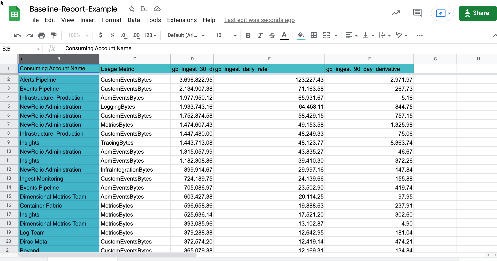
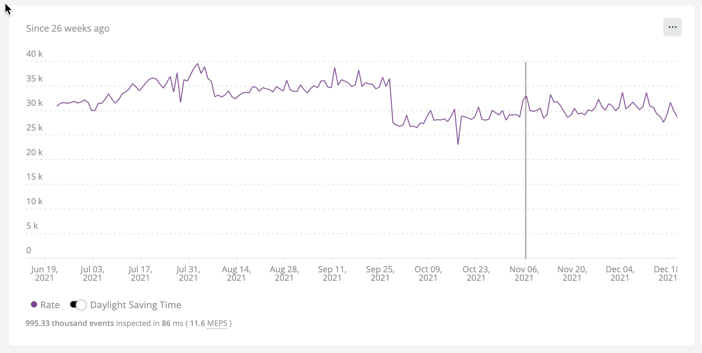
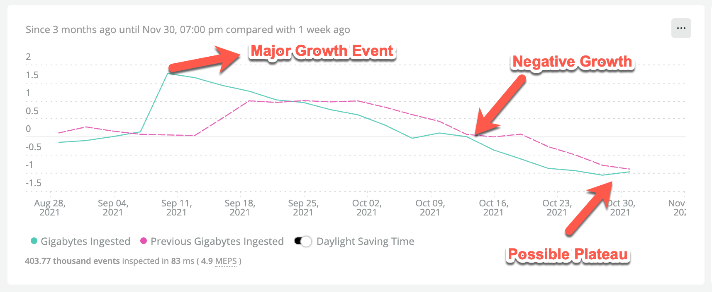

In this stage it is necessary to get a high level view of all of the telemetry currently being generated by your organization.  The unit focuses on breaking down ingest stats into various groups such as account, telemetry type, and application.  These figures will be used to inform the [Optimize your ingest data](/docs/new-relic-solutions/observability-maturity/operational-efficiency/dg-optimizing) and [Forecast your ingest data](/docs/new-relic-solutions/observability-maturity/operational-efficiency/dg-growth) stages.

You'll learn how to generate a structured breakdown report for the following dimensions:

- Organization
- Sub account
- Billable Telemetry Type

In the advanced topics section you'll see how to create some highly granular breakdowns including:

- Application (APM|Browser|Mobile)
- Infrastructure Integration


## Prerequisites

<CollapserGroup>
<Collapser
    id="understand-nr-consumption-metrics"
    title="Understand New Relic's built-in ingest tracking"
    >

All billable telemetry is tracked in the `NrConsumption` and `NrMTDConsumption` events.  In each of those events the attribute `usageMetric` denotes a general group of billable telemetry. 

* `NrConsumption` records usage every hour, and is the equivalent of "real-time" usage. Use this event to observe usage trends over time. 
* `NrMTDConsumption` generates aggregate values from the `NrConsumption` event. Use this event to see usage or estimated cost by monthly billing period. For organizations on the core user release, this is the best event for querying user count. 


Below are some of the most important attributes attached to `NrConsumption`.

<table>
  <thead>
    <tr>
      <th style={{ width: "200px" }}>
        Attribute
      </th>
 
      <th>
        Description
      </th>
    </tr>
  </thead>

  <tbody>
    <tr>
      <td>
        `productLine`
      </td>

      <td>
        The category of usage. There are three options: `DataPlatform`, `FullStackObservability`, and `ProactiveDetection`. (Starting November 1, 2021, `IncidentIntelligence` is no longer a billing factor.) For more details about these categories, see [New Relic platform](https://newrelic.com/platform).
      </td>
    </tr>

    <tr>
      <td>
        `metric`
      </td>

      <td>
        This consolidates multiple categories of usage into a single metric. Helpful when faceting by `productLine`. It's an enum with possible values of `BasicUsers`, `FullUsers`, and `GigabytesIngested`. Values for the core user release include `FullPlatformUsers` and `CoreUsers`. 
      </td>
    </tr>
    <tr>
      <td>
        `usageMetric`
      </td>

      <td>
        This gives us an understanding what telemetry type we've ingested.  For example `BrowserEventBytes` covers all of the low level events generated by the Browser agent.
      </td>
    </tr>
    <tr>
      <td>
        `consumingAccountId`
      </td>

      <td>
        ID of the New Relic account directly responsible for the stored events, as determined from the license key used.
      </td>
    </tr>

    <tr>
      <td>
        `estimatedCost`
      </td>

      <td>
        Calculates a cost estimate based on usage and metric cost. This is an estimate of costs to date, not your monthly invoice.
      </td>
    </tr>

  </tbody>
</table>

Now based on this we can ask a quetion like "How much browser data have we ingested in the last 30 days and break it down by sub-account and compare it against the previous 30 days"

```
FROM NrConsumption select sum(GigabytesIngested) where usageMetric = 'BrowserEventsBytes' since 30 days ago compare with 30 days ago facet consumingAccountName
```

The response shows us how many GB of Browser data we've brought in by account.

```
Banking Platform, 75 GB, +2.9%
Marketing Platform, 40 GB, -1.3%
```

This is an example of the complete JSON structure of an NrConsumption event.

```
        {
          "BytesIngested": 10284371464,
          "GigabytesIngested": 10.284371464,
          "consumingAccountId": 4506332,
          "consumingAccountName": "Banking Platform Team",
          "consumption": 10.284371464,
          "dpBytesIngested": 10284371464,
          "dpGigabytesIngested": 10.284371464,
          "masterAccountId": 766473,
          "masterAccountName": "Big Bank",
          "metric": "GigabytesIngested",
          "month": "January 2022",
          "monthTimestamp": 1640995200000,
          "nr.accountType": "non_cpm",
          "nr.aggregationEntityId": 2321606,
          "nr.averageUnitPrice": 0.25,
          "nr.billableEntityId": 2321606,
          "nr.consumption": 10.284371464,
          "nr.environment": "PRODUCTION",
          "nr.kafkaOffset": 7735934651,
          "nr.kafkaPartition": 6,
          "nr.legacyMetric": "dpGigabytesIngested",
          "nr.processedTime": 1642601787336,
          "nr.rawConsumption": 10284371464,
          "nr.usageRatingHost": "38f7cf2306d2",
          "partnershipOwningAccountId": 2321606,
          "partnershipOwningAccountName": "Big Bank Management Account",
          "productLine": "DataPlatform",
          "timestamp": 1642600799999,
          "type": "count",
          "usageMetric": "MetricsBytes",
          "version": "0.4.2"
        }
```

It's important to note that our granularity is to the `usageMetric` and `consumingAccountName`.  The NrMTDConsumption event is a more aggregated data strucutre that does not include that level of granularity.


*Billable Telemetry Breakdown*

<table>
  <thead>
    <tr>
      <th style={{ width: "200px" }}>
        NrcConsumption.usageMetric
      </th>
      <th style={{ width: "200px" }}>
        Constituent Events
      </th>
      <th>
        Source
      </th>
    </tr>
  </thead>
  <tbody>
    <tr>
      <td>
        `InfraHostBytes`
      </td>
      <td>
        `SystemSample`, `StorageSample`, `ContainerSample`, `InfrastructureEvent`
      </td>
      <td> 
        Infrastructure Agent
      </td>
    </tr>
    <tr>
      <td>
        `InfraProcessBytes`
      </td>
      <td>
        `ProcessSample`
      </td>
      <td>
        Infrastructure Agent
      </td>
    </tr>
    <tr>
      <td>
        `InfraIntegrationBytes`
      </td>
      <td>
        Various Events
      </td>
      <td>
        [On-Host-Integrations](https://docs.newrelic.com/docs/infrastructure/host-integrations/get-started/introduction-host-integrations/) and Certain [Cloud Integrations](https://docs.newrelic.com/docs/infrastructure/infrastructure-integrations/get-started/introduction-infrastructure-integrations/#cloud)
      </td>
    </tr>
    <tr>
      <td>
        ApmEventsBytes
      </td>
      <td>
        `Transaction`, `TransactionError`
      </td>
      <td>
        APM Agent(s)
      </td>
    </tr>
    <tr>
      <td>
        TracingBytes
      </td>
      <td>
        `Span`, `SpanEvent`
      </td>
      <td>
        APM Agent(s) and OTEL
      </td>
    </tr>
    <tr>
      <td>
        BrowserEventBytes
      </td>
      <td>
        `Browser`, `Browser:EventLog`, `Browser:JSErrors`, `PcvPerf`, `PageViewTiming`
      </td>
      <td>
        Browser Agent
      </td>
    </tr>
    <tr>
      <td>
        MobileEventsBytes
      </td>
      <td>
        `Mobile`, `MobileRequestError`, `MobileSession`, `MobileHandleException`, `MobileCrash`
      </td>
      <td>
        Mobile Agent
      </td>
    </tr>
    <tr>
      <td>
        SeverlessBytes
      </td>
      <td>
        Cloud-specific (i.e., AWS Lambda Events)
      </td>
      <td>
        Cloud-specific (i.e., AWS Lambda Integration)
      </td>
    </tr>
    <tr>
      <td>
        LoggingBytes
      </td>
      <td>
        `Log` as well as partition-specific events of the pattern `[partition].Log`
      </td>
      <td>
        Various (Fluentd, FluentBit, Syslog, Cloud-specific streaming services)
      </td>
    </tr>
    <tr>
      <td>
        MetricEventBytes
      </td>
      <td>
        `Metric`
      </td>
      <td>
        Various dimensional metrics (Prometheus, Cloud-specific streamed metrics, agent-specific dimensional metrics)
      </td>
    </tr>
    <tr>
      <td>
        CustomEventBytes
      </td>
      <td>
        Various
      </td>
      <td>
        Various APIs
      </td>
    </tr>
  </tbody>
</table>

View this [guide](https://docs.newrelic.com/docs/data-apis/manage-data/manage-data-coming-new-relic/) for reference.
</Collapser>
</CollapserGroup>

## Install the data governance dashboard

1. In a new tab [open](https://github.com/newrelic/newrelic-quickstarts/blob/main/quickstarts/oma-data-gov/dashboards/data-ingest-baseline.json) the *Data Governance Baseline* dashboard JSON in Github.
2. Download the file locally  
3. Edit the file to use your account id (This template uses an accountId of `0` as a placeholder).
4. Install it into your NR1 Master Account or POA account using the [import dashboard function](https://docs.newrelic.com/docs/query-your-data/explore-query-data/dashboards/introduction-dashboards/#dashboards-import)

The main tab shows a variety of charts including some powerful time series views.  


The second tab is for tabular baseline reports. 


<Callout variant="tip">
In addition to the custom queries used in the next section we suggest you familarize yourself with the built-in [data ingest drilldown tool](https://docs.newrelic.com/whats-new/2021/06/data-ingest-drill-down/) in the NR1 Platform.
</Callout>

## Generate your report

1. Open the previously installed *Data governance baseline* dashboard.
2. Click on the *Baseline report* tab.
3. Click on `...` in the upper right of the "Last 30 Days" table and choose `Export as CSV`
4. Import the CSV into *Google Sheets* or the spreadsheet of your choice.

*Alternatively* if you did not install the dashboard you may simply use this query to create a custom chart in [Query Builder](https://docs.newrelic.com/docs/query-your-data/explore-query-data/query-builder/introduction-query-builder/):

```
SELECT sum(GigabytesIngested) AS 'gb_ingest_30_day_sum', rate(sum(GigabytesIngested), 1 day) AS 'gb_ingest_daily_rate', derivative(GigabytesIngested, 90 day) as 'gb_ingest_90_day_derivative' FROM NrConsumption WHERE productLine='DataPlatform' since 30 days ago facet consumingAccountName, usageMetric  limit max
```

Below is an example of a sheet we imported into Google Sheets.  Feel free to view it [here](https://docs.google.com/spreadsheets/d/16HxvpAsPoLu3nJgApsN9zfMPF65ikCF1vAUBk9b_F7g/edit?usp=sharing).



The screenshot shows the table sorted by 30 day ingest total.

Feel free to adjust your timeline and some of the details as needed.  For example, we chose to extract a *90 day derivative* to have some sense of change over the past few months.  You could easily alter the time period of the derivative to suite your objectives.

## Customize your report

Add useful columns to your report in order to facilitate other phases of data governance such as *optimize* and *forecast*.  The following fields will help guide optimization and planning decisions:

- Notes: Note any growth anomalies and any relevant explanations for them.  Indicate any major expected growth if foreseen.
- Technical Contact: Name of the manager of a given sub-account or someone related to a specific telemetry type.


## Advanced Topics
<CollapserGroup>
  <Collapser
    id="baseline-query-examples"
    title="More Granular Analysis Using bytecountestimate()"
    >

We assume you'll need to customize them to some extent to match the organization specifics.

<CollapserGroup>
### Examples    
  <Collapser
    id="ingest-by-application"
    title="Ingest By Application (APM|Browser|Mobile)"
    >

Run these queies in each sub-account or in a dashboard with account-specific charts

*Daily Rate*

_APM_

```
FROM Transaction, TransactionError, TransactionTrace, SqlTrace, ErrorTrace, Span select rate(bytecountestimate()/10e8, 1 day) as 'GB Ingest' facet appName since 2 Weeks Days Ago
```

_BROWSER_

```
FROM PageAction, PageView, PageViewTiming, AjaxRequest, JavaScriptError select rate(bytecountestimate()/10e8, 1 day) as 'GB Ingest' facet appName since 2 Weeks Ago
```

_MOBILE_

```
FROM Mobile, MobileRequestError, MobileSession select rate(bytecountestimate()/10e8, 1 day) as 'GB Ingest' facet appName since 2 Weeks ago 
```

*Seven Day Sum*

_APM_

```
FROM Transaction, TransactionError, TransactionTrace, SqlTrace, ErrorTrace, Span select bytecountestimate()/10e8 as 'GB Ingest' facet appName since 7 days ago
```

_BROWSER_

```
FROM PageAction, PageView, PageViewTiming, AjaxRequest, JavaScriptError select bytecountestimate()/10e8 as 'GB Ingest' facet appName since 7 days ago
```

_MOBILE_

```
FROM Mobile, MobileRequestError, MobileSession select bytecountestimate()/10e8 as 'GB Ingest' facet appName since 7 days ago
```
  </Collapser>
  <Collapser
    id="metric-ingest-by-integration"
    title="Metric Ingest By Integration"
    >

The `Metric` namespace is quite monolithic.  This can make it challenging to understand what the source of all of this data is.  We can facet by `usage.Integration` to get a rough sense of where these are coming in.  It's possible to go deeper, but for a general baseline this is adquate.
Some examples of `usage.Integration` values that will show up with this facet are:

- com.newrelic.mssql (the New Relic MSSQL OHI)
- com.newrelic.rabbitmq (the New Relic RabbitMQ OHI)
- EC2 (the AWS EC2 integration)
- Lambda (the Lambda integration)

Run these queies in each sub-account or in a dashboard with account-specific charts

*Daily Rate*

```
FROM Metric select rate(bytecountestimate()/10e8, 1 day) facet usage.integrationName since 2 weeks ago
```

*Seven Day Sum*


```
FROM Metric select bytecountestimate()/10e8 facet usage.integrationName since 1 weeks ago
```

  </Collapser>
  <Collapser
    id="ingest-by-k8s-cluster"
    title="Ingest By K8s Cluster"
    >

*Daily Rate*

```
FROM K8sClusterSample, K8sContainerSample,K8sDaemonsetSample, K8sDeploymentSample, K8sEndpointSample, K8sHpaSample, K8sNamespaceSample, K8sNodeSample, K8sPodSample, K8sReplicasetSample, K8sServiceSample, K8sVolumeSample select rate(bytecountestimate()/10e8, 1 day) as 'GB Ingest' facet clusterName since 2 weeks ago
```

*Seven Day Sum*

```
FROM K8sClusterSample, K8sContainerSample,K8sDaemonsetSample, K8sDeploymentSample, K8sEndpointSample, K8sHpaSample, K8sNamespaceSample, K8sNodeSample, K8sPodSample, K8sReplicasetSample, K8sServiceSample, K8sVolumeSample select bytecountestimate()/10e8 as 'GB Ingest' facet clusterName since 1 week ago
```

  </Collapser>
  <Collapser
    id="ingest-by-data-center"
    title="Ingest By Data Center"
    >
    This KPI is going to vary depending on how your organization classifies data center.  It wil depend on your cloud provider and whether you have a mixture of cloud and on-prem data centers.  Here is where having metadata standards will help. 
    This is just an example to show how you can account for ingest cost by data center.  Often times you'll have a mixture of attributes like `zone`, 'datacenter', 'dc', etc.


    *Daily Rate*

    ```
    FROM ProcessSample select rate(bytecountestimate()/10e8, 1 day) facet zone since 2 weeks ago  
    ```

    *Seven Day Sum*

    ```
    FROM ProcessSample select bytecountestimate()/10e8 facet zone 7 days ago
    ```

  </Collapser>
  <Collapser
    id="ingest-per-ohi"
    title="Ingest Per OHI or Cloud Integration"
    >

    Data from On Host Interations or Cloud Integrations will show under NrConsumption as the usageMetric InfraIntegrationBytes.

    It will help to understand for a given set of accounts how much ingest is being consumed overall.

    ```
    FROM NrConsumption select sum(GigabytesIngested) where usageMetric = 'InfraIntegrationBytes' sinc 7 days ago
    ```

    Now to break it down further we will need to know a little more about the integrations that are actually used.

    Here are some examples...

    *Daily Rate*

    __MSSSQL__

    ```
    FROM MssqlDatabaseSample select rate(bytecountestimate()/10e8, 1 day) since 2 weeks ago
    ```

     __MongoDB__

     ```
     FROM MongoCollectionSample, MongoDatabaseSample, MongodSample, MongodTopSample select rate(bytecountestimate()/10e8, 1 day) since 2 weeks ago
     ```

     __GCP Big Table__

    ```
    FROM GcpBigtableClusterSample, GcpBigtableTableSample select rate(bytecountestimate(), 1 day)/10e8 since 2 weeks ago
    ```

     *Seven Day Sum*

     __MSSSQL__

    ```
    FROM MssqlDatabaseSample select bytecountestimate()/10e8 since 7 days ago
    ```

     __MongoDB__

    ```
    FROM MongoCollectionSample, MongoDatabaseSample, MongodSample, MongodTopSample select bytecountestimate()/10e8 since 7 days ago
    ```

    __GCP Big Table__

    ```
    FROM GcpBigtableClusterSample, GcpBigtableTableSample select bytecountestimate()/10e8 since 7 days ago
    ```

    To find out exactly which event or metric data is delivered from each integration view [this documentation](https://docs.newrelic.com/docs/infrastructure/host-integrations/get-started/introduction-host-integrations/).  From their brose the list nad there will be a breakdown of the data structure created by each.
  
    <Callout variant="tip">
    Infrasructure integrations are one of the most complex types of telemetry to track.  It helps to understand how to form your own ingest tracking queries as shown above, but we strongly suggest installing [this quickstarts dashboard library](https://onenr.io/0EPwJJO9Ow7).
    </Callout>
  
  </Collapser>
</CollapserGroup>
</Collapser>

<Collapser
  id="nrql-operators-for-baselining"
  title="Important NRQL Operators for Baselining & Change Modeling"
>

## Important NRQL Operators for Baselining & Change Modeling

<CollapserGroup>
  <Collapser
    id="the-rate-operator"
    title="Rate"
    >

*Compute rate based on a given sample of data*

Let's first see what our daily average ingest has been for the past month.  

```
SELECT rate(sum(GigabytesIngested), 1 day) AS 'Daily Ingest Rate (GB)'  FROM NrConsumption WHERE productLine = 'DataPlatform' LIMIT MAX SINCE 30 days AGO
```
*Note the use of the `rate` operator.  This will be very useful when querying the NrConsumption model.*

Our simple response for the entire organization is

```
Daily Ingest Rate: 30.4 k
```

That's a little over 30,000 GB or 30 TB per day or overy 900TB per month.  While that's a very impressive number and is meaningful to the procurement department and whoever needs ot know this months bill.  It is only the starting point to setup a data governance plan.   Let's assume our organization has a yearly budget for the current fiscal for 12TB per year.  We could infer that we are at about 90% of budget with the calculation but that assumes we are consuming at steady rate of 900TB each month.  Due to seasonality and observavabily needs evolving that is almost never the case.  Here is our actual consumption over the past 12 months. Let's do a simple `sum` rather than a rate since we have all the data collected.  Note that December 2021 will be incomplete since we are not all the way through the month.


</Collapser>
  <Collapser
    id="the-month-of-operator"
    title="MonthOf"
    >


*Facet by calendar month*

```
SELECT sum(GigabytesIngested) AS 'Daily Ingest Rate (GB)'  FROM NrConsumption WHERE productLine = 'DataPlatform' facet monthOf(timestamp) LIMIT MAX SINCE 56 weeks AGO
```

The resulting table shows fairly high variability.  Note that things were fairly `hot` in `august` and September.  Some of that is our organization seasonality but also was related to some increasing the breadth of our telemetry coverage.

|MONTH OF TIMESTAMP|GB INGESTED|
|---|---|
|December 2021*|636 k|
|November 2021|901 k|
|October 2021|873 k|
|September 2021|1.05 M|
|August 2021|1.08 M|
|July 2021|1.05 M|
|June 2021|887 k|
|May 2021|881 k|
|||


</Collapser>
<Collapser
   id="deeper-dive-using-bytecountestimate"
   title="bytecountestimate"
   >

*Compute ingest overhead for specific data points*

So far our discussions of analyzing data ingest have focused on the NrConsumption model.  This is intentional since this is the one model that all NR accounts will be able to leverage in their data governance program.  The drawback of that model is that it can only be grouped by the `consumingAccount` and the `usageMetric` (i.e, high level telemetry type).  There are times when we need to drill deeper in order to inform our growth forecasts and overall governance process.  For example:

- We see that InfraProcessBytes has increased dramatically accross all accounts but do not know why
- We have started to embrace Logs but feel like we have a hard time attributing log ingest by log level.
- We recently introduced metrics from Prometheus but can't tell easily which metrics comprise the bulk of data ingest.
- We want a better accounting of which APM or Browser applications contribute to TDP
- We want to know how much we are spending on MSSQL database monitoring

In this section we'll show some approaches to better understanding some of these.   In order to fully exploit this technique it helps to have a proper metadata standard for your organization.  That will be disucssed in the section on the *Telemetry Standards Guide*

__NOTE__: These queries will need to be run a normal consuming account.  Not a `Partnership` account.  In Partnership accounts you only have access to NrConsumption, but cannot query the underlying telemetry.

**Example 1: InfraProcessBytes**


```
ProcessSample gathers detailed resource usage information from programs running on a single system. We take a snapshot of this data every 20 seconds (configurable) for every active process and package it into a ProcessSample event, which is then sent to New Relic.
```

Process sample volume can be controlled by drop rules, as well as agent side sample rate configurations and even regex patterns in the Infrastructure agent itself.

First without faceting let's explore how many bytes of ingest are consumed by the [ProcessSample](https://docs.newrelic.com/docs/infrastructure/manage-your-data/data-instrumentation/default-infrastructure-monitoring-data/) event on our `Streaming Media Team` account in the last 7 days.

With the following query:

```
FROM ProcessSample select bytecountestimate()/10e8 as 'GB Ingested' since 7 days ago
```

We get the response:

```
63.296
GB Ingested
```

On a platform like New Relic where there is a transparent per GB ingest cost.  We can easily convert that into dollars with the formula `63.296*0.25` which yields $15.  So to collect process samples 

As an example of how can attribute specific ingest amounts to specific teams or platforms we'll modify the query to facet by the `team` tag which is one of our organizations standard infrastructure tag.

```
FROM ProcessSample select bytecountestimate()/10e8 as 'GB Ingested' since 7 days ago facet team 
```

From which we get the following result:

```
8.885
News

7.65
Entertainment

47.04
Other
```

From that we can know definitely that collecting process samples on Entertainment hosts costs $1.92 in the last 7 days.  More importantly we are now aware that the category `Other` which cost us $11.76 in the past 7 days.  This is a great argument for prioritizing metadata standards since by adhering to a consistent standard we can only account for the per-team cost of about 1/3 of our ingest for this particular telemetry type.


**Example 2: Logs**

We have recently begin to try to understand how different log sources contribute to our data ingest.  We have some written standards on attribution by application and log level, but what we've found is that there is great inconsistent even within a single account.  Some logs use `app` some use `application` others use `loglevel` others use `level` and still others use `log.level`.   Regardless we want to make sum general assessments of how many of our logs have not level indicator at all and how much those cost us each week.

First let's see what we are ingesting monthly in the Fantasy Sports Team account:

```
FROM Log select bytecountestimate()/10e8 as 'GB Ingested' since 7 days ago
```

Results in:

```
2552.504
GB Ingested
```

or about $638 in the past 7 days.  The obvious query to run is:

```
FROM Log select bytecountestimate()/10e8 as 'GB Ingested' where level = 'DEBUG' since 7 days ago facet level 
```

We know there is some inconsistency in the way in which we log `DEBUG` status so we use the like operator

```
FROM Log select bytecountestimate()/10e8 as 'GB Ingested' where level like '%DEBUG%' since 7 days ago facet level 
```

Which results in:


```
1.46
DEBUG

0.0253
app.DEBUG

0.000264
security.DEBUG

2252.74
Other
```

This is a warning sign that the use of the `level` attribute is not standard enough as we are ingesting over 88% of Logs without this attribute.  After some discussion with the development teams we realize that we have the following attributes that may indicate log level:

- level_value
- loglevel
- level
- log.level

Running the following query shows us we have 50% of our logs covered by at least one of these:

```
FROM Log select bytecountestimate()/10e8 as 'GB Ingested' since 7 days ago where level is NOT NULL or level_value is NOT NULL or loglevel is NOT NULL or log.level is not NULL
```

**Example 2: MSSQL**

The higher level NrConsumption model is very useful but can often obfuscate who much individual instrumentation contribute.  We have a team that has seen a 2x uptick in the GigabytesIngested for the InfraIntegrationBytes telemetry type.  They are unsure what contributed to it.

In the team account we see that the InfraIntegrationBytes for the past 7 days is 76GB.
They have a hunch that a substantial amount of the growth came from the addition of new MSSQL instances.  However there were also some 
The following query will provide a definitive answer as to how much of the InfraIntegrationBytes is acounted for:

```
FROM MssqlDatabaseSample, MssqlInstanceSample, MssqlWaitSample select bytecountestimate()/10e8 since 7 days ago
```

Results in:

```
49.55
GB Ingested
```

Which confirms our assesment that they MSSQL on host integration is the reason for the increase.
On additional query that will help us in our forecasting is to understand how many hosts we are monitoring.
Running the unique host count shows us that we have 10 hosts being monitored with the MSSQL OHI.  Since we plan on adding an additional 5 hosts next quarter.  We can make sure that we add an additional 100GB per month of ingest or an additional $25. 


</Collapser>
<Collapser
   id="change-analysis"
   title="Compare With"
   >

*Simple Change Analysis*

```
SELECT sum(GigabytesIngested) FROM NrConsumption WHERE productLine = 'DataPlatform'  and usageMetric = 'BrowserEventsBytes' since 6 months ago until 1 week ago TIMESERIES 7 weeks COMPARE WITH 2 months ago
```


</Collapser>

<Collapser
   id="sliding-window"
   title="Sliding Window"
   >

*Smooths Noise*

Telemetry is inherently noisy.  Real world phenomeno happen in spurts leaving with many random peaks and troughs in the signal.  This is good in a way since it lets us view the full comlexity of a phenomenon.  However when we are seeking to see trends we can be distracted by detail.  NRQL provides a powerful to smoothing out any time series by cominging each data point with slightly older points  This let's us focus on the overall temporal trend rather than one extreme `increase` or `decrease`


Note the jaggedness of the raw timeseries for 1 day ingest rate:

```
FROM NrConsumption SELECT rate(sum(GigabytesIngested), 1 day) WHERE productLine = 'DataPlatform' since 26 weeks ago TIMESERIES 1 day
```




Now if we use a [sliding window](https://docs.newrelic.com/docs/query-your-data/nrql-new-relic-query-language/nrql-query-tutorials/create-smoother-charts-sliding-windows/) of 4 days to reduce the impact of single day events we will see a clearer picture.  Four days is a good choice since it will blur the impact of `weekends` so data for a Sunday will be combined somewhat with data for a Friday etc.


```
FROM NrConsumption SELECT rate(sum(GigabytesIngested), 1 day) WHERE productLine = 'DataPlatform' since 26 weeks ago TIMESERIES 1 DAY SLIDE BY 4 days
```


</Collapser>

<Collapser
   id="derivative"
   title="Derivative"
   >
*Rate of Change*

NRQL provides us some tools to assess the rate of change.  This is useful since as we see in the previous example we had a very large increase over the past several months in Browser metrics.  This rate of change analysis uses the `derivative` operator and it gives us some confidence that the main growth happened back in early September.  It seems as though our growth rate based on the 7 day derivative is somewhat negative so we may have reached a new plateau at the moment in BrowserEventsBytes ingest.

```
SELECT derivative(sum(GigabytesIngested) , 7 day) FROM NrConsumption WHERE productLine = 'DataPlatform'  and usageMetric = 'BrowserEventsBytes'  LIMIT MAX SINCE 3 MONTHS AGO UNTIL THIS MONTH TIMESERIES 1 MONTH slide by 3 days compare with 1 week ago
```



In this scenario the uptick was so blatant a simple time series of the rate will suffice.  However the benefit of the deriviative is it can be more sensitive at assessing the relative quanty of growth and give us a sense of when it first started.  This can be useful if we in the early stages of a major uptick.

Here is the simple plot of the SUM

```
SELECT sum(GigabytesIngested) FROM NrConsumption WHERE productLine = 'DataPlatform'  and usageMetric = 'BrowserEventsBytes'  TIMESERIES  7 days since 6 months ago
```


</Collapser>
</CollapserGroup>
</Collapser>
<Collapser
  id="visualize-infrastructure-integration-sources"
  title="Visualize Infrastructure Integration Sources"
  >

  ### Infrastructure Integration Overview

This powerful dashboard set of dashboards can be installed [directly from New Relic I/O](https://onenr.io/0EPwJJO9Ow7).
Individual dashboards installed by this pakage include:

- AWS Integrations
- Azure Integrations
- GCP Integrations
- On-Host Integrations
- Kubernetes


</Collapser>
<Collapser
  id="alerting-on-consumption-anomalies"
  title="Detecting Consumption Anomalies"
>

### Alerts

Most organizations will want to setup some automated `alerts` that will give early warning of unexpected spikes in ingest usually on a day over day, week over week, or month over month basis.  We highly recommend you study [this guide](https://docs.newrelic.com/docs/accounts/accounts-billing/new-relic-one-pricing-billing/usage-queries-alerts/) on using NRQL Alerts to notify your organization when consumption anomalies (data or user) occur.

In addition to using NR alerts to identify consumption anomalies, you can use New Relic's Lookout anomaly visualization tool to explore for any potential ingest anomalies.  This is particular useful against the NrConsumption data model.

### Lookout View

New Relic's Lookout allows you to provide nearly any NRQL query and it will search for anomalies over a given period of time.
This view is based on the query

```
SELECT rate(sum(GigabytesIngested), 1 day) AS avgGbIngest FROM NrConsumption WHERE productLine='DataPlatform' facet usageMetric 
```


Simply changing the facet field to `consumingAcountName` gives us this view:


</Collapser>

</CollapserGroup>


## Relevant Docs [#data-ingest-tech-resources]

[Manage Incoming Data](https://docs.newrelic.com/docs/data-apis/manage-data/manage-data-coming-new-relic/)

[Data Management Hub](https://docs.newrelic.com/docs/data-apis/manage-data/manage-your-data/)

[Drop Data Using Nerdgraph](https://docs.newrelic.com/docs/data-apis/manage-data/drop-data-using-nerdgraph/)

[Alert on Data Ingest Anomalies](https://docs.newrelic.com/docs/accounts/accounts-billing/new-relic-one-pricing-billing/usage-queries-alerts/)

[Automating Telemetry Workflows](https://developer.newrelic.com/automate-workflows/)

[Metrics Aggregation and Events to Metrics](https://docs.newrelic.com/docs/data-apis/convert-to-metrics/create-metrics-other-data-types/)
