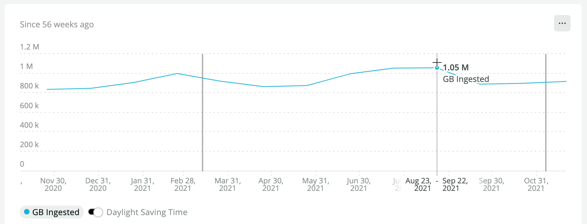
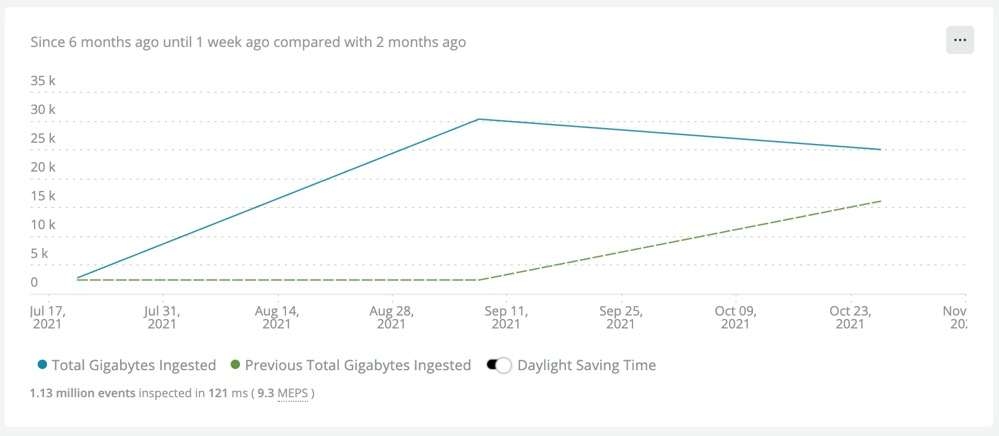
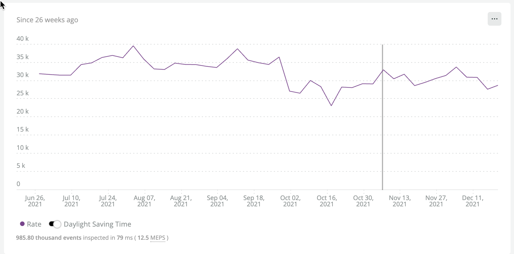

### High Level Accounting

At this point it is necessary to get a high level view of all of the telemetry currently being generated in your organization.  The assumption is that any substantial organization will have a master account and multiple sub-accounts which may be dedicated to specific, teams, projects, or even separate business units.  In the context of New Relic it is necesssary to break the current ingest down by:

- Organization
- Sub account
- Billable Telemetry Type

There is value in deeper breakdowns but this one can be facilitated on any New Relic account.  

*Billable Telemetry Types*

- Mobile Events
- Infrastructure Hosts
- Infrastructure Integrations
- Infrastructure Processes
- APM Events
- Tracing
- Metrics
- Logging
- Custom Events
- Browser Events
- Serverless

<Callout variant="tip">
The remainder of this section will show some custom NRQL queries and dashboards that we can use to customize our view of data ingest.  However, we recommend you familarize yourself with the built-in [data ingest drilldown tool](https://docs.newrelic.com/whats-new/2021/06/data-ingest-drill-down/) in the NR1 Platform.
</Callout>


Download the [Data Ingest Analytics](dashboards/data-ingest-analytics.json) dashboard. Install it into your NR1 Master Account or POA account.  You will first need to edit the JSON to include your account id.  This will allow you a fairly flexible visualization of ingest by an organizations accounts and telemetry types.  Your view may vary depending on the number of accounts and telemetry types in your organization.  You can also visualize some built in views in New Relic's "Manage Your Data" UI.  For the purposes of transparency we will show examples of the underlying NRQL queries in this document.

Let's first see what our daily average ingest has been for the past month.  

```
SELECT rate(sum(GigabytesIngested), 1 day) AS 'Daily Ingest Rate (GB)'  FROM NrConsumption WHERE productLine = 'DataPlatform' LIMIT MAX SINCE 30 days AGO
```
*Note the use of the `rate` operator.  This will be very useful when querying the NrConsumption model.*

Our simple response for the entire organization is

```
Daily Ingest Rate: 30.4 k
```

That's a little over 30,000 GB or 30 TB per day or overy 900TB per month.  While that's a very impressive number and is meaningful to the procurement department and whoever needs ot know this months bill.  It is only the starting point to setup a data governance plan.   Let's assume our organization has a yearly budget for the current fiscal for 12TB per year.  We could infer that we are at about 90% of budget with the calculation but that assumes we are consuming at steady rate of 900TB each month.  Due to seasonality and observavabily needs evolving that is almost never the case.  Here is our actual consumption over the past 12 months. Let's do a simple `sum` rather than a rate since we have all the data collected.  Note that December 2021 will be incomplete since we are not all the way through the month.

```
SELECT sum(GigabytesIngested) AS 'Daily Ingest Rate (GB)'  FROM NrConsumption WHERE productLine = 'DataPlatform' facet monthOf(timestamp) LIMIT MAX SINCE 56 weeks AGO
```

The resulting table shows fairly high variability.  Note that things were fairly `hot` in `august` and September.  Some of that is our organization seasonality but also was related to some increasing the breadth of our telemetry coverage.

|MONTH OF TIMESTAMP|GB INGESTED|
|---|---|
|December 2021*|636 k|
|November 2021|901 k|
|October 2021|873 k|
|September 2021|1.05 M|
|August 2021|1.08 M|
|July 2021|1.05 M|
|June 2021|887 k|
|May 2021|881 k|
|||

There was a bit of an effort to cool things down a bit in the fall.
Here is where a timeseries really helps





```
SELECT rate(sum(GigabytesIngested), 1 day) AS 'Daily Ingest Rate (GB)'  FROM NrConsumption WHERE productLine = 'DataPlatform' FACET usageMetric LIMIT MAX SINCE 30 days AGO
```


|Usage Metric|Daily Ingest Rate (GB)|
|---|---|
|MobileEventsBytes|9494.4826089365|
|InfraProcessBytes|7669.19820781793|
|ApmEventsBytes|4963.984544762140|
|MetricsBytes|2628.792197218970|
|InfraIntegrationBytes|2350.775419285230|
|InfraHostBytes|1276.2645170261700|
|CustomEventsBytes|940.0184543993|
|LoggingBytes|807.1707645250340|
|TracingBytes|160.5486142743330|
|BrowserEventsBytes|79.75575001916670|
|ServerlessBytes|6.372198490000000|
|||

Since we are trying to get a general lay of the land let's creat a time series query based on our previous query so we can see the daily ingest rates for the last six months

```
SELECT rate(sum(GigabytesIngested), 1 day) AS avgGbIngestTimeseries  FROM NrConsumption WHERE productLine = 'DataPlatform' FACET usageMetric LIMIT MAX SINCE 180 days AGO TIMESERIES auto
```


This kind of view provides a lot of visual information, especially if you have at least a little familiarity with the org.  Note the dip in InfraIntegrationBytes in late September.   A good working theory is that it's related to when the one of the teams altered the sample rate for their Postgres integration.  Looking at a vew like this periodically and comparing it to known ongoing work is a really valuable thing as we always want to be able to explain such dips (or spikes as the case may be).  

One final thing we can do very easily with a simple modification of the previous queries is we can facet the queries by account.  We have a far greater ability know who made a change if we can narrow it down to a specific account and telemetry type.

Let's look at the 30 day rate for all of our accounts using the last 60 days as input data.  This 30 day rate gives us the best estimate for what a customer's data ingest bill would be.


Let's limit to 5 results to keep the example table small:

```
SELECT rate(sum(GigabytesIngested), 30 day) AS avgGbIngestTimeseries  FROM NrConsumption WHERE productLine = 'DataPlatform' FACET consumingAccountName  LIMIT 10 SINCE 60 days ago
```

|Consuming Account Name|30 Day Ingest GB|
|---|---|
|Master Account|154416.2783845950|
|Streaming Video Team|147954.21967237500|
|Cloud Platform Team|100012.83564087500|
|Experimental Technology Team|88635.5364573755|
|Finance and Accounting Team|78512.21037361650|
|International Servivces|49788.566752227500|
|Shipping & Receiving|48850.56031237550|
|Front End Development|45605.86433004600|
|Marketing Technology|27633.66805779|
|||

### Alerting on Consumption anomalies
 
<Callout variant="tip">
Most organizations will want to setup some automated `tripwires` which will give early warning of unforseen.  We highly recommend you study [this guide](https://docs.newrelic.com/docs/accounts/accounts-billing/new-relic-one-pricing-billing/usage-queries-alerts/) on using NRQL Alerts to notify your organization when consumption anomalies (data or user) occur.
</Callout>

 

#### Artifact Definition: Ingest Baseline Report

To some of extent we have explored the main components of an ingest baseline report in the previous section.  Here we will simply codify the facts you will want to generate on at least monthly basis.  Having them in a dashboard may suffice, but it is also suitable to supplement with a spreadsheet of the most important values.  These figures should be updated at least as frequently as the chosen cadence of Check-in sessions (be it monthly or qurterly).  We suggest maintining them in dashboard form as well as a shared folder with spreadsheet versions of the most relevant ones.


|Fact|Type|Query|
|---|---|---|
|consuming-accounts|Number|SELECT uniqueCount(consumingAccountName) from NrConsumption since 7 days ago|
|avg-daily-rate-30-day-full-org-num|Number|SELECT rate(sum(GigabytesIngested), 1 day) FROM NrConsumption WHERE productLine = 'DataPlatform' LIMIT MAX SINCE 1 month AGO|
|daily-rate-9-month-full-org-ts|Timeseries|SELECT rate(sum(GigabytesIngested), 1 day) FROM NrConsumption WHERE productLine = 'DataPlatform' LIMIT MAX SINCE 9 months AGO TIMESERIES auto|
|consumption-by-month-full-org-ts|Timeseries|SELECT sum(GigabytesIngested) FROM NrConsumption WHERE productLine = 'DataPlatform' LIMIT MAX SINCE 56 weeks AGO TIMESERIES 30 days|
|consumption-by-month-full-org-table-tb|Table|SELECT sum(GigabytesIngested) FROM NrConsumption WHERE productLine = 'DataPlatform' facet monthOf(timestamp) LIMIT MAX SINCE 56 weeks AGO|
|avg-daily-rate-30-day-teltype-num|Table|SELECT rate(sum(GigabytesIngested), 1 day) FROM NrConsumption WHERE productLine = 'DataPlatform' LIMIT MAX SINCE 1 month AGO facet usageMetric |
|daily-rate-9-month-teltype-ts|Timeseries|SELECT rate(sum(GigabytesIngested), 1 day) FROM NrConsumption WHERE productLine = 'DataPlatform' LIMIT MAX SINCE 9 months AGO TIMESERIES auto facet usageMetric|
|consumption-by-month-teltype-ts|Timeseries|SELECT sum(GigabytesIngested) FROM NrConsumption WHERE productLine = 'DataPlatform' LIMIT MAX SINCE 56 weeks AGO TIMESERIES 30 days facet usageMetric|
|consumption-by-month-teltype-table-tb|Table|SELECT sum(GigabytesIngested) FROM NrConsumption WHERE productLine = 'DataPlatform' facet monthOf(timestamp), usageMetric  LIMIT MAX SINCE 56 weeks AGO|
|avg-daily-rate-30-day-acct-teltype-num|Table|SELECT rate(sum(GigabytesIngested), 1 day) FROM NrConsumption WHERE productLine = 'DataPlatform' LIMIT MAX SINCE 1 month AGO facet usageMetric, consumingAccountName |
|avg-daily-rate-9-month-acct-teltype-ts|Timeseries|SELECT rate(sum(GigabytesIngested), 1 day) FROM NrConsumption WHERE productLine = 'DataPlatform' LIMIT MAX SINCE 9 months AGO TIMESERIES auto facet usageMetric, consumingAccountName |
|consumption-by-month-acct-teltype-ts|Timeseries|SELECT sum(GigabytesIngested) AS FROM NrConsumption WHERE productLine = 'DataPlatform' LIMIT MAX SINCE 56 weeks AGO TIMESERIES 30 days facet usageMetric, consumingAccountName|
|consumption-by-month-acct-teltype-table-tb|Table|SELECT sum(GigabytesIngested) FROM NrConsumption WHERE productLine = 'DataPlatform' facet monthOf(timestamp), usageMetric, consumingAccountName   LIMIT MAX SINCE 56 weeks AGO|
||||

#### Change Analysis

There are some powerful techniques we can use to understand the rate of change in certain telemetry.  These change analysis techniques can be used to develop quarter and yearly growth estimates.  Some techniques include:

1. NRQL `COMPARE WITH` operator

```
SELECT sum(GigabytesIngested) FROM NrConsumption WHERE productLine = 'DataPlatform'  and usageMetric = 'BrowserEventsBytes' since 6 months ago until 1 week ago TIMESERIES 7 weeks COMPARE WITH 2 months ago
```




2. NRQL `SLIDING WINDOW` operator (for smoothing away certain noise)

Telemetry is inherently noisy.  Real world phenomeno happen in spurts leaving with many random peaks and troughs in the signal.  This is good in a way since it lets us view the full comlexity of a phenomenon.  However when we are seeking to see trends we can be distracted by detail.  NRQL provides a powerful to smoothing out any time series by cominging each data point with slightly older points  This let's us focus on the overall temporal trend rather than one extreme `increase` or `decrease`


Note the jaggedness of the raw timeseries for 1 day ingest rate:

```
FROM NrConsumption SELECT rate(sum(GigabytesIngested), 1 day) WHERE productLine = 'DataPlatform' since 26 weeks ago TIMESERIES 1 day
```


Now if we use a [sliding window](https://docs.newrelic.com/docs/query-your-data/nrql-new-relic-query-language/nrql-query-tutorials/create-smoother-charts-sliding-windows/) of 4 days to reduce the impact of single day events we will see a clearer picture.  Four days is a good choice since it will blur the impact of `weekends` so data for a Sunday will be combined somewhat with data for a Friday etc.


```
FROM NrConsumption SELECT rate(sum(GigabytesIngested), 1 day) WHERE productLine = 'DataPlatform' since 26 weeks ago TIMESERIES 1 DAY SLIDE BY 4 days
```



3. ADVANCED TREND ANALYSIS

NRQL provides us some tools to assess the rate of change.  This is useful since as we see in the previous example we had a very large increase over the past several months in Browser metrics.  This rate of change analysis uses the `derivative` operator and it gives us some confidence that the main growth happened back in early September.  It seems as though our growth rate based on the 7 day derivative is somewhat negative so we may have reached a new plateau at the moment in BrowserEventsBytes ingest.

```
SELECT derivative(sum(GigabytesIngested) , 7 day) FROM NrConsumption WHERE productLine = 'DataPlatform'  and usageMetric = 'BrowserEventsBytes'  LIMIT MAX SINCE 3 MONTHS AGO UNTIL THIS MONTH TIMESERIES 1 MONTH slide by 3 days compare with 1 week ago
```


In this scenario the uptick was so blatant a simple time series of the rate will suffice.  However the benefit of the deriviative is it can be more sensitive at assessing the relative quanty of growth and give us a sense of when it first started.  This can be useful if we in the early stages of a major uptick.

Here is the simple plot of the SUM

```
SELECT sum(GigabytesIngested) FROM NrConsumption WHERE productLine = 'DataPlatform'  and usageMetric = 'BrowserEventsBytes'  TIMESERIES  7 days since 6 months ago
```


#### Advanced: Drilling Deeper With `bytescountestimate()`

So far our discussions of analyzing data ingest have focused on the NrConsumption model.  This is intentional since this is the one model that all NR accounts will be able to leverage in their data governance program.  The drawback of that model is that it can only be grouped by the `consumingAccount` and the `usageMetric` (i.e, high level telemetry type).  There are times when we need to drill deeper in order to inform our growth forecasts and overall governance process.  For example:

- We see that InfraProcessBytes has increased dramatically accross all accounts but do not know why
- We have started to embrace Logs but feel like we have a hard time attributing log ingest by log level.
- We recently introduced metrics from Prometheus but can't tell easily which metrics comprise the bulk of data ingest.
- We want a better accounting of which APM or Browser applications contribute to TDP
- We want to know how much we are spending on MSSQL database monitoring

In this section we'll show some approaches to better understanding some of these.   In order to fully exploit this technique it helps to have a proper metadata standard for your organization.  That will be disucssed in the section on the *Telemetry Standards Guide*

__NOTE__: These queries will need to be run a normal consuming account.  Not a `Partnership` account.  In Partnership accounts you only have access to NrConsumption, but cannot query the underlying telemetry.

**Example 1: InfraProcessBytes**


```
ProcessSample gathers detailed resource usage information from programs running on a single system. We take a snapshot of this data every 20 seconds (configurable) for every active process and package it into a ProcessSample event, which is then sent to New Relic.
```

Process sample volume can be controlled by drop rules, as well as agent side sample rate configurations and even regex patterns in the Infrastructure agent itself.

First without faceting let's explore how many bytes of ingest are consumed by the [ProcessSample](https://docs.newrelic.com/docs/infrastructure/manage-your-data/data-instrumentation/default-infrastructure-monitoring-data/) event on our `Streaming Media Team` account in the last 7 days.

With the following query:

```
FROM ProcessSample select bytecountestimate()/10e8 as 'GB Ingested' since 7 days ago
```

We get the response:

```
63.296
GB Ingested
```

On a platform like New Relic where there is a transparent per GB ingest cost.  We can easily convert that into dollars with the formula `63.296*0.25` which yields $15.  So to collect process samples 

As an example of how can attribute specific ingest amounts to specific teams or platforms we'll modify the query to facet by the `team` tag which is one of our organizations standard infrastructure tag.

```
FROM ProcessSample select bytecountestimate()/10e8 as 'GB Ingested' since 7 days ago facet team 
```

From which we get the following result:

```
8.885
News

7.65
Entertainment

47.04
Other
```

From that we can know definitely that collecting process samples on Entertainment hosts costs $1.92 in the last 7 days.  More importantly we are now aware that the category `Other` which cost us $11.76 in the past 7 days.  This is a great argument for prioritizing metadata standards since by adhering to a consistent standard we can only account for the per-team cost of about 1/3 of our ingest for this particular telemetry type.


**Example 2: Logs**

We have recently begin to try to understand how different log sources contribute to our data ingest.  We have some written standards on attribution by application and log level, but what we've found is that there is great inconsistent even within a single account.  Some logs use `app` some use `application` others use `loglevel` others use `level` and still others use `log.level`.   Regardless we want to make sum general assessments of how many of our logs have not level indicator at all and how much those cost us each week.

First let's see what we are ingesting monthly in the Fantasy Sports Team account:

```
FROM Log select bytecountestimate()/10e8 as 'GB Ingested' since 7 days ago
```

Results in:

```
2552.504
GB Ingested
```

or about $638 in the past 7 days.  The obvious query to run is:

```
FROM Log select bytecountestimate()/10e8 as 'GB Ingested' where level = 'DEBUG' since 7 days ago facet level 
```

We know there is some inconsistency in the way in which we log `DEBUG` status so we use the like operator

```
FROM Log select bytecountestimate()/10e8 as 'GB Ingested' where level like '%DEBUG%' since 7 days ago facet level 
```

Which results in:


```
1.46
DEBUG

0.0253
app.DEBUG

0.000264
security.DEBUG

2252.74
Other
```

This is a warning sign that the use of the `level` attribute is not standard enough as we are ingesting over 88% of Logs without this attribute.  After some discussion with the development teams we realize that we have the following attributes that may indicate log level:

- level_value
- loglevel
- level
- log.level

Running the following query shows us we have 50% of our logs covered by at least one of these:

```
FROM Log select bytecountestimate()/10e8 as 'GB Ingested' since 7 days ago where level is NOT NULL or level_value is NOT NULL or loglevel is NOT NULL or log.level is not NULL
```

**Example 2: MSSQL**

The higher level NrConsumption model is very useful but can often obfuscate who much individual instrumentation contribute.  We have a team that has seen a 2x uptick in the GigabytesIngested for the InfraIntegrationBytes telemetry type.  They are unsure what contributed to it.

In the team account we see that the InfraIntegrationBytes for the past 7 days is 76GB.
They have a hunch that a substantial amount of the growth came from the addition of new MSSQL instances.  However there were also some 
The following query will provide a definitive answer as to how much of the InfraIntegrationBytes is acounted for:

```
FROM MssqlDatabaseSample, MssqlInstanceSample, MssqlWaitSample select bytecountestimate()/10e8 since 7 days ago
```

Results in:

```
49.55
GB Ingested
```

Which confirms our assesment that they MSSQL on host integration is the reason for the increase.
On additional query that will help us in our forecasting is to understand how many hosts we are monitoring.
Running the unique host count shows us that we have 10 hosts being monitored with the MSSQL OHI.  Since we plan on adding an additional 5 hosts next quarter.  We can make sure that we add an additional 100GB per month of ingest or an additional $25. 


## Technical Resources [#data-ingest-tech-resources]

[Manage Incoming Data](https://docs.newrelic.com/docs/data-apis/manage-data/manage-data-coming-new-relic/)

[Data Management Hub](https://docs.newrelic.com/docs/data-apis/manage-data/manage-your-data/)

[Drop Data Using Nerdgraph](https://docs.newrelic.com/docs/data-apis/manage-data/drop-data-using-nerdgraph/)

[Alert on Data Ingest Anomalies](https://docs.newrelic.com/docs/accounts/accounts-billing/new-relic-one-pricing-billing/usage-queries-alerts/)

[Automating Telemetry Workflows](https://developer.newrelic.com/automate-workflows/)

[Metrics Aggregation and Events to Metrics](https://docs.newrelic.com/docs/data-apis/convert-to-metrics/create-metrics-other-data-types/)
