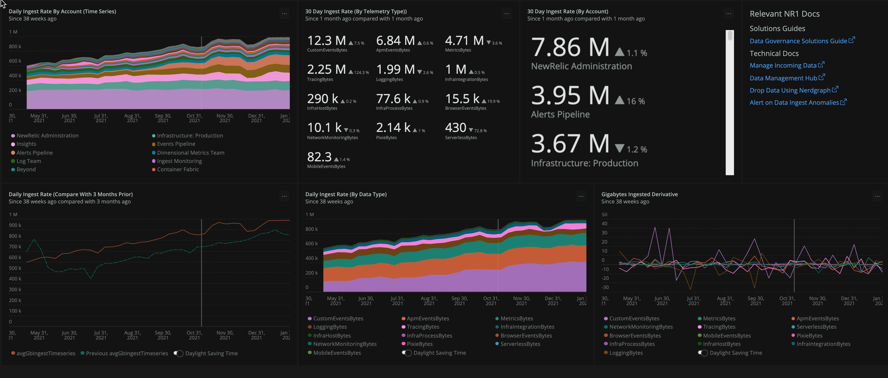
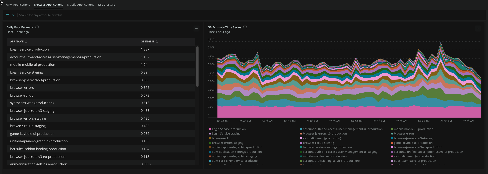

In this stage it is necessary to get a high level view of all of the telemetry currently being generated by your organization.  The unit focuses on breaking down ingest stats into various groups such as account, telemetry type, and application.  These figures will be used to inform the [Optimize your ingest data](/docs/new-relic-solutions/observability-maturity/operational-efficiency/dg-optimizing) and [Forecast your ingest data](/docs/new-relic-solutions/observability-maturity/operational-efficiency/dg-growth) stages.

You'll learn how to generate a structured breakdown report for the following dimensions:

- Organization
- Sub account
- Billable Telemetry Type

In the advanced topics section you'll see how to create some highly granular breakdowns including:

- Application (APM|Browser|Mobile)
- Infrastructure Integration


## Prerequisites

<CollapserGroup>
<Collapser
    id="understand-nr-consumption-metrics"
    title="Understand NrConsumption: New Relic's built-in ingest model"
    >

All billable telemetry is tracked in the `NrConsumption` and `NrMTDConsumption` events.  In each of those events the attribute `usageMetric` denotes a general group of billable telemetry. 

* `NrConsumption` records usage every hour, and is the equivalent of "real-time" usage. Use this event to observe usage trends over time. 
* `NrMTDConsumption` generates aggregate values from the `NrConsumption` event. Use this event to see usage or estimated cost by monthly billing period. For organizations on the core user release, this is the best event for querying user count. 


In NRQL we can ask a question like "How much browser data have we ingested in the last 30 days and break it down by sub-account and compare it against the previous 30 days"
 
```
FROM NrConsumption select sum(GigabytesIngested) where usageMetric = 'BrowserEventsBytes' since 30 days ago compare with 30 days ago facet consumingAccountName
```

The response shows us how many GB of Browser data we've brought in by account.

```
Banking Platform, 75 GB, +2.9%
Marketing Platform, 40 GB, -1.3%
```


It's important to note that our granularity is to the `usageMetric` and `consumingAccountName`.  The NrMTDConsumption event is a more aggregated data strucutre that does not include that level of granularity.


*Billable Telemetry Breakdown*

<table>
  <thead>
    <tr>
      <th style={{ width: "200px" }}>
        NrcConsumption.usageMetric
      </th>
      <th style={{ width: "200px" }}>
        Constituent Events
      </th>
      <th>
        Source
      </th>
    </tr>
  </thead>
  <tbody>
    <tr>
      <td>
        `InfraHostBytes`
      </td>
      <td>
        `SystemSample`, `StorageSample`, `ContainerSample`, `InfrastructureEvent`
      </td>
      <td> 
        Infrastructure Agent
      </td>
    </tr>
    <tr>
      <td>
        `InfraProcessBytes`
      </td>
      <td>
        `ProcessSample`
      </td>
      <td>
        Infrastructure Agent
      </td>
    </tr>
    <tr>
      <td>
        `InfraIntegrationBytes`
      </td>
      <td>
        Various Events
      </td>
      <td>
        [On-Host-Integrations](https://docs.newrelic.com/docs/infrastructure/host-integrations/get-started/introduction-host-integrations/) and Certain [Cloud Integrations](https://docs.newrelic.com/docs/infrastructure/infrastructure-integrations/get-started/introduction-infrastructure-integrations/#cloud)
      </td>
    </tr>
    <tr>
      <td>
        ApmEventsBytes
      </td>
      <td>
        `Transaction`, `TransactionError`
      </td>
      <td>
        APM Agent(s)
      </td>
    </tr>
    <tr>
      <td>
        TracingBytes
      </td>
      <td>
        `Span`, `SpanEvent`
      </td>
      <td>
        APM Agent(s) and OTEL
      </td>
    </tr>
    <tr>
      <td>
        BrowserEventBytes
      </td>
      <td>
        `Browser`, `Browser:EventLog`, `Browser:JSErrors`, `PcvPerf`, `PageViewTiming`
      </td>
      <td>
        Browser Agent
      </td>
    </tr>
    <tr>
      <td>
        MobileEventsBytes
      </td>
      <td>
        `Mobile`, `MobileRequestError`, `MobileSession`, `MobileHandleException`, `MobileCrash`
      </td>
      <td>
        Mobile Agent
      </td>
    </tr>
    <tr>
      <td>
        SeverlessBytes
      </td>
      <td>
        Cloud-specific (i.e., AWS Lambda Events)
      </td>
      <td>
        Cloud-specific (i.e., AWS Lambda Integration)
      </td>
    </tr>
    <tr>
      <td>
        LoggingBytes
      </td>
      <td>
        `Log` as well as partition-specific events of the pattern `[partition].Log`
      </td>
      <td>
        Various (Fluentd, FluentBit, Syslog, Cloud-specific streaming services)
      </td>
    </tr>
    <tr>
      <td>
        MetricEventBytes
      </td>
      <td>
        `Metric`
      </td>
      <td>
        Various dimensional metrics (Prometheus, Cloud-specific streamed metrics, agent-specific dimensional metrics)
      </td>
    </tr>
    <tr>
      <td>
        CustomEventBytes
      </td>
      <td>
        Various
      </td>
      <td>
        Various APIs
      </td>
    </tr>
  </tbody>
</table>

View this [guide](https://docs.newrelic.com/docs/data-apis/manage-data/manage-data-coming-new-relic/) for reference.
</Collapser>

  <Collapser
    id="baseline-query-examples"
    title="Understand bytecountestimate() for more granular breakdown"
    >

We assume you'll need to customize them to some extent to match the organization specifics.

<CollapserGroup>
### Examples    
  <Collapser
    id="ingest-by-application"
    title="Ingest By Application (APM|Browser|Mobile)"
    >

Run these queies in each sub-account or in a dashboard with account-specific charts.  The queries estimate a 30 day rate based on 1 week of collection.

*Estimate 30 Day Rate*

_APM_

```
FROM Transaction, TransactionError, TransactionTrace, SqlTrace, ErrorTrace, Span select rate(bytecountestimate()/10e8, 30 day) as 'GB Ingest' facet appName since 1 week ago
```

_BROWSER_

```
FROM PageAction, PageView, PageViewTiming, AjaxRequest, JavaScriptError select rate(bytecountestimate()/10e8, 30 day) as 'GB Ingest' facet appName since 1 week ago
```

_MOBILE_

```
FROM Mobile, MobileRequestError, MobileSession select rate(bytecountestimate()/10e8, 30 day) as 'GB Ingest' facet appName since 1 week ago 
```

  </Collapser>
  <Collapser
    id="metric-ingest-by-integration"
    title="Metric Ingest By Integration"
    >

The `Metric` namespace is quite monolithic.  This can make it challenging to understand what the source of all of this data is.  We can facet by `usage.Integration` to get a rough sense of where these are coming in.  It's possible to go deeper, but for a general baseline this is adquate.
Some examples of `usage.Integration` values that will show up with this facet are:

- com.newrelic.mssql (the New Relic MSSQL OHI)
- com.newrelic.rabbitmq (the New Relic RabbitMQ OHI)
- EC2 (the AWS EC2 integration)
- Lambda (the Lambda integration)

Run these queies in each sub-account or in a dashboard with account-specific charts

*Estimate 30 Day Rate*

```
FROM Metric select rate(bytecountestimate()/10e8, 30 day) facet usage.integrationName since 1 week ago
```

*Seven Day Sum*


```
FROM Metric select bytecountestimate()/10e8 facet usage.integrationName since 1 week ago
```

  </Collapser>
  <Collapser
    id="ingest-by-k8s-cluster"
    title="Ingest By K8s Cluster"
    >

*Estimate 30 Day Rate*

```
FROM K8sClusterSample, K8sContainerSample,K8sDaemonsetSample, K8sDeploymentSample, K8sEndpointSample, K8sHpaSample, K8sNamespaceSample, K8sNodeSample, K8sPodSample, K8sReplicasetSample, K8sServiceSample, K8sVolumeSample select rate(bytecountestimate()/10e8, 30 day) as 'GB Ingest' facet clusterName since 1 weeks ago
```

  </Collapser>
  <Collapser
    id="ingest-by-process-sample"
    title="Process Samples"
    >
   ProcessSample can be quite a high volume event.  In this example we'll compute the 30 day ingest per commandline.

    *Estimate 30 Day Rate By Command Name*

    ```
    FROM ProcessSample select rate(bytecountestimate()/10e8, 30 day) as 'GB Ingested' facet commandName since 1 day ago
    ```

  </Collapser>
 </CollapserGroup>
</Collapser>
<Collapser
  id="nrql-operators-for-baselining"
  title="Understand These 5 NRQL Operators for Baselining & Change Modeling"
>

## Important NRQL Operators for Baselining & Change Modeling

<CollapserGroup>
  <Collapser
    id="the-rate-operator"
    title="Rate"
    >

<Callout variant='IMPORTANT' title='When to Use'>
use the `rate` operator when you need to take a sample of data pulled from a certain time period and produce a given rate.  For example take a daily sample of data and compute a 30 day rate based on that.
</Callout>

*Compute rate based on a given sample of data*

Let's first see what our daily average ingest has been for the past month.  

```
SELECT rate(sum(GigabytesIngested), 1 day) AS 'Daily Ingest Rate (GB)'  FROM NrConsumption WHERE productLine = 'DataPlatform' LIMIT MAX SINCE 30 days AGO
```
*Note the use of the `rate` operator.  This will be very useful when querying the NrConsumption model.*

Our simple response for the entire organization is

```
Daily Ingest Rate: 30.4 k
```

That's a little over 30,000 GB or 30 TB per day or overy 900TB per month.  While that's a very impressive number and is meaningful to the procurement department and whoever needs ot know this months bill.  It is only the starting point to setup a data governance plan.   Let's assume our organization has a yearly budget for the current fiscal for 12TB per year.  We could infer that we are at about 90% of budget with the calculation but that assumes we are consuming at steady rate of 900TB each month.  Due to seasonality and observavabily needs evolving that is almost never the case.  Here is our actual consumption over the past 12 months. Let's do a simple `sum` rather than a rate since we have all the data collected.  Note that December 2021 will be incomplete since we are not all the way through the month.


</Collapser>
  <Collapser
    id="the-month-of-operator"
    title="MonthOf"
    >

<Callout variant='IMPORTANT' title='When to Use'>
When it's important to constrain an ingest calculation to specific calendar months.  For example ingest for an integration may have increased in late January and continued through mid February.  This operator will help facet the ingest to the specific calendar months used for billing.
</Callout>

*Facet by calendar month*

```
SELECT sum(GigabytesIngested) AS 'Daily Ingest Rate (GB)'  FROM NrConsumption WHERE productLine = 'DataPlatform' facet monthOf(timestamp) LIMIT MAX SINCE 56 weeks AGO
```

The resulting table shows fairly high variability.  Note that things were fairly `hot` in `august` and September.  Some of that is our organization seasonality but also was related to some increasing the breadth of our telemetry coverage.

|MONTH OF TIMESTAMP|GB INGESTED|
|---|---|
|December 2021*|636 k|
|November 2021|901 k|
|October 2021|873 k|
|September 2021|1.05 M|
|August 2021|1.08 M|
|July 2021|1.05 M|
|June 2021|887 k|
|May 2021|881 k|
|||


</Collapser>
<Collapser
   id="change-analysis"
   title="Compare With"
   >

<Callout variant='IMPORTANT' title='When to Use'>
When you want to evaluate the amount of change in ingest volume or rate between one time period in another.  This is important to know if you ingest is creeping up unexpetedly.
</Callout>

*Simple Change Analysis*

```
SELECT sum(GigabytesIngested) FROM NrConsumption WHERE productLine = 'DataPlatform'  and usageMetric = 'BrowserEventsBytes' since 6 months ago until 1 week ago TIMESERIES 7 weeks COMPARE WITH 2 months ago
```


</Collapser>

<Collapser
   id="sliding-window"
   title="Sliding Window"
   >

<Callout variant='IMPORTANT' title='When to Use'>
When you need to remove the effects of regular variability of ingest to see the broader pattern.
</Callout>


Telemetry is inherently noisy.  Real world phenomeno happen in spurts leaving with many random peaks and troughs in the signal.  This is good in a way since it lets us view the full comlexity of a phenomenon.  However when we are seeking to see trends we can be distracted by detail.  NRQL provides a powerful to smoothing out any time series by cominging each data point with slightly older points  This let's us focus on the overall temporal trend rather than one extreme `increase` or `decrease`


Note the jaggedness of the raw timeseries for 1 day ingest rate:

```
FROM NrConsumption SELECT rate(sum(GigabytesIngested), 1 day) WHERE productLine = 'DataPlatform' since 26 weeks ago TIMESERIES 1 day
```


Now if we use a [sliding window](https://docs.newrelic.com/docs/query-your-data/nrql-new-relic-query-language/nrql-query-tutorials/create-smoother-charts-sliding-windows/) of 4 days to reduce the impact of single day events we will see a clearer picture.  Four days is a good choice since it will blur the impact of `weekends` so data for a Sunday will be combined somewhat with data for a Friday etc.


```
FROM NrConsumption SELECT rate(sum(GigabytesIngested), 1 day) WHERE productLine = 'DataPlatform' since 26 weeks ago TIMESERIES 1 DAY SLIDE BY 4 days
```


</Collapser>

<Collapser
   id="derivative"
   title="Derivative"
   >
<Callout variant='IMPORTANT' title='When to Use'>
Use to estimate the statistical rate of change over a given time period.  The rate of change is calculated using a linear least-squares regression to approximate the derivative
</Callout>

NRQL provides us some tools to assess the rate of change.  This is useful since as we see in the previous example we had a very large increase over the past several months in Browser metrics.  This rate of change analysis uses the `derivative` operator and it gives us some confidence that the main growth happened back in early September.  It seems as though our growth rate based on the 7 day derivative is somewhat negative so we may have reached a new plateau at the moment in BrowserEventsBytes ingest.

```
SELECT derivative(sum(GigabytesIngested) , 7 day) FROM NrConsumption WHERE productLine = 'DataPlatform'  and usageMetric = 'BrowserEventsBytes'  LIMIT MAX SINCE 3 MONTHS AGO UNTIL THIS MONTH TIMESERIES 1 MONTH slide by 3 days compare with 1 week ago
```


In this scenario the uptick was so blatant a simple time series of the rate will suffice.  However the benefit of the deriviative is it can be more sensitive at assessing the relative quanty of growth and give us a sense of when it first started.  This can be useful if we in the early stages of a major uptick.

Here is the simple plot of the SUM

```
SELECT sum(GigabytesIngested) FROM NrConsumption WHERE productLine = 'DataPlatform'  and usageMetric = 'BrowserEventsBytes'  TIMESERIES  7 days since 6 months ago
```


</Collapser>
</CollapserGroup>
</Collapser>

</CollapserGroup>

## Install the data governance dashboard

### Option 1: Quick Install With New Relic IO

1. Click on the New Relic Instant Observabilty icon at the top of the NR1 UI
2. Check the `Dashboards` filter and enter the word `Governance` into the text filter


3. Click `Install this Quickstart` in the upper right
4. Select your top level master accoun tor POA account in the account drop down
5. Click `Done` since there is no agent to install and then click `See your data`

That will bring you to the newly installed dashboard

### Option 2: Manually Install the Dashboard JSON

1. In a new tab [open](https://github.com/newrelic/newrelic-quickstarts/blob/main/quickstarts/oma-data-gov/dashboards/data-ingest-baseline.json) the *Data Governance Baseline* dashboard JSON in Github.
2. Download the file locally  
3. Edit the file to use your account id (This template uses an accountId of `0` as a placeholder).
4. Install it into your NR1 Master Account or POA account using the [import dashboard function](https://docs.newrelic.com/docs/query-your-data/explore-query-data/dashboards/introduction-dashboards/#dashboards-import)

### Dashboard Overview 

The main overview tab shows a variety of charts including some powerful time series views.  



The second tab is for tabular baseline reports. 


The remaining tab are detailed view for specific telemetry types such as Logs, Traces, etc

Detail tabs include:

- APM
- Tracing
- Browser
- Mobile
- Infra (Host)
- Infra (Process)
- Infra (Integration)
- Custom Events
- Serverless
- Pixie

<Callout variant="tip">
In addition to the custom queries used in the next section we suggest you familarize yourself with the built-in [data ingest drilldown tool](https://docs.newrelic.com/whats-new/2021/06/data-ingest-drill-down/) in the NR1 Platform.
</Callout>

## Generate your report

1. Open the previously installed *Data governance baseline* dashboard.
2. Click on the *Baseline report* tab.
3. Click on `...` in the upper right of the "Last 30 Days" table and choose `Export as CSV`
4. Import the CSV into *Google Sheets* or the spreadsheet of your choice.

*Alternatively* if you did not install the dashboard you may simply use this query to create a custom chart in [Query Builder](https://docs.newrelic.com/docs/query-your-data/explore-query-data/query-builder/introduction-query-builder/):

```
SELECT sum(GigabytesIngested) AS 'gb_ingest_30_day_sum', rate(sum(GigabytesIngested), 1 day) AS 'gb_ingest_daily_rate', derivative(GigabytesIngested, 90 day) as 'gb_ingest_90_day_derivative' FROM NrConsumption WHERE productLine='DataPlatform' since 30 days ago facet consumingAccountName, usageMetric  limit max
```

Below is an example of a sheet we imported into Google Sheets.  Feel free to view it [here](https://docs.google.com/spreadsheets/d/16HxvpAsPoLu3nJgApsN9zfMPF65ikCF1vAUBk9b_F7g/edit?usp=sharing).


The screenshot shows the table sorted by 30 day ingest total.

Feel free to adjust your timeline and some of the details as needed.  For example, we chose to extract a *90 day derivative* to have some sense of change over the past few months.  You could easily alter the time period of the derivative to suite your objectives.

## Customize your report

Add useful columns to your report in order to facilitate other phases of data governance such as *optimize* and *forecast*.  The following fields will help guide optimization and planning decisions:

- Notes: Note any growth anomalies and any relevant explanations for them.  Indicate any major expected growth if foreseen.
- Technical Contact: Name of the manager of a given sub-account or someone related to a specific telemetry type.

## Detecting Ingest Anomalies

### Alerts

Most organizations will want to setup some automated `alerts` that will give early warning of unexpected spikes in ingest usually on a day over day, week over week, or month over month basis.  We highly recommend you study [this guide](https://docs.newrelic.com/docs/accounts/accounts-billing/new-relic-one-pricing-billing/usage-queries-alerts/) on using NRQL Alerts to notify your organization when consumption anomalies (data or user) occur.

In addition to using NR alerts to identify consumption anomalies, you can use New Relic's Lookout anomaly visualization tool to explore for any potential ingest anomalies.  This is particular useful against the NrConsumption data model.

### Lookout View

New Relic's Lookout allows you to provide nearly any NRQL query and it will search for anomalies over a given period of time.
This view is based on the query

```
SELECT rate(sum(GigabytesIngested), 1 day) AS avgGbIngest FROM NrConsumption WHERE productLine='DataPlatform' facet usageMetric 
```


Simply changing the facet field to `consumingAcountName` gives us this view:


## Install The Entity Breakdown Dashboard (Optional)

In a previous section we installed the name ingest baseline dashboard that uses NrConsumption as it's primary source.  That's an important dashboard as it works nicely in a high level parent account or POA account.  In addition to that high level view we can create other visualizations that use `bytescountestimats()` to estimate ingest for nearly any event or metric.  A detailed overview of `bytescountestimate()` was discussed [in the prerequisites section](http://localhost:8000/docs/new-relic-solutions/observability-maturity/operational-efficiency/dg-baselining#baseline-query-examples).

1. In a new tab [open](https://raw.githubusercontent.com/JimHagan/docs-website/jhagan-data-governance-oma-module/src/content/docs/new-relic-solutions/observability-maturity/operational-efficiency/dashboards/data-governance-entity-breakdown.json) the *Data Governance Entity Breakdowns* dashboard JSON in Github.
2. Download the file locally  
3. Edit the file to use your account id (This template uses an accountId of `0` as a placeholder).
4. Install it into any account that contains APM, Browser, Mobile appliactions or K8s clusters [import dashboard function](https://docs.newrelic.com/docs/query-your-data/explore-query-data/dashboards/introduction-dashboards/#dashboards-import)



Feel free to modify this dashboard to suit the specific types of entities you are monitoring in your accounts.  NOTE: these queries are more taxing since they are not working from a pre-aggregated data source like NrConsumption.  It may be necessary to adjust the time frames and take advantage of addtional where clauses and the `limit` clause to make them performant.

## Install the Cloud Integration Dashboard (optional)

Cloud Integrations can often be the source of data ingest growth.  Without good visualizations it can be very difficult to pinpoint where the growth is coming from.  This is partly because these integrations are so easy to configure and they are not part of an organizations normal CI/CD pipeline and may also not be part of a formal configuration management system.
Fortunately this powerful set of dashboards can be installed [directly from New Relic I/O](https://onenr.io/0EPwJJO9Ow7).
Individual dashboards installed by this pakage include:

- AWS Integrations
- Azure Integrations
- GCP Integrations
- On-Host Integrations
- Kubernetes


## Relevant Docs [#data-ingest-tech-resources]

[Manage Incoming Data](https://docs.newrelic.com/docs/data-apis/manage-data/manage-data-coming-new-relic/)

[Data Management Hub](https://docs.newrelic.com/docs/data-apis/manage-data/manage-your-data/)

[Drop Data Using Nerdgraph](https://docs.newrelic.com/docs/data-apis/manage-data/drop-data-using-nerdgraph/)

[Alert on Data Ingest Anomalies](https://docs.newrelic.com/docs/accounts/accounts-billing/new-relic-one-pricing-billing/usage-queries-alerts/)

[Automating Telemetry Workflows](https://developer.newrelic.com/automate-workflows/)

[Metrics Aggregation and Events to Metrics](https://docs.newrelic.com/docs/data-apis/convert-to-metrics/create-metrics-other-data-types/)
