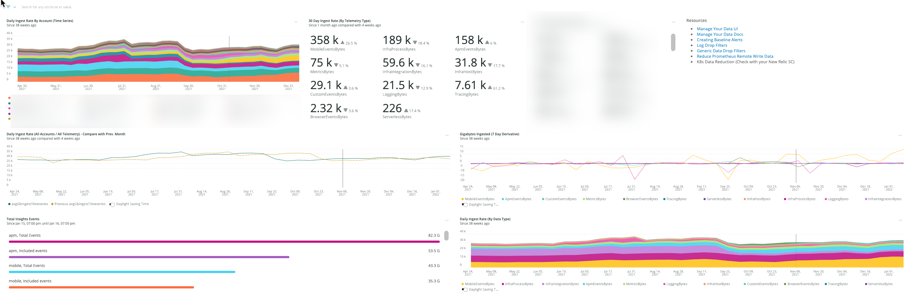
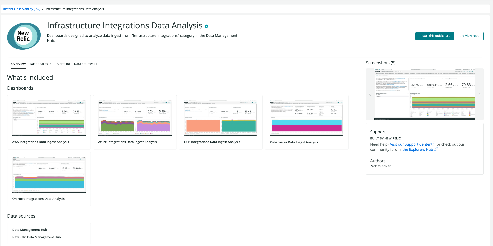

In this stage it is necessary to get a high level view of all of the telemetry currently being generated by your organization.  The unit will focus on various ways of breaking down ingest stats in various ways such as account, telemetry type, application and several other important facets.  These figures will be used to inform the [Optimizing](/docs/new-relic-solutions/observability-maturity/operational-efficiency/dg-optimizing) and [Optimizing](/docs/new-relic-solutions/observability-maturity/operational-efficiency/dg-optimizing) stages.
We'll show how to generate baselines for the following dimenions.

- Organization
- Sub account
- Billable Telemetry Type
- Infrastructure Integration

*Billable Telemetry Types Include:*

- Mobile Events
- Infrastructure Hosts
- Infrastructure Integrations
- Infrastructure Processes
- APM Events
- Tracing
- Metrics
- Logging
- Custom Events
- Browser Events
- Serverless
## Key Performance indicators [#key-performance-indicators]

These KPIs will be suitable in most organizations.  We assume you'll need to customize them to some extent.

<CollapserGroup>
### Technical KPIs

Technical KPIs are more familar and these are the ones we'll focus on the most.  These are not specifically tied to business activity, but relate to applications and platform which do support the business.

  <Collapser
    id="ingest-by-account"
    title="Ingest By Sub-Account"
    >

*Thirty Day Sum*


```SELECT sum(GigabytesIngested) FROM NrConsumption WHERE productLine = 'DataPlatform' since 30 days ago facet facet consumingAccountName```


*Average Daily Rate*

```SELECT rate(sum(GigabytesIngested), 1 day) FROM NrConsumption WHERE productLine = 'DataPlatform' since 30 days ago facet consumingAccountName```


*Calendar Month Tabulation*

```SELECT sum(GigabytesIngested) FROM NrConsumption WHERE productLine = 'DataPlatform' since 56 weeks ago facet monthOf(timestamp), consumingAccountName```

  </Collapser>
  <Collapser
    id="ingest-by-account-and-telemetry type"
    title="Ingest By Sub-Account & Telemetry Type"
    >

*Thirty Day Sum*


```SELECT sum(GigabytesIngested) FROM NrConsumption WHERE productLine = 'DataPlatform' since 30 days ago facet facet consumingAccountName, usageMetric```


*Average Daily Rate*

```SELECT rate(sum(GigabytesIngested), 1 day) FROM NrConsumption WHERE productLine = 'DataPlatform' since 30 days ago facet consumingAccountName, usageMetric```


*Calendar Month Tabulation*

```SELECT sum(GigabytesIngested) FROM NrConsumption WHERE productLine = 'DataPlatform' since 56 weeks ago facet monthOf(timestamp), consumingAccountName, usageMetric```


  </Collapser>
  <Collapser
    id="ingest-by-application"
    title="Ingest By Application (APM|Browser|Mobile)"
    >

Run these queies in each sub-account or in a dashboard with account-specific charts

*Daily Rate*

_APM_

```
FROM Transaction, TransactionError, TransactionTrace, SqlTrace, ErrorTrace, Span select rate(bytecountestimate()/10e8, 1 day) as 'GB Ingest' facet appName since 2 Weeks Days Ago
```

_BROWSER_

```
FROM PageAction, PageView, PageViewTiming, AjaxRequest, JavaScriptError select rate(bytecountestimate()/10e8, 1 day) as 'GB Ingest' facet appName since 2 Weeks Ago
```

_MOBILE_

```
FROM Mobile, MobileRequestError, MobileSession select rate(bytecountestimate()/10e8, 1 day) as 'GB Ingest' facet appName since 2 Weeks ago 
```

*Seven Day Sum*

_APM_

```
FROM Transaction, TransactionError, TransactionTrace, SqlTrace, ErrorTrace, Span select bytecountestimate()/10e8 as 'GB Ingest' facet appName since 7 days ago
```

_BROWSER_

```
FROM PageAction, PageView, PageViewTiming, AjaxRequest, JavaScriptError select bytecountestimate()/10e8 as 'GB Ingest' facet appName since 7 days ago
```

_MOBILE_

```
FROM Mobile, MobileRequestError, MobileSession select bytecountestimate()/10e8 as 'GB Ingest' facet appName since 7 days ago
```
  </Collapser>
  <Collapser
    id="ingest-by-k8s-cluster"
    title="Ingest By K8s Cluster"
    >

*Daily Rate*

```
FROM K8sClusterSample, K8sContainerSample,K8sDaemonsetSample, K8sDeploymentSample, K8sEndpointSample, K8sHpaSample, K8sNamespaceSample, K8sNodeSample, K8sPodSample, K8sReplicasetSample, K8sServiceSample, K8sVolumeSample select rate(bytecountestimate()/10e8, 1 day) as 'GB Ingest' facet clusterName since 2 weeks ago
```

*Seven Day Sum*

```
FROM K8sClusterSample, K8sContainerSample,K8sDaemonsetSample, K8sDeploymentSample, K8sEndpointSample, K8sHpaSample, K8sNamespaceSample, K8sNodeSample, K8sPodSample, K8sReplicasetSample, K8sServiceSample, K8sVolumeSample select bytecountestimate()/10e8 as 'GB Ingest' facet clusterName since 1 week ago
```

  </Collapser>
  <Collapser
    id="ingest-by-data-center"
    title="Ingest By Data Center"
    >
    This KPI is going to vary depending on how your organization classifies data center.  It wil depend on your cloud provider and whether you have a mixture of cloud and on-prem data centers.  Here is where having metadata standards will help. 
    This is just an example to show how you can account for ingest cost by data center.  Often times you'll have a mixture of attributes like `zone`, 'datacenter', 'dc', etc.


    *Daily Rate*

    ```
    FROM ProcessSample select rate(bytecountestimate()/10e8, 1 day) facet zone since 2 weeks ago  
    ```

    *Seven Day Sum*

    ```
    FROM ProcessSample select bytecountestimate()/10e8 facet zone 7 days ago
    ```

  </Collapser>
  <Collapser
    id="ingest-per-ohi"
    title="Ingest Per OHI or Cloud Integration"
    >

    Data from On Host Interations or Cloud Integrations will show under NrConsumption as the usageMetric InfraIntegrationBytes.

    It will help to understand for a given set of accounts how much ingest is being consumed overall.

    ```
    FROM NrConsumption select sum(GigabytesIngested) where usageMetric = 'InfraIntegrationBytes' sinc 7 days ago
    ```

    Now to break it down further we will need to know a little more about the integrations that are actually used.

    Here are some examples...

    *Daily Rate*

    __MSSSQL__

    ```
    FROM MssqlDatabaseSample select rate(bytecountestimate()/10e8, 1 day) since 2 weeks ago
    ```

     __MongoDB__

     ```
     FROM MongoCollectionSample, MongoDatabaseSample, MongodSample, MongodTopSample select rate(bytecountestimate()/10e8, 1 day) since 2 weeks ago
     ```

     __GCP Big Table__

    ```
    FROM GcpBigtableClusterSample, GcpBigtableTableSample select rate(bytecountestimate(), 1 day)/10e8 since 2 weeks ago
    ```

     *Seven Day Sum*

     __MSSSQL__

    ```
    FROM MssqlDatabaseSample select bytecountestimate()/10e8 since 7 days ago
    ```

     __MongoDB__

    ```
    FROM MongoCollectionSample, MongoDatabaseSample, MongodSample, MongodTopSample select bytecountestimate()/10e8 since 7 days ago
    ```

    __GCP Big Table__

    ```
    FROM GcpBigtableClusterSample, GcpBigtableTableSample select bytecountestimate()/10e8 since 7 days ago
    ```

    To find out exactly which event or metric data is delivered from each integration view [this documentation](https://docs.newrelic.com/docs/infrastructure/host-integrations/get-started/introduction-host-integrations/).  From their brose the list nad there will be a breakdown of the data structure created by each.
  
    <Callout variant="tip">
    Infrasructure integrations are one of the most complex types of telemetry to track.  It helps to understand how to form your own ingest tracking queries as shown above, but we strongly suggest installing [this quickstarts dashboard library](https://onenr.io/0EPwJJO9Ow7).
    </Callout>
  
  </Collapser>

### Business KPIs

Business KPIs will vary greatly between organizations and it's likely each org would have several very distinct business KPIs for each business unit and customer facing platform.  In this case we've identified two fairly simple ones that are wroth tracking in order to relate ingest costs to overall size of the supported business activity.  The key goal of these business KPIs is to link together your business growth with ingest growth to tie ingest directly to value.

  <Collapser
    id="ingest-per-customer"
    title="Ingest Per Customer or MAU"
    >

    It's likely in each organization there are a number of important platforms with separate customer bases.  The goal here is not to have perfect coverage, but use the example of a video streaming platform that shows movies an televeision series.  There may be a set of infrastructure and apps to maint that.  For example:

    - A set of microservices
    - A set of K8s clusters
    - A set of relational and non-relation Databases
    - Load balancers
    - A variety of logs
    - Backend video processing services
    - Message brokers
    - Mobile and Browser applications

    For this use case we could use a number of proxies for customers or MAU.  We may use unique session from browser or mobile.  We may also use login transactions for a variety of services to indicate how many customers are active in our platform.

  </Collapser>
  <Collapser
    id="ingest-per-business-transaction"
    title="Ingest Per Business Transaction (Order|Sale|Registration)"
    >

    Example: An ecommerce company has pushed to increase sales per customer so sales are growing at a higher rate than new customers.  They can identify all relevant apps and infrastructure that service the ecommerce platform:

    - A set of microservices
    - A set of K8s clusters
    - A set of relational and non-relation Databases
    - Load balancers
    - A variety of logs
    - Image processing services for product thumbnails etc.
    - Mobile and Browser applications
    
    They may use a proxy for sales such as some key transactions from a subset of APM or Mobile transactions.  Using the video streaming example from the previous KPI, we may also seek out key transactions that indicate videos viewed since it's possible for viewing activity could increase at a higher rate than the number of active users.
    
    

  </Collapser>
</CollapserGroup>


## Visualizations

### High Level Account Overview
Download the [Data Ingest Analytics](dashboards/data-ingest-analytics.json) dashboard. Install it into your NR1 Master Account or POA account.  You will first need to edit the JSON to include your account id.  This will allow you a fairly flexible visualization of ingest by an organizations accounts and telemetry types.  Your view may vary depending on the number of accounts and telemetry types in your organization.  You can also visualize some built in views in New Relic's "Manage Your Data" UI.  For the purposes of transparency we will show examples of the underlying NRQL queries in this document.



<Callout variant="tip">
In addition to the custom queries used in the next section we suggest you familarize yourself with the built-in [data ingest drilldown tool](https://docs.newrelic.com/whats-new/2021/06/data-ingest-drill-down/) in the NR1 Platform.
</Callout>

### Infrastructure Integration Overview

This powerful dashboard set of dashboards can be installed [directly from New Relic I/O](https://onenr.io/0EPwJJO9Ow7).
Individual dashboards installed by this pakage include:

- AWS Integrations
- Azure Integrations
- GCP Integrations
- On-Host Integrations
- Kubernetes



## Creating a Simple Baseline Report

To some of extent we have explored the main components of an ingest baseline report in the previous section.  Here we will simply codify the facts you will want to generate on at least monthly basis.  Having them in a dashboard may suffice, but it is also suitable to supplement with a spreadsheet of the most important values.  These figures should be updated at least as frequently as the chosen cadence of Check-in sessions (be it monthly or qurterly).  We suggest maintining them in dashboard form as well as a shared folder with spreadsheet versions of the most relevant ones.

*Consumption by calendar month for a variety of facets*

|Metric|Scope|Type|Query|
|---|---|---|--|
|Consumption By Month (12 Month)|Full Org|Table|SELECT sum(GigabytesIngested) FROM NrConsumption WHERE productLine = 'DataPlatform' facet monthOf(timestamp) LIMIT MAX SINCE 56 weeks AGO|
|Consumption By Month (12 Month)|Sub Account|Table|SELECT sum(GigabytesIngested) FROM NrConsumption WHERE productLine = 'DataPlatform' facet monthOf(timestamp), consumingAccount LIMIT MAX SINCE 56 weeks AGO|
|Consumption By Month (12 Month)|Telemetry Type|Table|SELECT sum(GigabytesIngested) FROM NrConsumption WHERE productLine = 'DataPlatform' facet monthOf(timestamp) LIMIT MAX SINCE 56 weeks AGO facet usageMetric|
|Consumption By Month (12 Month)|Sub Account & Telemetry Type|Table|SELECT sum(GigabytesIngested) FROM NrConsumption WHERE productLine = 'DataPlatform' facet monthOf(timestamp), consumingAccount, usageMetric LIMIT MAX SINCE 56 weeks AGO|
||||

*Average daily rate for a variety of faets*

|Metric|Scope|Type|Query|
|---|---|---|--|
|Avg. Daily Rate (12 Month)|Full Org|Number|SELECT rate(sum(GigabytesIngested), 1 day) FROM NrConsumption WHERE productLine = 'DataPlatform' LIMIT MAX SINCE 1 month AGO|
|Avg. Daily Rate (12 Month)|Sub Account|Number|SELECT rate(sum(GigabytesIngested), 1 day) FROM NrConsumption WHERE productLine = 'DataPlatform' LIMIT MAX SINCE 1 month AGO facet consumingAccount|
|Avg. Daily Rate (12 Month)|Telemetry Type|Number|SELECT rate(sum(GigabytesIngested), 1 day) FROM NrConsumption WHERE productLine = 'DataPlatform' LIMIT MAX SINCE 1 month AGO facet usageMetric|
|Avg. Daily Rate (12 Month)|Sub Account & Telemetry Type|Number|SELECT rate(sum(GigabytesIngested), 1 day) FROM NrConsumption WHERE productLine = 'DataPlatform' LIMIT MAX SINCE 1 month AGO facet consumingAccount, usageMetric|
||||


## Important NRQL Operators for Baselining & Change Modeling

<CollapserGroup>
  <Collapser
    id="the-rate-operator"
    title="Rate"
    >

*Compute rate based on a given sample of data*

Let's first see what our daily average ingest has been for the past month.  

```
SELECT rate(sum(GigabytesIngested), 1 day) AS 'Daily Ingest Rate (GB)'  FROM NrConsumption WHERE productLine = 'DataPlatform' LIMIT MAX SINCE 30 days AGO
```
*Note the use of the `rate` operator.  This will be very useful when querying the NrConsumption model.*

Our simple response for the entire organization is

```
Daily Ingest Rate: 30.4 k
```

That's a little over 30,000 GB or 30 TB per day or overy 900TB per month.  While that's a very impressive number and is meaningful to the procurement department and whoever needs ot know this months bill.  It is only the starting point to setup a data governance plan.   Let's assume our organization has a yearly budget for the current fiscal for 12TB per year.  We could infer that we are at about 90% of budget with the calculation but that assumes we are consuming at steady rate of 900TB each month.  Due to seasonality and observavabily needs evolving that is almost never the case.  Here is our actual consumption over the past 12 months. Let's do a simple `sum` rather than a rate since we have all the data collected.  Note that December 2021 will be incomplete since we are not all the way through the month.


</Collapser>
  <Collapser
    id="the-month-of-operator"
    title="MonthOf"
    >


*Facet by calendar month*

```
SELECT sum(GigabytesIngested) AS 'Daily Ingest Rate (GB)'  FROM NrConsumption WHERE productLine = 'DataPlatform' facet monthOf(timestamp) LIMIT MAX SINCE 56 weeks AGO
```

The resulting table shows fairly high variability.  Note that things were fairly `hot` in `august` and September.  Some of that is our organization seasonality but also was related to some increasing the breadth of our telemetry coverage.

|MONTH OF TIMESTAMP|GB INGESTED|
|---|---|
|December 2021*|636 k|
|November 2021|901 k|
|October 2021|873 k|
|September 2021|1.05 M|
|August 2021|1.08 M|
|July 2021|1.05 M|
|June 2021|887 k|
|May 2021|881 k|
|||


</Collapser>
<Collapser
   id="alerting-on-consumption-anomalies"
   title="Alerting on Consumption Anomalies"
   > 

Most organizations will want to setup some automated `tripwires` which will give early warning of unforseen.  We highly recommend you study [this guide](https://docs.newrelic.com/docs/accounts/accounts-billing/new-relic-one-pricing-billing/usage-queries-alerts/) on using NRQL Alerts to notify your organization when consumption anomalies (data or user) occur.

In addition to using NR alerts to identify consumption anomalies, you can use New Relic's Lookout anomaly visualization tool to explore for any potential ingest anomalies.  This is particular useful against the NrConsumption data model.

</Collapser>


<Collapser
   id="deeper-dive-using-bytecountestimate"
   title="bytecountestimate"
   >

*Compute ingest overhead for specific data points*

So far our discussions of analyzing data ingest have focused on the NrConsumption model.  This is intentional since this is the one model that all NR accounts will be able to leverage in their data governance program.  The drawback of that model is that it can only be grouped by the `consumingAccount` and the `usageMetric` (i.e, high level telemetry type).  There are times when we need to drill deeper in order to inform our growth forecasts and overall governance process.  For example:

- We see that InfraProcessBytes has increased dramatically accross all accounts but do not know why
- We have started to embrace Logs but feel like we have a hard time attributing log ingest by log level.
- We recently introduced metrics from Prometheus but can't tell easily which metrics comprise the bulk of data ingest.
- We want a better accounting of which APM or Browser applications contribute to TDP
- We want to know how much we are spending on MSSQL database monitoring

In this section we'll show some approaches to better understanding some of these.   In order to fully exploit this technique it helps to have a proper metadata standard for your organization.  That will be disucssed in the section on the *Telemetry Standards Guide*

__NOTE__: These queries will need to be run a normal consuming account.  Not a `Partnership` account.  In Partnership accounts you only have access to NrConsumption, but cannot query the underlying telemetry.

**Example 1: InfraProcessBytes**


```
ProcessSample gathers detailed resource usage information from programs running on a single system. We take a snapshot of this data every 20 seconds (configurable) for every active process and package it into a ProcessSample event, which is then sent to New Relic.
```

Process sample volume can be controlled by drop rules, as well as agent side sample rate configurations and even regex patterns in the Infrastructure agent itself.

First without faceting let's explore how many bytes of ingest are consumed by the [ProcessSample](https://docs.newrelic.com/docs/infrastructure/manage-your-data/data-instrumentation/default-infrastructure-monitoring-data/) event on our `Streaming Media Team` account in the last 7 days.

With the following query:

```
FROM ProcessSample select bytecountestimate()/10e8 as 'GB Ingested' since 7 days ago
```

We get the response:

```
63.296
GB Ingested
```

On a platform like New Relic where there is a transparent per GB ingest cost.  We can easily convert that into dollars with the formula `63.296*0.25` which yields $15.  So to collect process samples 

As an example of how can attribute specific ingest amounts to specific teams or platforms we'll modify the query to facet by the `team` tag which is one of our organizations standard infrastructure tag.

```
FROM ProcessSample select bytecountestimate()/10e8 as 'GB Ingested' since 7 days ago facet team 
```

From which we get the following result:

```
8.885
News

7.65
Entertainment

47.04
Other
```

From that we can know definitely that collecting process samples on Entertainment hosts costs $1.92 in the last 7 days.  More importantly we are now aware that the category `Other` which cost us $11.76 in the past 7 days.  This is a great argument for prioritizing metadata standards since by adhering to a consistent standard we can only account for the per-team cost of about 1/3 of our ingest for this particular telemetry type.


**Example 2: Logs**

We have recently begin to try to understand how different log sources contribute to our data ingest.  We have some written standards on attribution by application and log level, but what we've found is that there is great inconsistent even within a single account.  Some logs use `app` some use `application` others use `loglevel` others use `level` and still others use `log.level`.   Regardless we want to make sum general assessments of how many of our logs have not level indicator at all and how much those cost us each week.

First let's see what we are ingesting monthly in the Fantasy Sports Team account:

```
FROM Log select bytecountestimate()/10e8 as 'GB Ingested' since 7 days ago
```

Results in:

```
2552.504
GB Ingested
```

or about $638 in the past 7 days.  The obvious query to run is:

```
FROM Log select bytecountestimate()/10e8 as 'GB Ingested' where level = 'DEBUG' since 7 days ago facet level 
```

We know there is some inconsistency in the way in which we log `DEBUG` status so we use the like operator

```
FROM Log select bytecountestimate()/10e8 as 'GB Ingested' where level like '%DEBUG%' since 7 days ago facet level 
```

Which results in:


```
1.46
DEBUG

0.0253
app.DEBUG

0.000264
security.DEBUG

2252.74
Other
```

This is a warning sign that the use of the `level` attribute is not standard enough as we are ingesting over 88% of Logs without this attribute.  After some discussion with the development teams we realize that we have the following attributes that may indicate log level:

- level_value
- loglevel
- level
- log.level

Running the following query shows us we have 50% of our logs covered by at least one of these:

```
FROM Log select bytecountestimate()/10e8 as 'GB Ingested' since 7 days ago where level is NOT NULL or level_value is NOT NULL or loglevel is NOT NULL or log.level is not NULL
```

**Example 2: MSSQL**

The higher level NrConsumption model is very useful but can often obfuscate who much individual instrumentation contribute.  We have a team that has seen a 2x uptick in the GigabytesIngested for the InfraIntegrationBytes telemetry type.  They are unsure what contributed to it.

In the team account we see that the InfraIntegrationBytes for the past 7 days is 76GB.
They have a hunch that a substantial amount of the growth came from the addition of new MSSQL instances.  However there were also some 
The following query will provide a definitive answer as to how much of the InfraIntegrationBytes is acounted for:

```
FROM MssqlDatabaseSample, MssqlInstanceSample, MssqlWaitSample select bytecountestimate()/10e8 since 7 days ago
```

Results in:

```
49.55
GB Ingested
```

Which confirms our assesment that they MSSQL on host integration is the reason for the increase.
On additional query that will help us in our forecasting is to understand how many hosts we are monitoring.
Running the unique host count shows us that we have 10 hosts being monitored with the MSSQL OHI.  Since we plan on adding an additional 5 hosts next quarter.  We can make sure that we add an additional 100GB per month of ingest or an additional $25. 


</Collapser>
<Collapser
   id="change-analysis"
   title="Compare With"
   >

*Simple Change Analysis*

```
SELECT sum(GigabytesIngested) FROM NrConsumption WHERE productLine = 'DataPlatform'  and usageMetric = 'BrowserEventsBytes' since 6 months ago until 1 week ago TIMESERIES 7 weeks COMPARE WITH 2 months ago
```


</Collapser>

<Collapser
   id="sliding-window"
   title="Sliding Window"
   >

*Smooths Noise*

Telemetry is inherently noisy.  Real world phenomeno happen in spurts leaving with many random peaks and troughs in the signal.  This is good in a way since it lets us view the full comlexity of a phenomenon.  However when we are seeking to see trends we can be distracted by detail.  NRQL provides a powerful to smoothing out any time series by cominging each data point with slightly older points  This let's us focus on the overall temporal trend rather than one extreme `increase` or `decrease`


Note the jaggedness of the raw timeseries for 1 day ingest rate:

```
FROM NrConsumption SELECT rate(sum(GigabytesIngested), 1 day) WHERE productLine = 'DataPlatform' since 26 weeks ago TIMESERIES 1 day
```


Now if we use a [sliding window](https://docs.newrelic.com/docs/query-your-data/nrql-new-relic-query-language/nrql-query-tutorials/create-smoother-charts-sliding-windows/) of 4 days to reduce the impact of single day events we will see a clearer picture.  Four days is a good choice since it will blur the impact of `weekends` so data for a Sunday will be combined somewhat with data for a Friday etc.


```
FROM NrConsumption SELECT rate(sum(GigabytesIngested), 1 day) WHERE productLine = 'DataPlatform' since 26 weeks ago TIMESERIES 1 DAY SLIDE BY 4 days
```


</Collapser>

<Collapser
   id="derivative"
   title="Derivative"
   >
*Rate of Change*

NRQL provides us some tools to assess the rate of change.  This is useful since as we see in the previous example we had a very large increase over the past several months in Browser metrics.  This rate of change analysis uses the `derivative` operator and it gives us some confidence that the main growth happened back in early September.  It seems as though our growth rate based on the 7 day derivative is somewhat negative so we may have reached a new plateau at the moment in BrowserEventsBytes ingest.

```
SELECT derivative(sum(GigabytesIngested) , 7 day) FROM NrConsumption WHERE productLine = 'DataPlatform'  and usageMetric = 'BrowserEventsBytes'  LIMIT MAX SINCE 3 MONTHS AGO UNTIL THIS MONTH TIMESERIES 1 MONTH slide by 3 days compare with 1 week ago
```


In this scenario the uptick was so blatant a simple time series of the rate will suffice.  However the benefit of the deriviative is it can be more sensitive at assessing the relative quanty of growth and give us a sense of when it first started.  This can be useful if we in the early stages of a major uptick.

Here is the simple plot of the SUM

```
SELECT sum(GigabytesIngested) FROM NrConsumption WHERE productLine = 'DataPlatform'  and usageMetric = 'BrowserEventsBytes'  TIMESERIES  7 days since 6 months ago
```


</Collapser>
</CollapserGroup>


## Technical Resources [#data-ingest-tech-resources]

[Manage Incoming Data](https://docs.newrelic.com/docs/data-apis/manage-data/manage-data-coming-new-relic/)

[Data Management Hub](https://docs.newrelic.com/docs/data-apis/manage-data/manage-your-data/)

[Drop Data Using Nerdgraph](https://docs.newrelic.com/docs/data-apis/manage-data/drop-data-using-nerdgraph/)

[Alert on Data Ingest Anomalies](https://docs.newrelic.com/docs/accounts/accounts-billing/new-relic-one-pricing-billing/usage-queries-alerts/)

[Automating Telemetry Workflows](https://developer.newrelic.com/automate-workflows/)

[Metrics Aggregation and Events to Metrics](https://docs.newrelic.com/docs/data-apis/convert-to-metrics/create-metrics-other-data-types/)
