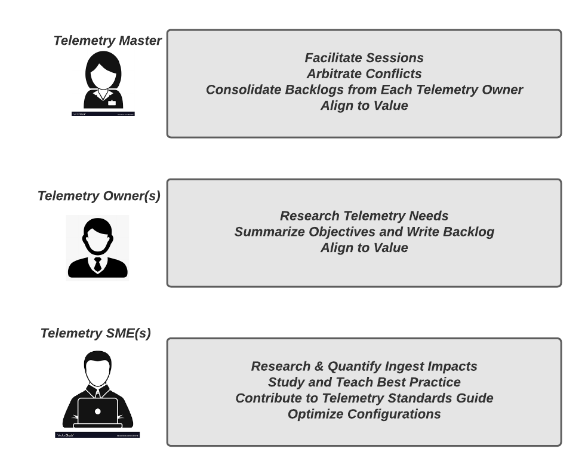
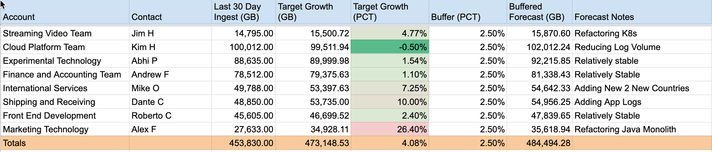

### The Process

When properly executed the data budgeting framework will create a simple but actionable structure and continous process optimization]:
To borrow language from *Scrum* methodology we will create three main artifacts as well as several roles and rituals (which we'll call sessions).

<Callout variant="tip">
If your organization uses scrum it is a great idea to invite some of your scrum masters or other scrum practice experts to view this framework and setup an internal meeting to discuss how existing backlog management tools like Jira and modes of communication like Slack and Microsoft Teams may be leveraged to manage telemetry change in a similar way how you manage and track backlogs from platforms and services.
</Callout>

*Artifacts*
- Input
  - Baseline Ingest Report
  - Ingest Growth Estimates
- Output
  - Telemetry Budget Sheet

*Activities*
- Planning Session
- Periodic Checkin

[Lucidchart Link](https://lucid.app/documents/view/c8f7c004-ec86-4ec2-ac1f-06a88c41ab52)

*Roles*
- Telemetry Master
- Telemetry Owner(s)
- Telemetry SME(s)

[Lucidchart Link](https://lucid.app/documents/view/463f6334-cb29-4953-a130-3de57ec6982e)

### Developing Your Telemetry Budget Sheet

#### Overview
In this section we'll work through an example telemetry budget sheet and give a broad overview of the kinds of considerations that must be taken to manage data ingest in a complex organization.

[Example Sheet Link](https://docs.google.com/spreadsheets/d/1fVKL3H876pCsOBNKCqDKHhFeZDGQfGyKlR3LwaEBjFE/edit?usp=sharing)

In this sheet we track the budget at the level of individual accounts.  In a model where many disparate teams share the same account the line items in the sheet can be `teams` and it's possible there will be more than one team per account.

The minimal requirements for the sheet are:

|Column|Description|
|---|---|
|Account Name|New Relic Account Name|
|Telemetry Owner|Manages budget for a given account for one or more teams|
|Last Thirty Days of Ingest (GB)|30 Day Ingest Total for All |
|Ninety Day Target Forecast (GB) |Estimated 30 Day Ingest 90 Days from Now|
|Forecast Growth %|Directly Correlated with the ninety day target|
|Growth Driver Notes| Explanation of any factors that would lead to expected increase or decrease in ingest|

Let's look in more detail at the growth drivers for some of the teams

|Team|Growth Driver|
|---|---|
|Streaming Video| This team is refactoring some K8s infrastructure.  Currently the have on-prem K8s clusters managed in their data center.  They expect to be spinning up some new clusters in their AWS VPC and for much of the quarter they may have redundant infra.  The K8s Telemetry SME helped them arrive a growth rate of just under 5% for the quarter.  In the quarter after this they may have a flat or negative reate as they bring down the on-prem clusters  |
|Cloud Platform Team| This team has plans to reduce log volume substantiall by getting rid of some excessively chatty, low value logs from some of their cloud services.  Using a deep dive analysis using `bytecountestimate()` they came up with a plan to reduce ingest by 5% over the quarter.  So they should see negative growth rate over 90 days|
|International Services|This teams plan to add support for two additional countries.   Working with the APM K8s and Mobile SMEs they were able to come up with an estimate of 7.25% growth, mustly coming from increased Mobile events.  Since they have good forecasts of how much user activity they should see they were able to built a relatively good model based on current ingest with the 5 countries they currently support.|
|Shipping & Receiving|This team plans to add application logs this quarter.  Using estimates derived from the number of logs current recorded to disk and using some factors to account for the additional logs-in-context tags that will be added.  This team expects a 12.6% growth this quarter.  The Logging SME has given them excellent guidance on using New Relic drop rules as well as how to streamline the data in Fluentbit so they are confident that they will be able to steer into this estimate|
|Marketing Technology|This team is refactoring a Java monolith into 3 or 4 separate microservices.  Based on some code analysis from other refactors and a careful audit of the Telemetry behavior of the monolith thsi team has forecast a 26.7% growth rate.  This is relatively large.  However this is the kind of refactor that should leave the code base relatively stable for another 3 to 5 years.|

#### Developing Growth Estimates

In this section we'll show how to use a more detailed telemetry worksheet to come up with the growth estimates that are used in the budget sheet previously described.  This framework does not outline a formal mechanis for development the estimates, however best practice is to do the following:

- For each consuming account evaluate each telemetry type
  - For each telemetry type assess what growth drivers are relevant in the coming months

Now let's work through the example of the "International Services" team which as we saw in the example sheet's notes is adding support for two new countries.  This implies the possibility of

1. Increased Monthly Users
2. Some New Infrastructure Hosts
3. A small number of supporting APM Transactions

*International Services High Level Forecast (from main budget sheet)*

## Framework Activity: *Periodic Checkin*
### Tracking against plan

#### The Status Checklist

- Is our overall organization over budget or under budget
- Are certain sub-accounts that are serious over or under
- Are there accounts that could stand to trade allotements
- Have any major innovation or scaling initiaves been canceled
- Have any major innovation or scaling initiates been added to the schedule

#### Rectification

After the budget has been revised if there is still an overrage at the organization level.  If some consumption overage is allowed (for example +10% for the year) this may be okay.  If that situation is not allowed by the organization's policy this may need to be escalated.  In this situation please consult with your New Relic TAM to ensure that all the facts and figures add up.  

 
If we are still in an overrage condition.  We will need some kind of resolution process.  One legitimate resolution is to approve the overage and do nothing to reduce ingest.  The assumption here is that all of the increase is justfied form a value standoint.  In most cases the Telemetry Master will be able to arbitrate between competing objectives.  If necessary we recommend bringing in some additional stakeholders to help determine where cuts should be made.
The folowing impact assesment model can be used to acknowledge the impact of the cuts.

- Observability Impact
  - Innovation cycle will be impacted (y/n)
  - Deployment velocity will be impacted (y/n)
  - A production system will have substantially reduced observability (y/n)
  - Mean time to discover and recover is impacted (y/n)

- Business Impact
  - A new acquision or business unit will lack significant visibility (y/n)
  - Our understanding of customer experience and attrition indicators is diminished (y/n)
  - Our ability to resolve SEV1 incidents will be impacted (y/n)
  - Changes to our product inventory and rollout schedule is impacted (y/n)

This impact assessment should be used in the next fiscal budget cycle to ensure that we can remove these impacts at the earliest.

## Partnering With New Relic

Your technical acount manager and solution consultant are willing and ready to checkin on a regular candence including weekly.  Generally weekly checkins will be called for when major initiaves are being undertaken or some anomaly is being investigated.  At a regular checking always do the following:

- Review the Data Ingest Analytics
- Make The TAM and SC aware of any ingest budget issues you have observed
- Identify any action items for the TAM and SC to help find solutions to those issues
- At a monthly (and especially quarter level) you TAM and SC will be able to give product roadmap updates.  Always dicuss any telemetry ingest impacts by future revisions and ensure that we can incorporate this into future budgeting.

#### Ingest Best Practice Review

There are always changes in observability related to changes in the platform or changes in the entities being observed.  In addition there are often improvements made to our documentation or best practice guides that can illuminate area related to data ingest.  For examples of topics to discuss with your TAM and SC:

- New Capabilities Related to Filtering Data
- New Log Parsing Capabilities
- New Events to Metrics and Data Rollup Capabilities
- Changes to Instrumementation
  - Sampling rates
  - In agent filtering
  - Entity Selection Rules
  - Changes to Limits Which Could Increase / Decrease Ingest
- New Dashboards and Visualization Techniques
- New Cloud Integrations and Changes to Configurations for Existing Configurations
- New Third Party SaaS Platforms That Require Observability
- Changes to Third Party Agents Such as Prometheus, Fluentd, Logstash, Cribl, etc.
- New In-Platform Features that Create Telemetry
- Changes to Entity Synthethis Management
- Egress Policy Changes for Cloud Vendors
- Best Practice for Account Structure and User Management

There is much more we could cover but using this checklist should greatly reduce any blindspots in your process.

## Consulting Engagements

The framework described in this document would require non-trivial effort to implement fully.  The operational efficiencies gained from adopting this process can be justfied in any large enterprise account.  New Relic can work with you to setup an engagement with one of our consulting partners to help you initiatve this process in your organization including:

- Initial Baseline Analysis (core engagement)
- Initial Telemetry Budget (core engagement)
- First Regular Checking (core engagement)
- Enablement of Stakeholders to Perform Data Governance Roles (core engagement)
- Ad Hoc Technical Solutioning (custom engagement)
- Development of Telemetry Standards Guide (custom engagement)
