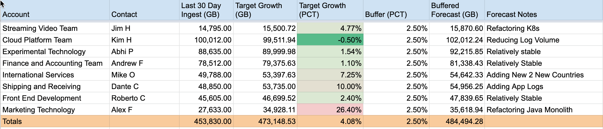
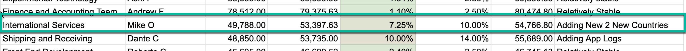

import forecasticon from './images/oma-oe-dg-forecasting-icon.png'
import monthlyingestcheckin from './images/oma-oe-dg-monthly-ingest-checkin-icon.png'
import adhocanomalyicon from './images/oma-oe-dg-adhoc-anomaly-icon.png'

In this stage you will:
- Use your baseline data to understand growth trends.
- Identify and prioritize observability objectives.
- Coordinate stakeholders in your organization to develop consensus ingest targets.
- Publish forecast and work with NR account team to steer toward the targets.

## Desired outcome [#desired-outcome]
Use the analysis produced in the baselining stage along with the observability value goals from the optimizing stage to produce future looking estimates for ingest for the coming months, and even years.
## Process [#process]

### Overview

When properly executed the forecasting stage will create a simple but actionable estimate of your organizations ingest for at least the next six months to one year.
As with the previous stages in this framework we try to keep things light.  There is one simple input and one simple output artifact in the forecasting stage.  In addition there are two planned activities, one for creating the forecast and one for validating our actual ingest against the forecast.

*Artifacts*
- Input: Baseline ingest report
  - A simple spreadsheet derived in the baselinging stage. 
  - Preferably this spreadsheet includes relevant changes made during the optimization section.
- Output: Telemetry forecast sheet
  - An data driven yet informal description of relevant predicted growth in relevant accounts
  - Detailed explanations of growth drivers that are expected to occur

*Activities*
- Yearly Ingest target planning
- Monthly Ingest Checkin

*Roles*
- Observability Manager
- Data Ingest Governance Team

## Developing Your Telemetry Forecast Sheet
In this section we'll work through an example telemetry forecast sheet and give a broad overview of the kinds of considerations that must be taken to manage data ingest in a complex organization.

In this sheet we track the forecast at the level of individual accounts.  In a model where many disparate teams share the same account the line items in the sheet can be `teams` and it's possible there will be more than one team per account.

The minimal requirements for the sheet are:

|Column|Description|
|---|---|
|Account Name|New Relic Account Name|
|Telemetry Owner|Manages forecast for a given account for one or more teams|
|Last Thirty Days of Ingest (GB)|30 Day Ingest Total for All |
|Ninety Day Target Forecast (GB) |Estimated 30 Day Ingest 90 Days from Now|
|Forecast Growth %|Directly Correlated with the ninety day target|
|Growth Driver Notes| Explanation of any factors that would lead to expected increase or decrease in ingest|

### Looking more closely at growth drivers

Let's look in more detail at the growth drivers for some of the teams

|Team|Growth Driver|
|---|---|
|Streaming Video| This team is refactoring some K8s infrastructure.  Currently the have on-prem K8s clusters managed in their data center.  They expect to be spinning up some new clusters in their AWS VPC and for much of the quarter they may have redundant infra.  The K8s Telemetry SME helped them arrive a growth rate of just under 5% for the quarter.  In the quarter after this they may have a flat or negative reate as they bring down the on-prem clusters  |
|Cloud Platform Team| This team has plans to reduce log volume substantiall by getting rid of some excessively chatty, low value logs from some of their cloud services.  Using a deep dive analysis using `bytecountestimate()` they came up with a plan to reduce ingest by 5% over the quarter.  So they should see negative growth rate over 90 days|
|International Services|This teams plan to add support for two additional countries.   Working with the APM K8s and Mobile SMEs they were able to come up with an estimate of 7.25% growth, mustly coming from increased Mobile events.  Since they have good forecasts of how much user activity they should see they were able to built a relatively good model based on current ingest with the 5 countries they currently support.|
|Shipping & Receiving|This team plans to add application logs this quarter.  Using estimates derived from the number of logs current recorded to disk and using some factors to account for the additional logs-in-context tags that will be added.  This team expects a 12.6% growth this quarter.  The Logging SME has given them excellent guidance on using New Relic drop rules as well as how to streamline the data in Fluentbit so they are confident that they will be able to steer into this estimate|
|Marketing Technology|This team is refactoring a Java monolith into 3 or 4 separate microservices.  Based on some code analysis from other refactors and a careful audit of the Telemetry behavior of the monolith thsi team has forecast a 26.7% growth rate.  This is relatively large.  However this is the kind of refactor that should leave the code base relatively stable for another 3 to 5 years.|

This framework does not outline a formal mechanism for development the estimates, only the general form of the estimates.  However best practice is to do the following:

- For each consuming account evaluate each telemetry type
  - For each telemetry type assess what growth drivers are relevant in the coming months

Take the example of the *International Services* account in the previous budget sheet

*International Services High Level Forecast (from main budget sheet)*

## *Monthly ingest checkin*

In our section on [roles and practices](/docs/new-relic-solutions/observability-maturity/operational-efficiency/dg-coe) we strongly suggest periodic checkins to track ingest against your ingest targets.  In the case where you have conducted the forecasting stage.  The forecast report will be a major part of your plan.  The following questions help guide the agenda of that checkin:

- Is our overall organization over budget or under budget
- Are certain sub-accounts that are serious over or under

## Anomaly resolution

If we determine that there is a misalignment between our forecast and actual ingest target we recommend you call an [*Ad Hoc Anomaly* session](http://localhost:8000/docs/new-relic-solutions/observability-maturity/operational-efficiency/dg-coe#ad-hoc) with your data governance team.  That is the proper former for choosing a course of action.  Fundamentally there are a handful of actions that could be warranted:

- Accept the overage as an unavoidable necessity and re-budget according
- Work on an optimization plan to bring the excessive consumption down
- Work out a "trade" in ingest alotments
-- For example there may an account that is over by 1TB per month and another tha is under by a similar amount.  There may be an opportunity to swap those alotments since there is no net overage for the main account.

<Callout variant='IMPORTANT' title='Your Account Team is Here to Help'>
As always consult your New Relic account team for support early in the process and they will be able to bring expert resources to help find a suitable solution for your organization.
</Callout>

