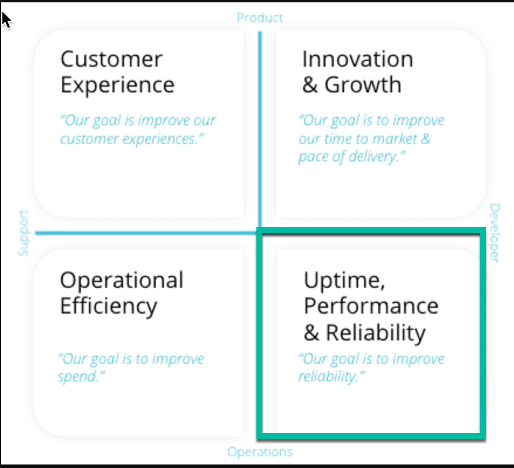
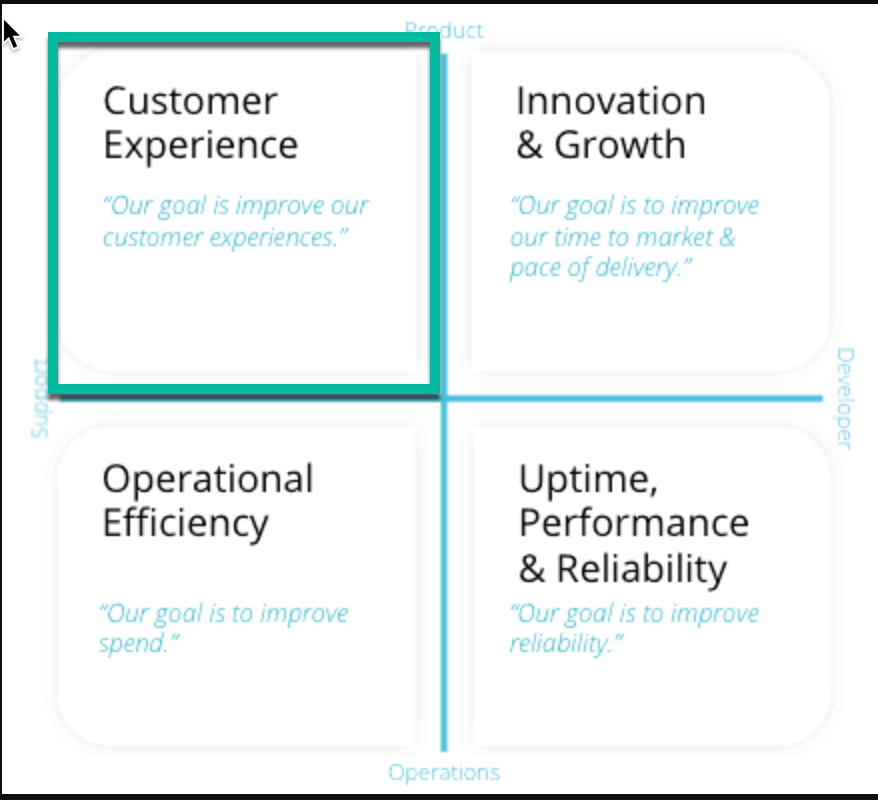
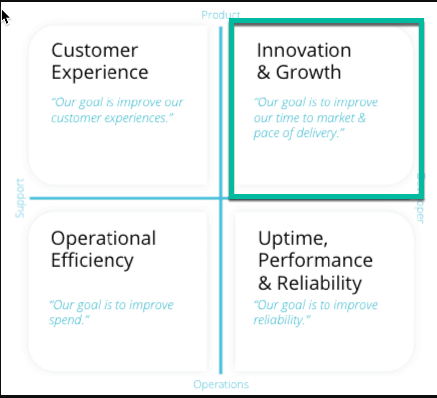

## Overview

Optimizing is a very overloaded term.  However in our context it means maximimizing observability value of delivered data.  In the process of optimizing ingest there can be really reductions in overall spend, but the goal starts from the standpoint of prioritizing different telemetry data and if needed to reduce the volume of certain data to meet certain budgetary guidelines.  In this section we will focus on:


## Aligning to Value
Consumption based observability platforms have revolutionized the way in which organizations can achieve maximum visibility in to their cloud-based and on-prem platforms and services.  Like with a migration to cloud compute consumption based SaaS platforms give business fine grained control over what they pay.  This enables them to align costs more closesly to identifid business value.  However this paradigm does require some additional thought into the value of collected telemtry in order to exploit the benefits.

When executed properly this approach will allow us to move beyond purely reactive efforts to reduce and troubhleshoot unexplained increases or low value telemetry.  Adopting a value driven approach to optimization is a clear indicator of *observability maturity*.

<Callout variant="tip">
This may be a good time to familiarize yourself with the [observability maturity principles](/docs/new-relic-solutions/observability-maturity/introduction/).  This will make the concept of `value` more concrete from an observability standpoint.
</Callout>


## Three Steps to Optimization


<CollapserGroup>
<Collapser
  id="prioritize-your-observability-objectives"
  title="Prioritize your Observability Value Drivers"
>
One of the most important parts of the data governance framework is to align collected telemetry with *observability value drivers*.  What we mean here is to ensure that we understand what the primary observability objective is when we configure new telemetry.

When we introduce new telemetry we will want to understand what it delivers to our overall observability solution.  There will be overlap, but if we are considering introducing telemetry that we can align to any of the key objectives we may reconsider introducing that data.

Objectives include:

- Meeting an Internal SLA
- Meeting an External SLA
- Supporting Feature Innovation (A/B Perfomance & Adoption Testing)
- Monitor Customer Experience
- Hold Vendors and Internal Service Providers to Their SLA
- Business Process Health Monitoring
- Other Compliance Requirements

Alignment to these objectives are what allow us to make flexible and intuitive decisions about prioritizing one set of data over another and helping guide teams know where to start when instrumenting new platforms and services.

</Collapser>
<Collapser
  id="prioritize-your-telemetry"
  title="Prioritize Your Telemetry"
>

In this section we'll make two core assumptions

- We have the tools and techniques from the [Baselining](/docs/new-relic-solutions/observability-maturity/operational-efficiency/dg-baselining) section to have a proper accounting of where our ingset comes from.
- We have a good understanding of the [OM Value Drivers](https://docs.newrelic.com/docs/new-relic-solutions/observability-maturity/introduction/) as presented in New Relic's OMA framework.  This will be crucial in applying a value and a priority to groups of telemetry


<CollapserGroup>
<Collapser
  id="case-study-1"
  title="Example 1: Prioritize Uptime and Reliability"
>

### Prioritizing Exercise 1: Top Priority - Uptime and Reliability

An account is ingesting about 20% more than they had budgeted for.  They have been asked by a manager to find some way to reduce consumption.  Their most important value driver is `Uptime and Reliability`



Their estate includes:

- APM (Dev, Staging, Prod)
- Distributed Tracing
- Browser
- Infrastructure Monitoring 100 hosts
- K8s Monitoring (Dev, Staging, Prod)
- Logs (Dev, Staging, Prod - Including Debug)

Upon going through a baselining exercise they understand where the ingest is coming from.  Their decision is as follows:

- Omit debug logs (knowning they can be turned on if there is an issue) (saves 5%)
- Omit several K8s events which are not required to display the Kubernetes Cluster Explore (saves 10%)
- Drop some custom Browser events they were collecting back when they were doing a lot of A/B testing of new features (saves 10%)

After executing those changes the team is 5% below their budget and has freed up some space to do a NPM pilot.  Their manager is satisfied they are not losing any signifanct `Uptime and Reliability` observability.

Final Outcome

- 10% under their original budget
- headroom created for an NPM pilot which servers Uptime and Reliability Objectives
- No loss of Uptime and Reliability observability

</Collapser>
<Collapser
  id="case-study-2"
  title="Example 2: Prioritize Customer Experience"
>

### Prioritizing Exercise 2: Top Priority - Customer Experience

A team responsible for a new user facing platform with an emphasis on Mobile and Browser is running 50% over budget.  They will need to right size their ingest, but they are adament about not sacrificing any `Customer Experience` observability.



Their estate includes:

- Mobile
- Browser
- APM
- Distributed Tracing
- Infrastructure on 30 Hosts Including Process Samples
- Serverless monitoring for some backend asynchronous processes
- Logs from their serverless functions
- Various cloud integrations

Upon going through the baselining exercie they come to the following decisions:

- Omit the serverless logs (they are basically redundant to what they get from their Lambda integration)
- Decrease the process sample rate on their hosts to every one minute
- Drop process sample data in DEV environments
- Turn off EC2 integration which is highly redundant with other infrastructure monitoring provided by the New Relic infra agent.

Final Outcome

- 5% over their original budget
- Sufficent to get them trough peak season
- No loss of customer experience observability

After executing the changes they are now just 5% over their original budget, but they conclude this will be sufficient to carry them through peak season.

</Collapser>
<Collapser
  id="case-study-3"
  title="Example 3: Prioritize Innovation"
>

A team is in the process of refactoring a large Python monolith to four microservices.  The monolith shares much infrastructure with the new architecture including a customer database, and a cache layer.  They are 70% over budget and have two months to go before they can officially decommision the monolith.



Their estate includes:

- K8s Monitoring (microservices)
- New Relic Host Monitoring (monolith)
- APM (microservices and host monitoring)
- Distributed Tracing (microservices and host monitoring)
- Postgresql (shared)
- Redis(shared)
- MSSQL (future DB for the microservice architecture)
- Load Balancer Logging (microservices and host monitoring)

Upon going through the baselining exercie they come to the following decisions:

- Configure load balancer logging to only monitor 5xx response codes (monolith)
- Disable ProcessSample, StorageSample, and NetworkSample for hosts running the monolith
- Disable MSSQL monitoring since currently the new architecture does not use it.
- Disable Distributed Tracing for the monolith as it's far less useful then it will be for the microservice architecture.

Final Outcome

- 1% under their original budget
- No loss of Innovation observability

</Collapser>
</CollapserGroup>

</Collapser>

<Collapser
  id="techniques-for-reduction"
  title="Reduce Telemetry Based on Priorities"
>

At this stage we assume you've given some good thought to all of the kinds of telemetry in your account(s) and how they relate to your value drivers.  This section will provide detailed technical instructions and examples on how to reduce a variety of telemetry types.
We will break them up into three different approaches:

<CollapserGroup>
<Collapser
  id="optimization-through-configuration"
  title="Optimization Through Configuration"
>

<CollapserGroup>
<Collapser
  id="apm-agent"
  title="APM Agent"
>

The volume of data generated by the APM agent will be determined by several factors:

- The amount of organic traffic generated by the application (i.e, all things being equal an app producin one million transactions per day will generate more data then one processing one thousand)
- Some characteristics of the underlying transaction data itself (length and complexity of URLs)
- Whether the application is reporting datase queries 
- Whether the application has a lot (or any) custom attributes added to each transaction
- The error volume for the application
- Whether the application is reporting distributed Tracing

### Managing Volume

While we can assume that all calls to an application are needed to support the business, it is possible that we could be more thrifty in our overall architecture.  In an extreme case we may have a user profile microservice that is called every 10 seconds by its clients.  This helps reduce latency if some user information is updated by other clients.  However, one lever we have is reducing the frequency of calls to this service to for example every minute.

### Custom attributes

Any [custom attributes](https://docs.newrelic.com/docs/data-apis/custom-data/custom-events/collect-custom-attributes/) added using a call to an APM API's [addCustomParameter](https://developer.newrelic.com/collect-data/custom-attributes/) will add an additional attribute to the Transaction payload.  These are often useful, but as application logic and priorities changes the data can be come less valuable or even obsolute.  
It is also true that 

Our Java agent will capture the following request.headers by default:

- request.headers.referer
- request.headers.accept
- request.headers.contentLength
- request.headers.host
- request.headers.userAgent

Developers will also use `addCustomParameter` to capture additional (potentially more verbose headers).

For an example of the rich configuration that is available in relation to APM see our [Java agent documentation](https://docs.newrelic.com/docs/apm/agents/java-agent/attributes/java-agent-attributes/#requestparams)


### Error Events

It is possible to determine how errors will be handled by APM.  This can reduce the volume of data in some cases.  For example there may be a high volume, but harmless error that cannot be removed at the present time.

We have the ability to `collect`, `ignore`, or `mark as expected`.   This document covers [all of the details](https://docs.newrelic.com/docs/apm/agents/manage-apm-agents/agent-data/manage-errors-apm-collect-ignore-or-mark-expected/).

### Database Queries

One highly variable aspect of APM instances is the number of database calls and what configurations we have set.  We have a fair amount of control on how verbose database query monitoring is.  These queries will show up in the transaction traces page.

Common database query setting changes include:

- [Collecting raw query data instead of obfuscated or turning off query collection](https://docs.newrelic.com/docs/apm/transactions/transaction-traces/configure-transaction-traces#record-sql)
- Changing the stack trace threshold
- Turning on query explain plan collection

More details can be found [here](https://docs.newrelic.com/docs/apm/transactions/transaction-traces/transaction-traces-database-queries-page/#settings).

### Transaction Traces

In APM, [transaction traces](https://docs.newrelic.com/docs/apm/transactions/transaction-traces/transaction-traces) record in-depth details about your application's transactions and database calls. You can edit the default settings for transaction traces.
This is also highly configurable using [this guide](https://docs.newrelic.com/docs/apm/transactions/transaction-traces/configure-transaction-traces)
The level and mode of configurability will be language-specific in many cases.

Transaction trace settings available using server-side configuration will differ depending on the New Relic agent you use. The UI includes descriptions of each. Settings in the UI may include:

- Transaction tracing and threshold
- Record SQL, including recording level and input fields
- Log SQL and stack trace threshold
- SQL query plans and threshold
- Error collection, including HTTP code and error class
- Slow query tracing
- Thread profiler
- Cross application tracing


### Distributed Tracing

Distributed tracing configuration will have some language-specific differences.  

Distributed tracing can be disabled as needed.  This is an example for Java agent `newrelic.yml`

```
distributed_tracing:
    enabled: false
```

This is a node.js example for `newrelic.js`

```
distributed_tracing: {
  enabled: false
}
```

Data volume will also vary based on whether you are using `infite tracing` or not.

Standard distributed tracing for APM agents (above) captures up to 10% of your traces, but if you want us to analyze all your data and find the most relevant traces, you can set up Infinite Tracing. This alternative to standard distributed tracing is available for all APM language agents except C SDK.

The main parameters that could drive a small increase in monthly ingest are:

- Configure trace observer monitoring
- Configure span attribute trace filter
- Configure random trace filter

</Collapser>

<Collapser
  id="browser-agent"
  title="Browser Agent"
>
In [agent version 1211](https://docs.newrelic.com/docs/release-notes/new-relic-browser-release-notes/browser-agent-release-notes/) or higher, all network requests made by a page are recorded as AjaxRequest events. You can use the deny list configuration options in the Application settings page to filter which requests record events. Regardless of this filter, all network requests are captured as metrics and available in the AJAX page.

### Using the deny list

Requests can be blocked in three ways:

- To block recording of all `AjaxRequest` events, add an asterisk * as a wildcard.
- To block recording of `AjaxRequest` events to a domain, enter just the domain name. Example: `example.com`
- To block recording of `AjaxRequest` events to a specific domain and path, enter the domain and path. Example: `example.com/path`
- The protocol, port, search and hash of a URL are ignored by the deny list.

The protocol, port, search and hash of a URL are ignored by the deny list.

To validate whether the filters you have added work as expected, run a NRQL query for AjaxRequest events matching your filter.

### Accessing the deny list

To update the deny list of URLs your application will filter from creating events, go to the app settings page:

Go to [one.newrelic.com](http://one.newrelic.com/), and click Browser.
Select an app.
On the left navigation, click *App settings*.
Under *Ajax Request Deny List*, add the filters you would like to apply to your app.
Select *Save application settings* to update the agent configuration.
Redeploy the browser agent (either restarting the associated APM agent or updating the copy/paste browser installation).


### Validating


```
FROM AjaxRequest SELECT * WHERE requestUrl LIKE `%example.com%`
```

</Collapser>

<Collapser
  id="mobile-agent"
  title="Mobile Agent"
>

### Android

[Feature Flags](https://docs.newrelic.com/docs/mobile-monitoring/new-relic-mobile-android/android-sdk-api/android-agent-configuration-feature-flags/)

All settings, including the call to invoke the agent, are called in the onCreate method of the MainActivity class. To change settings, call the setting in one of two ways (if the setting supports it):

```
NewRelic.disableFeature(FeatureFlag.DefaultInteractions);
NewRelic.enableFeature(FeatureFlag.CrashReporting);
NewRelic.withApplicationToken(<NEW_RELIC_TOKEN>).start(this.getApplication());
```
[Analytics Settings](Enable or disable collection of event data. These events are reported to Insights and used in the Crash analysis page.)
Enable or disable collection of event data. These events are reported to Insights and used in the Crash analysis page.

It's also possible to configure [agent logging](Enable or disable collection of event data. These events are reported to Insights and used in the Crash analysis page.) to be more or less verbose.

### iOS

Like with Android New Relic's iOS configuration allows to enable and disable feature flags.

The following feature flags can be configured:

#### Crash and Error Reporting 

- NRFeatureFlag_CrashReporting
- NRFeatureFlag_HandleExceptionEvents
- NRFeatureFlag_CrashReporting

#### Distributed Tracing

- NRFeatureFlag_DistributedTracing

#### Interactions

- NRFeatureFlag_DefaultInteractions
- NRFeatureFlag_InteractionTracing
- NRFeatureFlag_SwiftInteractionTracing

#### Network Feature Flags

- NRFeatureFlag_ExperimentalNetworkInstrumentation
- NRFeatureFlag_NSURLSessionInstrumentation
- NRFeatureFlag_NetworkRequestEvents
- NRFeatureFlag_RequestErrorEvents
- NRFeatureFlag_HttpResponseBodyCapture

See this document for [more details](https://docs.newrelic.com/docs/mobile-monitoring/new-relic-mobile-ios/ios-sdk-api/ios-agent-configuration-feature-flags/).

</Collapser>
<Collapser
  id="infrastructure-agent"
  title="Infrastructure Agent"
>

New Relic's [Infrastructure agent configuration file](https://docs.newrelic.com/docs/infrastructure/install-infrastructure-agent/configuration/infrastructure-agent-configuration-settings/) contains a couple of powerful ways to control ingest volume.  The most important is using sampling rates.  There are several distinct sampling rate configurations that can be used:
The other is through custom process samle filters.

### Sampling Rates

There are a number of sampling rates that can be configured in infrastructure, but these are the most commonly used.

|Parameter|Default|Disable|
|---|---|---|
|metrics_storage_sample_rate|5|-1|
|metrics_process_sample_rate|20|-1|
|metrics_network_sample_rate|10|-1|
|metrics_system_sample_rate|5|-1|
|metrics_nfs_sample_rate|5|-1|


### Process samples

Process samples can be the single most high volume source of data from the infrastructure agent.  This is becuase it will send information about any running process on a host.  They are disabled by default, however they can be enabled as follows:

```
enable_process_metrics: true
```

This has the same effect as setting `metrics_process_sample_rate` to -1.

By default, processes using low memory are excluded from being sampled. For more information, see `disable-zero-mem-process-filter`.

You can control how much data is sent to New Relic by configuring `include_matching_metrics`, which allows you to restrict the transmission of metric data based on the values of metric [attributes](https://docs.newrelic.com/docs/query-your-data/nrql-new-relic-query-language/nrql-query-tutorials/query-infrastructure-dimensional-metrics-nrql#naming-conventions).

You include metric data by defining literal or partial values for any of the attributes of the metric. For example, you can choose to send the host.process.cpuPercent of all processes whose process.name match the ^java regular expression.

In this example, we include process metrics using executable files and names:

```
include_matching_metrics: # You can combine attributes from different metrics
    process.name:
      - regex “^java”    # Include all processes starting with "java"
    process.executable:
      - “/usr/bin/python2”              # Include the Python 2.x executable
      - regex “\\System32\\svchost”     # Include all svchost executables
```

You can also use this filter for the Kubernetes integration:

```
env:
    - name: NRIA_INCLUDE_MATCHING_METRICS
      value: |
        process.name:
          - regex "^java"
        process.executable:
          - "/usr/bin/python2"
          - regex "\\System32\\svchost"
```

### Network Interface filter
The configuration uses a simple pattern-matching mechanism that can look for interfaces that start with a specific sequence of letters or numbers following either pattern:

- `{name}[other characters]`
- `[number]{name}[other characters]` , where you specify the name using the `index-1` option

```
network_interface_filters:
  prefix:
    - dummy
    - lo
  index-1:
    - tun
```

Default network interface filters for Linux:

- Network interfaces that start with `dummy`, `lo`, `vmnet`, `sit`, `tun`, `tap`, or `veth`
- Network interfaces that contain `tun` or `tap`

Default network interface filters for Windows:

- Network interfaces that start with `Loop`, `isatap`, or `Local`


To override defaults inclue your own filter in the config file:

```
network_interface_filters:
  prefix:
    - dummy
    - lo
  index-1:
    - tun
```

### Custom attributes

[Custom attributes](Custom attributes are key-value pairs (similar to tags in other tools) used to annotate the data from the Infrastructure agent. You can use this metadata to build filter sets, group your results, and annotate your data. For example, you might indicate a machine's environment (staging or production), the service a machine hosts (login service, for example), or the team responsible for that machine.) are key-value pairs (similar to tags in other tools) used to annotate the data from the Infrastructure agent. You can use this metadata to build filter sets, group your results, and annotate your data. For example, you might indicate a machine's environment (staging or production), the service a machine hosts (login service, for example), or the team responsible for that machine.

Example of custom attributes from `newrelic.yml`

```
custom_attributes:
  environment: production
  service: billing
  team: alpha-team
```

They are powerful and useful but if the data is not well organized or has become obsolete in any way you should consider streamling these.


</Collapser>
<Collapser
  id="k8s-manifest"
  title="K8s Manifest"
>
#### K8s Manifest
</Collapser>


<Collapser
  id="log-forwarders"
  title="Log Forwarders"
>

Logs represent one of the most flexible sources of telemetry in that we are typically routing logs through a dedicated forwarding layer with its own routing and transform rules.  Since there are a variety of forwarders we'll focus on the most commonly used ones:

- Fluentd
- Fluentbit
- New Relic Infra Agent (built-in Fluentbit)
- Logstash

Forwarders generaly provide a fairly complete [routing workflow](https://docs.fluentd.org/configuration/routing-examples) that includes filtering, and transformation.

New Relic's infrastructure agent provides some very simple patterns for filtering unwanted logs.

Regular expression for filtering records. Only supported for the tail, systemd, syslog, and tcp (only with format none) sources.

This field works in a way similar to grep -E in Unix systems. For example, for a given file being captured, you can filter for records containing either `WARN` or `ERROR` using:

```
- name: only-records-with-warn-and-error
  file: /var/log/logFile.log
  pattern: WARN|ERROR
```

Detailed routing and filtering resources:

- [Common filter and routing patterns in Fluentd](https://docs.fluentd.org/configuration/routing-examples)
- [Fluentbit data pipeline](https://docs.fluentbit.io/manual/concepts/data-pipeline)
- [Forwarding logs with New Relic Infrastructure agent](https://docs.newrelic.com/docs/logs/forward-logs/forward-your-logs-using-infrastructure-agent/)


</Collapser>

<Collapser
  id="cloud-integration"
  title="Cloud Integrations"
>
#### Cloud Metrics Integrations
</Collapser>

<Collapser
  id="prometheus"
  title="Prometheus"
>
#### Prometheus Configurations
</Collapser>
</CollapserGroup>
</Collapser>


<Collapser
  id="optimization-with-drop-rules"
  title="Optimization With Drop Rules"
>

*If you can query it you can drop it*

Drop filter rules help you accomplish several important goals:

- Lower costs by storing only the logs relevant to your account.
- Protect privacy and security by removing personal identifiable information (PII).
- Reduce noise by removing irrelevant events and attributes.

*A note of caution*

When creating drop rules, you are responsible for ensuring that the rules accurately identify and discard the data that meets the conditions that you have established. You are also responsible for monitoring the rule, as well as the data you disclose to New Relic.

<CollapserGroup>
<Collapser
  id="logs"
  title="Logs"
>

All New Relic drop rules are implemented by the same backend data model and API.  However New Relic Log Management provides a powerful UI that makes it very easy to create and monitor drop rules.
In our previous section on prioritizing telemetry we ran through some exercises to show ways in which we could deprecate certain data.   Let's revisit this example:

```
Omit debug logs (knowning they can be turned on if there is an issue) (saves 5%)
```

#### Method 1: [Log UI](https://docs.newrelic.com/docs/logs/ui-data/drop-data-drop-filter-rules/)

- Identify the logs we care about using a filter in the Log UI: `level: DEBUG`
- Make sure it finds the logs we want to drop
- Check some alternative syntax such as `level:debug` and `log_level:Debug`.  These variations are common.
- Under *Manage Data* click *Drop filters* and create and enable a filter named 'Drop Debug Logs'
- Verify the rule works

#### Method 2: [GraphQL API](https://docs.newrelic.com/docs/data-apis/manage-data/drop-data-using-nerdgraph/)

- Create the relevant NRQL query: `SELECT count(*) FROM Log WHERE `level` = 'DEBUG'`
- Make sure it finds the logs we want to drop
- Check variations on the attribute name and value (Debug vs DEBUG)
- Execute the following NerdGraph statement and make sure it works:

```
mutation {
    nrqlDropRulesCreate(accountId: YOUR_ACCOUNT_ID, rules: [
        {
            action: DROP_DATA
            nrql: "SELECT * FROM Log WHERE `level` = 'DEBUG'"
            description: "Drops DEBUG logs.  Disable if needed for troubleshooting."
        }
    ])
    {
        successes { id }
        failures {
            submitted { nrql }
            error { reason description }
        }
    }
}
```

</Collapser>
<Collapser
  id="process-samples"
  title="Process Samples"
>

Let's implement the recommendation: `Drop process sample data in DEV environments`.

- Create the relevant query: 'SELECT * FROM ProcessSample WHERE `env` = 'DEV''
- Make sure it finds the process samples we want to drop
- Check for other variations on `env` such as `ENV` and `Environment`
- Check for various of `DEV` such as `Dev` and `Development`
- Use the NerGraph API to execute the following statement and make sure it works:

```
mutation {
    nrqlDropRulesCreate(accountId: YOUR_ACCOUNT_ID, rules: [
        {
            action: DROP_DATA
            nrql: "SELECT * FROM ProcessSample WHERE `env` = 'DEV'"
            description: "Drops ProcessSample from development environments"
        }
    ])
    {
        successes { id }
        failures {
            submitted { nrql }
            error { reason description }
        }
    }
}
```


</Collapser>
<Collapser
  id="cloud-metrics"
  title="Cloud Metrics"
>

In some cases we can economize on data where we have redundant coverage.  For example in an environment where I have the AWS RDS integration running as well as the New Relic OHI I maybe be able to discard some overlapping metrics.
For quick exploration we can run a query like this:

```
FROM Metric select count(*) where metricName like 'aws.rds%' facet metricName limit max
```

That will show us all metricNames matching the pattern.

We see from the results there is a high volume of metrics of the pattern `aws.rds.cpu%`.  Let's drop those since we have other insrtrumentation for those.

- Create the relevant query: 'FROM Metric select * where metricName like 'aws.rds.cpu%' facet metricName limit max since 1 day ago'
- Make sure it finds the process samples we want to drop
- Use the NerGraph API to execute the following statement and make sure it works:

```
mutation {
    nrqlDropRulesCreate(accountId: YOUR_ACCOUNT_ID, rules: [
        {
            action: DROP_DATA
            nrql: "FROM Metric select * where metricName like 'aws.rds.cpu%' facet metricName limit max since 1 day ago"
            description: "Drops rds cpu related metrics"
        }
    ])
    {
        successes { id }
        failures {
            submitted { nrql }
            error { reason description }
        }
    }
}
```


</Collapser>
</CollapserGroup>
</Collapser>

<Collapser
  id="optimization-with-sampling-and-transformation"
  title="Optimization With New Relic ETL (future)"
>
<CollapserGroup>
<Collapser
  id="compression"
  title="Compression (future)"
>
</Collapser>

<Collapser
  id="sampling"
  title="Sampling (future)"
>
</Collapser>

<Collapser
  id="aggregation"
  title="Aggregation (future)"
>
</Collapser>
</CollapserGroup>
</Collapser>

</CollapserGroup>
</Collapser>
</CollapserGroup>