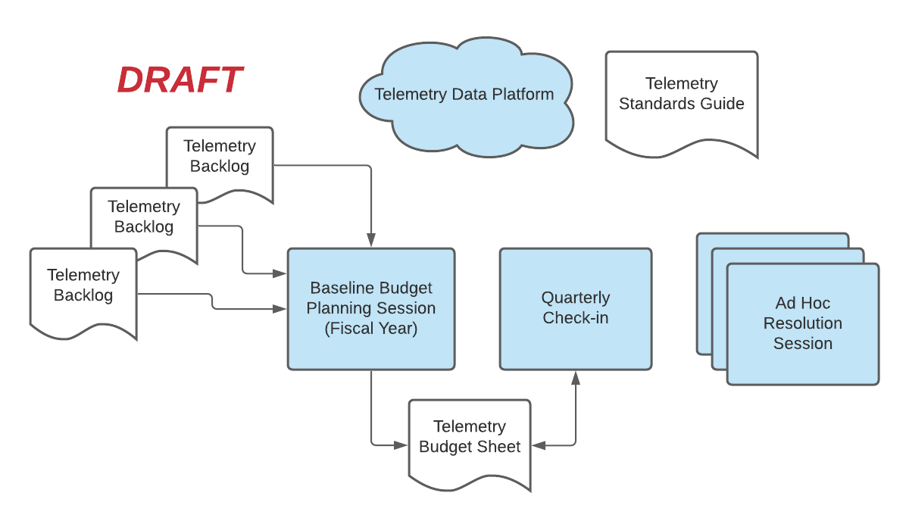
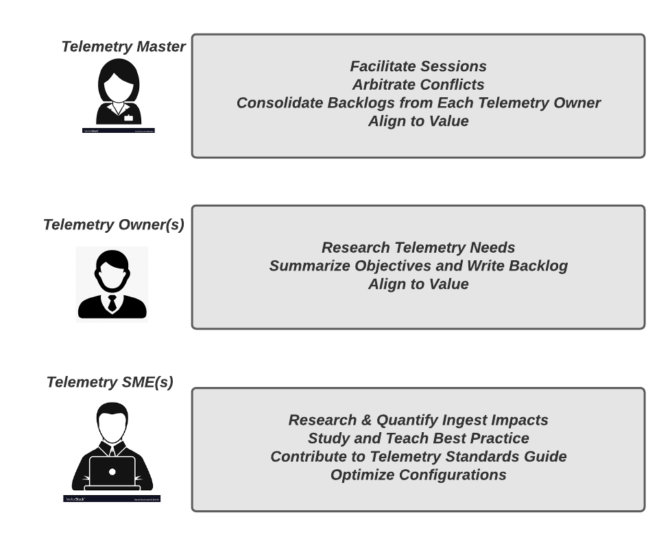
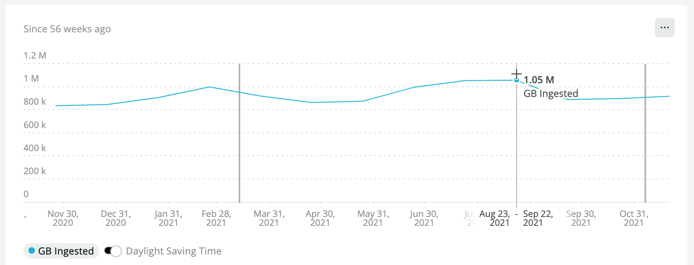
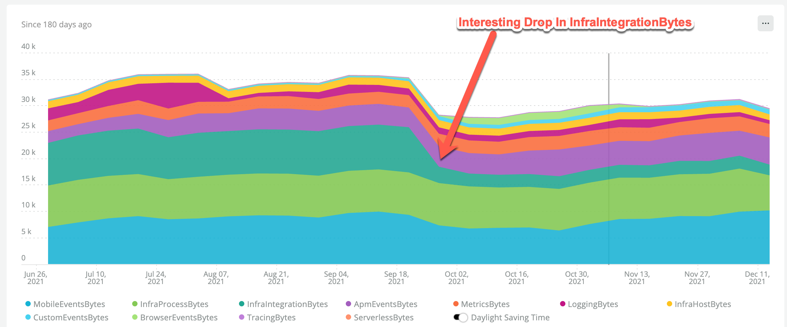
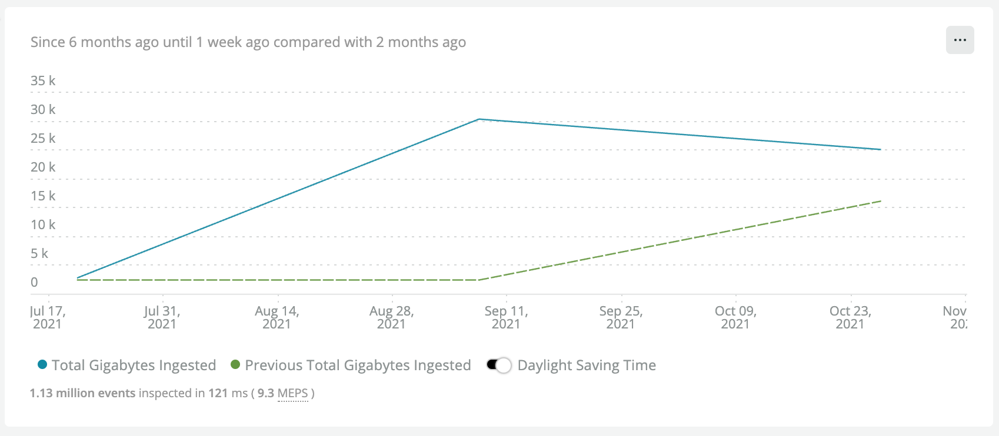
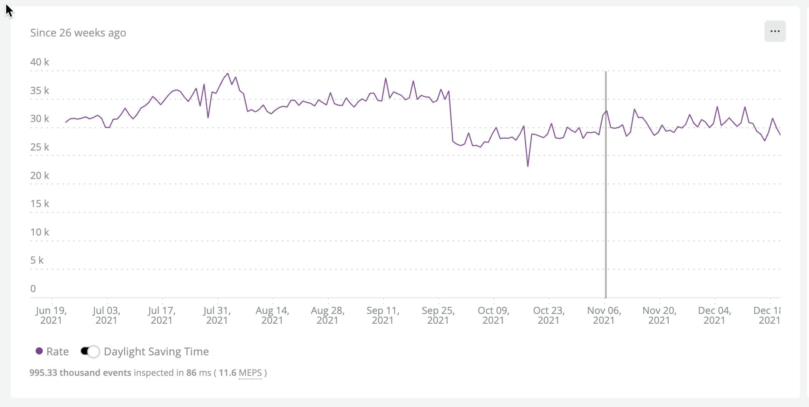
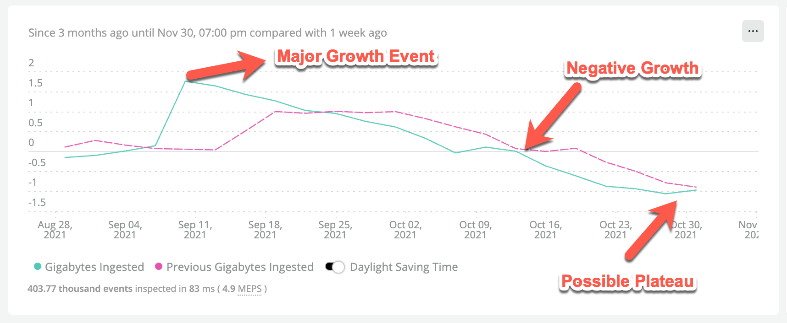
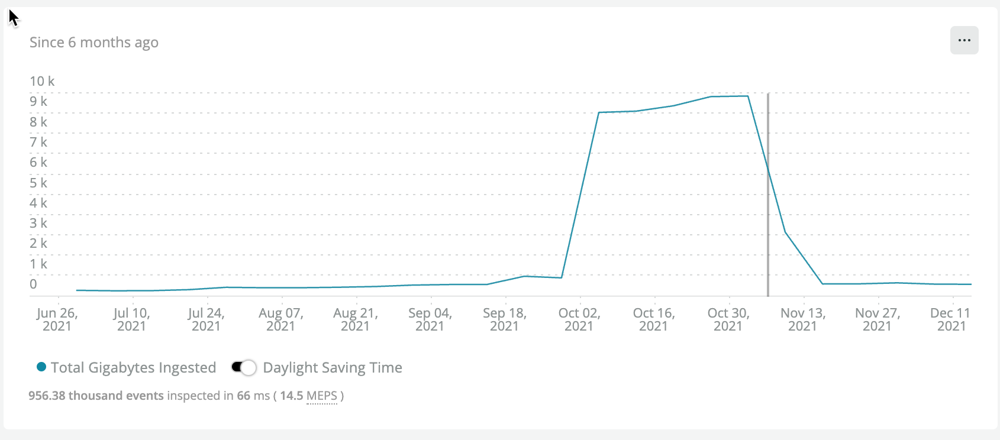
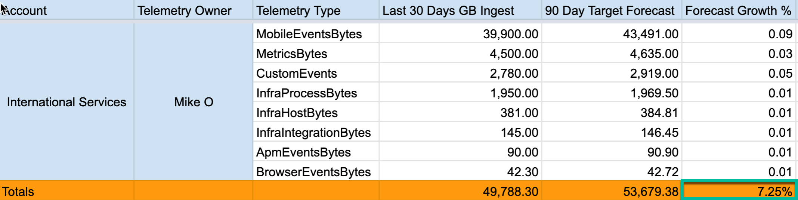

## Overview [#overview]

Data governance is a practice of ensuring optimal value for telemetry data collected by an organization particulary a complex organization with numerous business units and working groups.  The objective is get appropriate ROI for investimate in telemetry data.  This requires a framework that combines a complex mixture of technical understand with a formal and intuitive understanding of how telemetry data supports the business objectives.

## Desired outcome [#desired-outcome]

At minimum implementing data governance practices in your organization will increase the predictability, and repeatibility of your data ingest.  However we also expect you to get some higher order benefits such as:

- Transition to a value centered approach
 - Map telemetry to technical objectives
 - Map telemetry to business objectives
 - Improved transparency (Where does it come from? Who uses it?  Who needs it)
- Increased collaboration
 - Working accross silos for the benefit of the broader organization
- Standardizing and Optimization of Telemetry Practice

It is not an exaggeration to say that for some implemntations DG will yield millions of dollars in business value through reduced waste and inproved value per GB of ingested data.

## Why do we need data governance?

Consumption based observability platforms have revolutionized the way in which organizations can achieve maximum visibility in to their cloud-based and on-prem platforms and services.  Like with a migration to cloud compute consumption based SaaS platforms give business fine grained control over what they pay.  This enables them to align costs more closesly to identifid business value.  However this paradigm does require some additional thought into the value of collected telemtry in order to exploit the benefits.

Some organizations express hesitancy to focus on telemetry standards and the value discussion in general.  Although the old black box model of observability was not as cost-effective they didn't have to think much about what was ingested.  However consumption based models allow vendors to scale more fluidly with their customer's growth.

One outcome of data governance is to increase transparency in terms of the following telemetry attributes:

- What group within the organization configured this telemetry?

- Does it meet organizational standards for quality instrumentation?

- What platform or application does it monitor?

- What are the growth characteristics of this data?

- What value driver(s) does it support?

- How is data growth correlated to revenue growth or provable cost efficiencies?

When executed properly this framework will allow us to move beyond reactive efforts to reduce and troubhleshoot unexplained increases or low value telemetry.  Such an organization will have achieved an explicitly proactive and value driven approach which is the ultimate goal of *observability maturity*.

<Callout variant="tip">
This may be a good time to familiarize yourself with the [observability maturity principles](/docs/new-relic-solutions/observability-maturity/introduction/).  This will make the concept of `value` more concrete from an observability standpoint.
</Callout>


### Reduced Noise

In addition to raising the transparency of data and data sources data governance aims to reduce what "noise" in data streams.  This will follow on by the introduction of metadata standards and also through apply a value based approach to telemetry we may be able to reduce unnecessary redundancy.  As part of the right sizing process we will often drop unnecessary attributes and metadata from an otherwise valuable data source.  By creating baseline budgets and conducting regular check ins we'll see how erratic telemetry will be identified and potentially removed or refined if it does not provide adequate value.

### Alignment of Costs With Observability Objectives

One of the most important parts of the data governance framework is to align collected telemetry with *observability objectives*.  What we mean here is to ensure that we understand what the primary observability objective is when we configure new telemetry.

When we introduce new telemetry we will want to understand what it delivers to our overall observability solution.  There will be overlap, but if we are considering introducing telemetry that we can align to any of the key objectives we may reconsider introducing that data.

Objectives include:

- Meeting an Internal SLA
- Meeting an External SLA
- Supporting Feature Innovation (A/B Perfomance & Adoption Testing)
- Monitor Customer Experience
- Hold Vendors and Internal Service Providers to Their SLA
- Business Process Health Monitoring
- Other Compliance Requirements

Alignment to these objectives are what allow us to make flexible and intuitive decisions about prioritizing one set of data over another and helping guide teams know where to start when instrumenting new platforms and services.

## Key Performance indicators

It is important to identify some simple KPIs that help to gauge the overall efficiency of your telemetry data ingest. These KPIs are optional.  The most important thing is to choose some KPIs that track data ingest in relation to unit of business value whether that is users on your site or number of sales or gross sales value.  Practioner KPIs are not directly tied to revenue or business units.  Instead they are meant to show the relationship of data ingestested to entities monitored.  Those entities could be users, sessions, database tranactions etc.

### Business KPIs
<CollapserGroup>
  <Collapser
    id="gb-ingest-per-user-on-platform"
    title="GB Ingest Per Platform User"
    >
Every organization has a sense of how many users are using their digital platforms.  Let's use the example of a video streaming service.  They may track as a high level KPI the number of registered users or more likely the number of active users.  With the `GB Ingest Per Platform User` we want to understand what it costs us to monitor a certain number of users and quarter to quarter whether we are spending more or less to do so.  A similar KPI can also used by practioners for backend systems.  For example they may use this kind of KPI for the number of users of a MSSQL platform.
 </Collapser>
  <Collapser
    id="gb-ingest-against-gross-revenue"
    title="GB Ingest Against Gross Revenue"
    >
Since there are other revenue drivers than simply the number of users on a platform, we may wish to consider the relation of GB ingest against gross revenue.  This is useful since there are some scenarios where we have flat growth in new users, but for some reason the revenue generated per user is higher and it will likely cost us more to monitor that increase in overall business activity.
 </Collapser>
</CollapserGroup>
### Practitioner KPIs
<CollapserGroup>
  <Collapser
    id="gb-ingest-per-team"
    title="GB Ingest Per Team"
    >
All organizations are comprised of different teams who are generally responsible for developming and maintaining services and platforms.  They are also responsible for their own instrumentation.  One way to make sure that we are not experiencing ingest bloat due to proliferation of teams and the related silos is to track our ingest efficiency per team.
 </Collapser>
  <Collapser
    id="apm-gb-ingest-per-transaction"
    title="APM GB Ingest Per Transaction"
    >
For organizations using APM we will want to baseline and understand our APM ingest footprint per transaction.  By tracking thise we can understand if any growth is rational based on growth in the number of transactions.  If our APM ingest doubles we will consider this explainable and reasonable given that our APM transactions doubled as well.  It is beyond the scope of the framework to determine if our applications are logging too many transactions but the framework can help start the discussion.

 </Collapser>
   <Collapser
    id="infra-event-gb-ingest-per-transaction"
    title="Infra Event GB Ingest Per Host"
    >
For organizations using Infrastructure Monitoring we will want to baseline and understand our Infra event ingest footprint per host.  By tracking these we can understand if any growth is rational based on growth in the number of hosts.  If our Infra ingest doubles we will consider this explainable and reasonable given that our hosts counts doubled as well.  It is beyond the scope of the framework to determine if we are using too many hosts but the framework can help start the discussion.
 </Collapser>
  <Collapser
    id="browser-gb-ingest-per-session"
    title="Browser GB Ingest Per Sessions"
    >
For organizations using Browser Monitoring we will want to baseline and understand our Browser data ingest per user session.  By tracking these we can understand if any growth is rational based on growth in the number of user sessions.  If our Browser ingest doubles we will consider this explainable and reasonable given that our number of browser sessions doubled as well.  It is beyond the scope of the framework to determine if we are using too many hosts but the framework can help start the discussion.

 </Collapser>
  <Collapser
    id="mobile-gb-ingest-per-mau"
    title="Mobile GB Ingest Per MAU"
    >
For organizations using Mobile Monitoring we will want to baseline and understand our Mobile event ingest footprint per monthly active user.  By tracking these we can understand if any growth is rational based on growth in the number of hosts.  If our Mobile ingest doubles we will consider this explainable and reasonable given that our mobile active users counts doubled as well.  It is beyond the scope of the framework to determine if we are using too many hosts but the framework can help start the discussion.
 </Collapser>
  <Collapser
    id="observability-automation-rate"
    title="Observabilty Automation Rate"
    >
This KPI is unique in that it tracks our implementation of a methodology.  We are of the strong opinion that observability as code through automation is a key prequisite to achieving maximum observability maturity.  The way in which this can computed will vary by team.  But it could take into consideration things like

- The percentage of applications instrumented through a config management or CI/CD framework
- The percentag of hosts instrumentedd through a config management

The list could grow extremely long, but it suffices that maximum automation is an objective.
 </Collapser>
</CollapserGroup>

One way in which this framework is like scrum is that we really can't assess our efficiency until we start iterating.  We can't just look at a number in in isolation to know if it is good or bad.  We need to be able able to generate some consistent KPIs over time to know if we are maintaining or improving our efficincies or falling behind.  Often with KPIs we are looking for the outliers that jump out at us.  For example.  Let's say in a given quarter we saw Mobile GB Ingest increase 200% yet the number of montly active users on our Mobile Platforms stayed the same or declined.  This would be something we would call out at our quarterly checkin.  Those checkins are part of the framework definition and are discussed in detail later.  The KPIs listed above OR the KPIs your organization chooses should be presented and discussed as needed at each checkin.

## Framework Definition and Practices

<CollapserGroup>
  <Collapser
    id="data-governance-framework-summary"
    title="DG Defined"
    >
## Formal Framework Definition

When properly executed the data governance framework will create a simple but actionable structure and continous process for executing the key actions of the framework:

- Development of telemetry budget
- Aligning new telemetry to observability objectives
- Providing checks and balances on telemetry configuration
- Tracking the telemetry footprint of newly acquired business units or restructures within the org.

To borrow language from *Scrum* methodology we will create three main artifacts as well as several roles and rituals (which we'll call sessions).

<Callout variant="tip">
If your organization uses scrum it is a great idea to invite some of your scrum masters or other scrum practice experts to view this framework and setup an internal meeting to discuss how existing backlog management tools like Jira and modes of communication like Slack and Microsoft Teams may be leveraged to manage telemetry change in a similar way how you manage and track backlogs from platforms and services.
</Callout>

*Artifacts*
- Ingest Fact Baseline Report
- Telemetry Budget Sheet
- Telemetry Standards Guide
- Telemetry Backlog (optional)

*Roles*
- Telemetry Master (responsible at high level for all org. accounts)
  - Focus on all telemetry (accross business units, teams, platforms)
  - Focus on transparency
  - Focus on empiracism
  - Represents the organizations business objectives
  - Responsible for scheduling and managing check-ins
- Telemetry Owners (responsible for specific sub-accounts or telemetry types in sub accounts)
  - Focus on observability objectives
  - Focus on valuation of data
  - Represents technical & business objectives of developers, SRE, IT 
- Telemetry SMEs (expert in a broad domain such as "Logs", "APM Transactions", "On Host Integrations" etc.)
  - Adds value to all accounts and teams through technical expertise
  - Focus on observability best practice (especially operational efficiency)
- Vendor Technical Account Manager
  - Communicates vendors roadmap and emerging best practices
  - Consults during various sessions
  - Helps align telemetry to observability objectives
  - Helps validate ingest analytics and forecasts

*Sessions*
- Baseline Budget Planning Session
  - Ensure that ingest baseline reports are known, shared and agreed upon
  - Ensure that change/growth estimates are created and understood
  - Haggle over resource conflicts ensuring observability objectives are priority
- Monthly/Quarterly Check-In (Telemetry Master & Telemery Managers)
  - Ensure that ingest baseline reports are known, shared and agreed upon
  - Identify any overages (or underages) against budget
  - Refine budget as needed
  - Escalating within the org as necessary
- Ad Hoc Resolution Sessions
  - Forum for appropriate stakeholders to address the following
    - Data ingest anomalies
    - Violation of telemetry standards impacting observability
    - Changes to organization strucutre (re-organization, merger, acquisition)
    - Address critical changes in platforms, tools and observability platform architecture



[Lucidchart Link](https://lucid.app/documents/view/c8f7c004-ec86-4ec2-ac1f-06a88c41ab52)


  </Collapser>
<Collapser
    id="roles-and-responsibilities"
    title="DG Roles and Responsibiliities"
  >


## Framework Practice: Roles and Responsibilities

Our goal is not to mimic Scrum rigidly but to provide a structured framework with some artifacts, roles, and rituals that enable an organization to get on the path to a self organized team that improves in efficiency and works iteratively to solve problems and meet the organizations overall business objective.  As with actual Scrum it is often hards to harmonize the frameworks roles with a person's actual job description.  Be flexible and use the detailed descriptions of the responsibiliites to guide how to do it in your organization.  It's more important that responsibilities be met rather than exactly who meets them, however our proposed structure is to provide some separation of labor and concerns where possible. 



[Lucidchart Link](https://lucid.app/documents/view/463f6334-cb29-4953-a130-3de57ec6982e)

### Telemetry Master
*Scope*: One per organization

The idea of a telemetry master is one who has the most vested interest in the product of this framework.  They may be the existing "account owner" in the sense that they have been the main point of contact with the observability vendor.  It's also possible they are the account owner in the sense that they have signed contracts or have a role in consulting other managers who are resonsible for the observability platform contract.  

We'll expand on the previously defined highlights of this role:

- Focus on all telemetry (accross business units, teams, platforms)
  - Conflict resolver
  - Undertands the larger business objective and cost structure
  - Broad knowledg of observability best practice
  - Understands how to evaluate the value of telemetry and the cost of not having it
- Focus on transparency
  - Communicates the budget expectations clearly to the other roles
  - Doesn't surpress messiness in the data -- works to find interpretations collaboratively
  - Not afraid to identify bad practices and uses the Telemetry Standards Guide as critical reference
- Focus on empiracism
  - Understands can be backed up by data analytics from the observability platform
  - Where hunches or rough estimates are used these are identified
  - Understands how to iterate monthly and quarter to improve the governance process based on prior experience
  - Will seek out Telemetry SMEs as need to better understand growth characteristics and value of specific telemetry types
- Represents the organizations business objectives
  - Has an understand of value the digital platforms of the organization contribute to the bottom line
  - Views telemetry in how well it aids uptime, reliability, innovation, and general operational efficiency
  - Is able to fluidly understand what telemetry is required to enforce customer experience objectives
  - Thinks in terms of service boundaries and SLAs
- Responsible for scheduling and managing check-ins
  - Ensures the involvement of the righ people
  - Provides neutrality when appropriate
  - Ensures the following artifacts are produced in a timeley manner and are available to all stakeholders:
    - Ingest Baseline Report
    - Telemetry Budget Sheet
    - Quarterly Change Plan
    - Telemetry Standards Guide 

### Telemetry Owner
*Scope*: One per sub-account or group of sub-accounts

To some extent the Telemetry Owners can be seen as the equivalent of Scrum's product owner.  They are responsible for maintaining and understanding the priorize set of observability objectives at the level of a team or business unit that may own one or actual accounts.  These priorities will be use to make often tough decisions about what telemetry to focus on in a given month or quarter and how to manage negotiations with other telemetry manages where there may be conflicts.  The Telemetry master will help facility.  Although not a required artifcat of the data governance framework it would be good practie for the Telemetry owner to have a a running telemetry backlog of priorities that can be used in the planning process and checkins.  If the Telemetry Master so chooses they may consolidate these backlogs into a master sheet updated at least once or twice a year.  Here is an example:

|Objective|Priority|Status|Ingest Impact Estimate (GB/Month)| Ingest Impact Actual|Tech. Owner|
|---|---|---|---|---|---|
|Improve Awareness of Kafka Queue Saturation|1|Done|+Hi|10000|Jim|
|Filter Health Checks from APM alerts|2|Done|+Low|0|Kim|
|Collect Product Info In App Logs|3|In Progress|+Medium|2000|Adi|
|Reduce Sampling Rate on Process Samples|4|Not Started|-Hi|-5000|Adi|

The obove is a farely simple example, but it would make sense to track this at a high level at least.  Note because telemetry initiatives can have a positive or negative impact on ingest you'll want to include some kind of `sign` on the estimates even if it's just a quantitative hi/low estimate.  A specific technical owner may be designated.  That techical owner is someone who understands the techncial details of how the instrumentation will be configured and how success will be measured from an observability standpoint as well as how to measure the impact on ingest.

Let's expand a bit on our previous summary of this role:

- Focus on observability objectives
  - By maintaining an observability backlog the Telemetry Owner knows what the team or business units goals are.
- Focus on valuation of data
  - In order to be able to prioritize telemetry work the Telemetry Owner will need to understand the value brough in terms of improved innnovation, improved uptime & reliability or overall improvement in operational efficiency.
  - When there is a resource constraint such as there is time to add Logging or Kafka Topic Lag Metrics the Telemetry owner can understand how to make a ranking.
  - When the conflict is cross-departmental the Telemetry owner will be able to negotiate and occasionally defer to the objectives of the other team based on the top level organization objectives.  In such a scenario the the Telemetry Master will help out.
- Represents technical & business objectives of developers, SRE, and IT staff.
  - While not necesssarily a technical manager the Telemetry Owner will be able to represent the objectives of the various developers, SRE and IT staff.   He will have good skills of delegating analysis to better understand the observability objectives.  For example he will know who to talk to to understand what Logging inititiaves should be prioritized this year.

### Telemetry SMEs (multiple / as needed)

This is the most informal of roles within the framework.  To some extend nearly every engineer could be a Telemetry SME. It's also possible for less hands-on staff such as a product manager to be a Telemetry SME in some contexts.  The key points are:

The Telemetry SME
*Scope*: Several per organization.  May be focused on a technical domain or platform but may also be a generalist.

- Knows how the telemetry in question is used in alerts and dashboards
- Knows how the instrumentation is configured
- Understands the growth characteristics
- Knows how to find alternatives to a given set of telemetry and how using an alternative would impact the overall observability objective
- Knows how the analyze the data ingest footprint for a given set of telemetry
- Is facile in querying the data
- Contributes to the Telemetry Standards Guide where possible especially in helping optimize configurations, and improving metadata standards 

 </Collapser>
  <Collapser
    id="telemetry-ingest-drivers"
    title="Prerequisite Work: Understanding Ingest Drivers"
    >

## Understanding Ingest Drivers

### Storage and Compute Overhead

When provisioning compute on prem or in a private account within a cloud provider there are some compute and storage costs which may be incurred in the collection of telemetry.  Some examples include:
- Storage and compute needed for a Prometheus or Elasticsearch database
- Storage need for raw log files such as those in `/var/logs`
- Compute for log forwarders such as `fluentbit`, `logstash`, etc.
- Compute for APM and infrastructure monitoring agents
All storage and compute is priced differently depending on the host profile.  The only major distinction are those costs that are incurred to persist adn large amounts of data (e.g., Prometheus or Elasticsearch) vs. those used to forward data onto a SaaS provider where the long term persistence takes place.

### Cloud Provider Service Costs

Most cloud providers offer some different native monitoring solutions such as AWS CloudWatch. The provider will provide a per host or volume based fee for using these products.

### Egress Costs

Egress costs refer to the fees incurred by transmitting data from one network zone to another.  These can be paid to a network service provider servicing an on prem. data center.   All cloud service providers will assess some cost for moving data outside of the cloud providers domain.  Egress costs are a consideration when transmitting telemetry to to a SaaS observability platform.  these costs need to be balanced against the overall value of telemetry in our overall observability solution.

### SaaS Ingest Costs

Cloud providers may assess telemetry ingest fees based in a variety of ways.  Sometimes these can be quite complex but generally it will be along the lines of.

- Number of agent instances
- Number of application transactions monitored
- Number of traces collected
- Number of monthly active users
- Number of logs ingested
- *Gigabytes of data ingested*

This framework could provide some value to a variety of models.  However it is intended to work with the *Gigabytes of data ingested* model used by New Relic.

### Opportunity Costs

Assuming a fixed data ingest budget of $100,000 per year we can say that there are some tradeoffs between telemetry types that are stored.  For example in an organization which is currently ingesting exactly $80k per year.  One team wants to use the additional 20k for detailed user transaction logs.  These give great insights into user transactions including the products that are being purchased as well as other user context that will be really useful for the business analytics and overall business health.  Another team wishes to use the additional budget to send Browser metrics included RUM data that will offer a great detail of information about underlying user experience in our core application.  This conflict represents an opportunity cost in the sense that we can do one or another but not both within the 100k budget.  Later on we'll see how the budget planning process can be used to rectify these by possibly reducing a third source of data that may turn out to have lower value than both the Browser metrics and the Logs.  This kind of "horse trading" is an important concept in a value base data governance strategy.  If we are unable to support both Browser metrics and logs, one will be omitted and that represents the opportunity cost.

### Key Concepts: Understanding Telemetry Growth

When executing this framework it is also critical to understand the sources of telemetry growth that will occur through the year and over the years.  Some of these are generally anticipate and others may be unexpected and others completely anomalous.  These concepts are important when coming up with baseline budgets and growth targets and can also help during an ad hoc resolution of unexpected telemetry growth.

#### Business Transaction & User Growth
This class of user growth is often welcome but can also seem overwhelming if we have not data governance plan in place.  Our business is growing and we are bringing in new users and the activity of each of those users is causing additional Browser, APM, and Log data to be emitted.  The need to scale K8s clusters, load balancers, and supporting platforms like Kafka also cause an increase in the emitted telemetry.  Another type of growth is caused by an increase in business transactions without an obvious increase in the number of users.  For example a website that sells one type of product (Shoes) has now broadened its inventory to offer Hats and Gloves.  This results in more business transactions per user causing a similar cascade in telemetry as an increase in users.

<Callout variant="tip">
One optional exercise you may want to context is to review each of your major platforms and services and come up with some estimate of how the scale of that application is correlated with growth in your users/customers and the amount of business activity generated by them.  This will help make planning for growth a more intuitive process.
</Callout>

#### Code Logic Change
There are some scenarios where a change in application code will cause a sudden increase in telemetry volume without any additional users or business transactions.  Some examples:

- A developer adds additional java javascript code that interacts with the backend every time a user visits a page.
- A developer adds new logging code to some application methods that are called very frequently.
- A new database schema requires  multiple database calls where previously one was needed.
- A monolithic application is broken into 5 microservices with the resulting APM and distriubuted trace data being emitted for each.

#### Instrumentation Misconfiguration
Field Example: An organization previously used a 30s sampling rate for core operating system metrics for about 2000 hosts.  A misconfiguration or unauthorized change to 10s tripled the OS metrics telemetry captured from those hosts.

Later on we will discuss telemetry standards. One of the thing often governed by a telemetry standard is the sampling rate for various monitoring activities.

#### Increasing Breadth of Observability
Field Example: It is part of the continuous improvement process to expand observability.  An organization that was monitoring Kafka broker health for nearly two years decided to start monitoring Kafa topic offsets.  Not realizing the verbosity of topic monitoring data they are surprised when the telemetry footprint from Kafka monitoring increase 5 times.  

<Callout variant="caution">
Mergers and acquisitions are a common way in which telemetry growth "sneaks up" on an organization.  We suggest you incorporate observability consolidation as a formal action item as part of the integration process.  This is no different then adding *cloud compute consolidation* to your overall integration plans.  This is also an area where you should fall back on your New Relic account team since there are times when these events are somewhat unexpected.
</Callout>

#### Unexpected Third Party Change
Field Example: A JMX integration is designed to get any metric exposed by a third party application with prefix "Transaction_".  With version 1.0 of the application that yields in 10 events per sample.  The team maintaining the third party application adds 10 additional metrics with the "Transaction_" prefix.  When our team installs the new code, we are a bit surprised to know what JMX events have increased 2 times.


  </Collapser>

<Collapser
    id="baselining-data-ingest"
    title="Prerequisite Work: Baselining Data Ingest"
  >

## Baselining Data Ingest [#current-state]

### High Level Accounting

At this point it is necessary to get a high level view of all of the telemetry currently being generated in your organization.  The assumption is that any substantial organization will have a master account and multiple sub-accounts which may be dedicated to specific, teams, projects, or even separate business units.  In the context of New Relic it is necesssary to break the current ingest down by:

- Organization
- Sub account
- Billable Telemetry Type

There is value in deeper breakdowns but this one can be facilitated on any New Relic account.  

*Billable Telemetry Types*

- Mobile Events
- Infrastructure Hosts
- Infrastructure Integrations
- Infrastructure Processes
- APM Events
- Tracing
- Metrics
- Logging
- Custom Events
- Browser Events
- Serverless

<Callout variant="tip">
The remainder of this section will show some custom NRQL queries and dashboards that we can use to customize our view of data ingest.  However, we recommend you familarize yourself with the built-in [data ingest drilldown tool](https://docs.newrelic.com/whats-new/2021/06/data-ingest-drill-down/) in the NR1 Platform.
</Callout>


Download the [Data Ingest Analytics](dashboards/data-ingest-analytics.json) dashboard. Install it into your NR1 Master Account or POA account.  You will first need to edit the JSON to include your account id.  This will allow you a fairly flexible visualization of ingest by an organizations accounts and telemetry types.  Your view may vary depending on the number of accounts and telemetry types in your organization.  You can also visualize some built in views in New Relic's "Manage Your Data" UI.  For the purposes of transparency we will show examples of the underlying NRQL queries in this document.

Let's first see what our daily average ingest has been for the past month.  

```
SELECT rate(sum(GigabytesIngested), 1 day) AS 'Daily Ingest Rate (GB)'  FROM NrConsumption WHERE productLine = 'DataPlatform' LIMIT MAX SINCE 30 days AGO
```
*Note the use of the `rate` operator.  This will be very useful when querying the NrConsumption model.*

Our simple response for the entire organization is

```
Daily Ingest Rate: 30.4 k
```

That's a little over 30,000 GB or 30 TB per day or overy 900TB per month.  While that's a very impressive number and is meaningful to the procurement department and whoever needs ot know this months bill.  It is only the starting point to setup a data governance plan.   Let's assume our organization has a yearly budget for the current fiscal for 12TB per year.  We could infer that we are at about 90% of budget with the calculation but that assumes we are consuming at steady rate of 900TB each month.  Due to seasonality and observavabily needs evolving that is almost never the case.  Here is our actual consumption over the past 12 months. Let's do a simple `sum` rather than a rate since we have all the data collected.  Note that December 2021 will be incomplete since we are not all the way through the month.

```
SELECT sum(GigabytesIngested) AS 'Daily Ingest Rate (GB)'  FROM NrConsumption WHERE productLine = 'DataPlatform' facet monthOf(timestamp) LIMIT MAX SINCE 56 weeks AGO
```

The resulting table shows fairly high variability.  Note that things were fairly `hot` in `august` and September.  Some of that is our organization seasonality but also was related to some increasing the breadth of our telemetry coverage.

|MONTH OF TIMESTAMP|GB INGESTED|
|---|---|
|December 2021*|636 k|
|November 2021|901 k|
|October 2021|873 k|
|September 2021|1.05 M|
|August 2021|1.08 M|
|July 2021|1.05 M|
|June 2021|887 k|
|May 2021|881 k|
|||

There was a bit of an effort to cool things down a bit in the fall.
Here is where a timeseries really helps





```
SELECT rate(sum(GigabytesIngested), 1 day) AS 'Daily Ingest Rate (GB)'  FROM NrConsumption WHERE productLine = 'DataPlatform' FACET usageMetric LIMIT MAX SINCE 30 days AGO
```


|Usage Metric|Daily Ingest Rate (GB)|
|---|---|
|MobileEventsBytes|9494.4826089365|
|InfraProcessBytes|7669.19820781793|
|ApmEventsBytes|4963.984544762140|
|MetricsBytes|2628.792197218970|
|InfraIntegrationBytes|2350.775419285230|
|InfraHostBytes|1276.2645170261700|
|CustomEventsBytes|940.0184543993|
|LoggingBytes|807.1707645250340|
|TracingBytes|160.5486142743330|
|BrowserEventsBytes|79.75575001916670|
|ServerlessBytes|6.372198490000000|
|||

Since we are trying to get a general lay of the land let's creat a time series query based on our previous query so we can see the daily ingest rates for the last six months

```
SELECT rate(sum(GigabytesIngested), 1 day) AS avgGbIngestTimeseries  FROM NrConsumption WHERE productLine = 'DataPlatform' FACET usageMetric LIMIT MAX SINCE 180 days AGO TIMESERIES auto
```



This kind of view provides a lot of visual information, especially if you have at least a little familiarity with the org.  Note the dip in InfraIntegrationBytes in late September.   A good working theory is that it's related to when the one of the teams altered the sample rate for their Postgres integration.  Looking at a vew like this periodically and comparing it to known ongoing work is a really valuable thing as we always want to be able to explain such dips (or spikes as the case may be).  

One final thing we can do very easily with a simple modification of the previous queries is we can facet the queries by account.  We have a far greater ability know who made a change if we can narrow it down to a specific account and telemetry type.

Let's look at the 30 day rate for all of our accounts using the last 60 days as input data.  This 30 day rate gives us the best estimate for what a customer's data ingest bill would be.


Let's limit to 5 results to keep the example table small:

```
SELECT rate(sum(GigabytesIngested), 30 day) AS avgGbIngestTimeseries  FROM NrConsumption WHERE productLine = 'DataPlatform' FACET consumingAccountName  LIMIT 10 SINCE 60 days ago
```

|Consuming Account Name|30 Day Ingest GB|
|---|---|
|Master Account|154416.2783845950|
|Streaming Video Team|147954.21967237500|
|Cloud Platform Team|100012.83564087500|
|Experimental Technology Team|88635.5364573755|
|Finance and Accounting Team|78512.21037361650|
|International Servivces|49788.566752227500|
|Shipping & Receiving|48850.56031237550|
|Front End Development|45605.86433004600|
|Marketing Technology|27633.66805779|
|||

### Alerting on Consumption anomalies
 
<Callout variant="tip">
Most organizations will want to setup some automated `tripwires` which will give early warning of unforseen.  We highly recommend you study [this guide](https://docs.newrelic.com/docs/accounts/accounts-billing/new-relic-one-pricing-billing/usage-queries-alerts/) on using NRQL Alerts to notify your organization when consumption anomalies (data or user) occur.
</Callout>

 

#### Artifact Definition: Ingest Baseline Report

To some of extent we have explored the main components of an ingest baseline report in the previous section.  Here we will simply codify the facts you will want to generate on at least monthly basis.  Having them in a dashboard may suffice, but it is also suitable to supplement with a spreadsheet of the most important values.  These figures should be updated at least as frequently as the chosen cadence of Check-in sessions (be it monthly or qurterly).  We suggest maintining them in dashboard form as well as a shared folder with spreadsheet versions of the most relevant ones.


|Fact|Type|Query|
|---|---|---|
|consuming-accounts|Number|SELECT uniqueCount(consumingAccountName) from NrConsumption since 7 days ago|
|avg-daily-rate-30-day-full-org-num|Number|SELECT rate(sum(GigabytesIngested), 1 day) FROM NrConsumption WHERE productLine = 'DataPlatform' LIMIT MAX SINCE 1 month AGO|
|daily-rate-9-month-full-org-ts|Timeseries|SELECT rate(sum(GigabytesIngested), 1 day) FROM NrConsumption WHERE productLine = 'DataPlatform' LIMIT MAX SINCE 9 months AGO TIMESERIES auto|
|consumption-by-month-full-org-ts|Timeseries|SELECT sum(GigabytesIngested) FROM NrConsumption WHERE productLine = 'DataPlatform' LIMIT MAX SINCE 56 weeks AGO TIMESERIES 30 days|
|consumption-by-month-full-org-table-tb|Table|SELECT sum(GigabytesIngested) FROM NrConsumption WHERE productLine = 'DataPlatform' facet monthOf(timestamp) LIMIT MAX SINCE 56 weeks AGO|
|avg-daily-rate-30-day-teltype-num|Table|SELECT rate(sum(GigabytesIngested), 1 day) FROM NrConsumption WHERE productLine = 'DataPlatform' LIMIT MAX SINCE 1 month AGO facet usageMetric |
|daily-rate-9-month-teltype-ts|Timeseries|SELECT rate(sum(GigabytesIngested), 1 day) FROM NrConsumption WHERE productLine = 'DataPlatform' LIMIT MAX SINCE 9 months AGO TIMESERIES auto facet usageMetric|
|consumption-by-month-teltype-ts|Timeseries|SELECT sum(GigabytesIngested) FROM NrConsumption WHERE productLine = 'DataPlatform' LIMIT MAX SINCE 56 weeks AGO TIMESERIES 30 days facet usageMetric|
|consumption-by-month-teltype-table-tb|Table|SELECT sum(GigabytesIngested) FROM NrConsumption WHERE productLine = 'DataPlatform' facet monthOf(timestamp), usageMetric  LIMIT MAX SINCE 56 weeks AGO|
|avg-daily-rate-30-day-acct-teltype-num|Table|SELECT rate(sum(GigabytesIngested), 1 day) FROM NrConsumption WHERE productLine = 'DataPlatform' LIMIT MAX SINCE 1 month AGO facet usageMetric, consumingAccountName |
|avg-daily-rate-9-month-acct-teltype-ts|Timeseries|SELECT rate(sum(GigabytesIngested), 1 day) FROM NrConsumption WHERE productLine = 'DataPlatform' LIMIT MAX SINCE 9 months AGO TIMESERIES auto facet usageMetric, consumingAccountName |
|consumption-by-month-acct-teltype-ts|Timeseries|SELECT sum(GigabytesIngested) AS FROM NrConsumption WHERE productLine = 'DataPlatform' LIMIT MAX SINCE 56 weeks AGO TIMESERIES 30 days facet usageMetric, consumingAccountName|
|consumption-by-month-acct-teltype-table-tb|Table|SELECT sum(GigabytesIngested) FROM NrConsumption WHERE productLine = 'DataPlatform' facet monthOf(timestamp), usageMetric, consumingAccountName   LIMIT MAX SINCE 56 weeks AGO|
||||

#### Change Analysis

There are some powerful techniques we can use to understand the rate of change in certain telemetry.  These change analysis techniques can be used to develop quarter and yearly growth estimates.  Some techniques include:

1. NRQL `COMPARE WITH` operator

```
SELECT sum(GigabytesIngested) FROM NrConsumption WHERE productLine = 'DataPlatform'  and usageMetric = 'BrowserEventsBytes' since 6 months ago until 1 week ago TIMESERIES 7 weeks COMPARE WITH 2 months ago
```




2. NRQL `SLIDING WINDOW` operator (for smoothing away certain noise)

Telemetry is inherently noisy.  Real world phenomeno happen in spurts leaving with many random peaks and troughs in the signal.  This is good in a way since it lets us view the full comlexity of a phenomenon.  However when we are seeking to see trends we can be distracted by detail.  NRQL provides a powerful to smoothing out any time series by cominging each data point with slightly older points  This let's us focus on the overall temporal trend rather than one extreme `increase` or `decrease`


Note the jaggedness of the raw timeseries for 1 day ingest rate:

```
FROM NrConsumption SELECT rate(sum(GigabytesIngested), 1 day) WHERE productLine = 'DataPlatform' since 26 weeks ago TIMESERIES 1 day
```




Now if we use a [sliding window](https://docs.newrelic.com/docs/query-your-data/nrql-new-relic-query-language/nrql-query-tutorials/create-smoother-charts-sliding-windows/) of 4 days to reduce the impact of single day events we will see a clearer picture.  Four days is a good choice since it will blur the impact of `weekends` so data for a Sunday will be combined somewhat with data for a Friday etc.


```
FROM NrConsumption SELECT rate(sum(GigabytesIngested), 1 day) WHERE productLine = 'DataPlatform' since 26 weeks ago TIMESERIES 1 DAY SLIDE BY 4 days
```


3. ADVANCED TREND ANALYSIS

NRQL provides us some tools to assess the rate of change.  This is useful since as we see in the previous example we had a very large increase over the past several months in Browser metrics.  This rate of change analysis uses the `derivative` operator and it gives us some confidence that the main growth happened back in early September.  It seems as though our growth rate based on the 7 day derivative is somewhat negative so we may have reached a new plateau at the moment in BrowserEventsBytes ingest.

```
SELECT derivative(sum(GigabytesIngested) , 7 day) FROM NrConsumption WHERE productLine = 'DataPlatform'  and usageMetric = 'BrowserEventsBytes'  LIMIT MAX SINCE 3 MONTHS AGO UNTIL THIS MONTH TIMESERIES 1 MONTH slide by 3 days compare with 1 week ago
```



In this scenario the uptick was so blatant a simple time series of the rate will suffice.  However the benefit of the deriviative is it can be more sensitive at assessing the relative quanty of growth and give us a sense of when it first started.  This can be useful if we in the early stages of a major uptick.

Here is the simple plot of the SUM

```
SELECT sum(GigabytesIngested) FROM NrConsumption WHERE productLine = 'DataPlatform'  and usageMetric = 'BrowserEventsBytes'  TIMESERIES  7 days since 6 months ago
```




#### Advanced: Drilling Deeper With `bytescountestimate()`

So far our discussions of analyzing data ingest have focused on the NrConsumption model.  This is intentional since this is the one model that all NR accounts will be able to leverage in their data governance program.  The drawback of that model is that it can only be grouped by the `consumingAccount` and the `usageMetric` (i.e, high level telemetry type).  There are times when we need to drill deeper in order to inform our growth forecasts and overall governance process.  For example:

- We see that InfraProcessBytes has increased dramatically accross all accounts but do not know why
- We have started to embrace Logs but feel like we have a hard time attributing log ingest by log level.
- We recently introduced metrics from Prometheus but can't tell easily which metrics comprise the bulk of data ingest.
- We want a better accounting of which APM or Browser applications contribute to TDP
- We want to know how much we are spending on MSSQL database monitoring

In this section we'll show some approaches to better understanding some of these.   In order to fully exploit this technique it helps to have a proper metadata standard for your organization.  That will be disucssed in the section on the *Telemetry Standards Guide*

__NOTE__: These queries will need to be run a normal consuming account.  Not a `Partnership` account.  In Partnership accounts you only have access to NrConsumption, but cannot query the underlying telemetry.

**Example 1: InfraProcessBytes**


```
ProcessSample gathers detailed resource usage information from programs running on a single system. We take a snapshot of this data every 20 seconds (configurable) for every active process and package it into a ProcessSample event, which is then sent to New Relic.
```

Process sample volume can be controlled by drop rules, as well as agent side sample rate configurations and even regex patterns in the Infrastructure agent itself.

First without faceting let's explore how many bytes of ingest are consumed by the [ProcessSample](https://docs.newrelic.com/docs/infrastructure/manage-your-data/data-instrumentation/default-infrastructure-monitoring-data/) event on our `Streaming Media Team` account in the last 7 days.

With the following query:

```
FROM ProcessSample select bytecountestimate()/10e8 as 'GB Ingested' since 7 days ago
```

We get the response:

```
63.296
GB Ingested
```

On a platform like New Relic where there is a transparent per GB ingest cost.  We can easily convert that into dollars with the formula `63.296*0.25` which yields $15.  So to collect process samples 

As an example of how can attribute specific ingest amounts to specific teams or platforms we'll modify the query to facet by the `team` tag which is one of our organizations standard infrastructure tag.

```
FROM ProcessSample select bytecountestimate()/10e8 as 'GB Ingested' since 7 days ago facet team 
```

From which we get the following result:

```
8.885
News

7.65
Entertainment

47.04
Other
```

From that we can know definitely that collecting process samples on Entertainment hosts costs $1.92 in the last 7 days.  More importantly we are now aware that the category `Other` which cost us $11.76 in the past 7 days.  This is a great argument for prioritizing metadata standards since by adhering to a consistent standard we can only account for the per-team cost of about 1/3 of our ingest for this particular telemetry type.


**Example 2: Logs**

We have recently begin to try to understand how different log sources contribute to our data ingest.  We have some written standards on attribution by application and log level, but what we've found is that there is great inconsistent even within a single account.  Some logs use `app` some use `application` others use `loglevel` others use `level` and still others use `log.level`.   Regardless we want to make sum general assessments of how many of our logs have not level indicator at all and how much those cost us each week.

First let's see what we are ingesting monthly in the Fantasy Sports Team account:

```
FROM Log select bytecountestimate()/10e8 as 'GB Ingested' since 7 days ago
```

Results in:

```
2552.504
GB Ingested
```

or about $638 in the past 7 days.  The obvious query to run is:

```
FROM Log select bytecountestimate()/10e8 as 'GB Ingested' where level = 'DEBUG' since 7 days ago facet level 
```

We know there is some inconsistency in the way in which we log `DEBUG` status so we use the like operator

```
FROM Log select bytecountestimate()/10e8 as 'GB Ingested' where level like '%DEBUG%' since 7 days ago facet level 
```

Which results in:


```
1.46
DEBUG

0.0253
app.DEBUG

0.000264
security.DEBUG

2252.74
Other
```

This is a warning sign that the use of the `level` attribute is not standard enough as we are ingesting over 88% of Logs without this attribute.  After some discussion with the development teams we realize that we have the following attributes that may indicate log level:

- level_value
- loglevel
- level
- log.level

Running the following query shows us we have 50% of our logs covered by at least one of these:

```
FROM Log select bytecountestimate()/10e8 as 'GB Ingested' since 7 days ago where level is NOT NULL or level_value is NOT NULL or loglevel is NOT NULL or log.level is not NULL
```

**Example 2: MSSQL**

The higher level NrConsumption model is very useful but can often obfuscate who much individual instrumentation contribute.  We have a team that has seen a 2x uptick in the GigabytesIngested for the InfraIntegrationBytes telemetry type.  They are unsure what contributed to it.

In the team account we see that the InfraIntegrationBytes for the past 7 days is 76GB.
They have a hunch that a substantial amount of the growth came from the addition of new MSSQL instances.  However there were also some 
The following query will provide a definitive answer as to how much of the InfraIntegrationBytes is acounted for:

```
FROM MssqlDatabaseSample, MssqlInstanceSample, MssqlWaitSample select bytecountestimate()/10e8 since 7 days ago
```

Results in:

```
49.55
GB Ingested
```

Which confirms our assesment that they MSSQL on host integration is the reason for the increase.
On additional query that will help us in our forecasting is to understand how many hosts we are monitoring.
Running the unique host count shows us that we have 10 hosts being monitored with the MSSQL OHI.  Since we plan on adding an additional 5 hosts next quarter.  We can make sure that we add an additional 100GB per month of ingest or an additional $25. 

 </Collapser>
<Collapser
    id="budget-planning"
    title="DG in Practice: Creating a Telemetry Budget Plan"
  >

## Framework Practice: *Telemetry Budget Planning*
### Value Mindset

As prequestion to the budget planning session it is important to revisit the concept of value.  Entering the sessions with the "Value" mindset means that each participant will work to make decisions in terms of value that will be delivered by each class of telemetry that is created.

In our introduction to Observability Maturity we introduced the concept of *value driver*.  It is important to align observability objectives with value.  This makes it much easier to make tough decisions about priority and tradeoffs.


In our section discussing the *Telemetry Owner Role* we showed an example of a telemetry backlog.  Let's look at a revised version of that which includes value drivers as a column.


|Objective|Priority|Status|Ingest Impact Estimate (GB/Month)| Ingest Impact Actual|Value|Tech. Owner|
|---|---|---|---|---|---|---|
|Improve Awareness of Kafka Queue Saturation|1|Done|+Hi|10000|Uptime/Reliability|Jim|
|Filter Health Checks from APM alerts|2|Done|+Low|0|Uptime/Reliability|Kim|
|Collect Product Info In App Logs|3|In Progress|+Medium|2000|Customer Experience|Adi|
|Reduce Sampling Rate on Process Samples|4|Not Started|-Hi|-5000|Efficiency|Adi|

Like all things in an agile setting there will be grey areas and there may be some "haggling" over value.  It's also possible that a telemetry objective will contribute value in multiple ways.  If you are at the haggling stage that's a good thing.  It indicates that you have adopted the value mindset.

### Understanding Growth Drivers

Understanding the growth drivers of your telemetry is as important as understanding the value drivers.  With growth drivers there are ways in which they are highly correlated, but in generally we should choose the main and most direct driver.  The following growth drivers can be used to augment the telemetry backlog with information that can be used to understand the quarterly and yearly growth characteristics.

- Increase in Active Users
  - Application Transactions (user initiated)
  - Browser Sessions
  - User Databases, Queues, and Topics
- Increase in Number of Products
  - Application Transactions (inventory processing)
  - Application Transactions (image processing/loading)
  - Product Databases, Queues, and Topics
- Infrastructure Scaling Initiative
  - Kubernetes Clusters
  - Database Instances
  - Load Balancer Instances
  - Containers & Hosts
- Innovation Initiatives
  - New in app user experiences
  - Architecture Refactors (Maintain Old & New)
  - Feature adopted over time
- Efficency Efforts (Reduction of Telemetry Ingest)
  - Adding drop filters for certain telemetry
  - Reducing the number of attributes and tags attached to telemetry
  - Moving from a less efficient collection agent (i.e., Prometheus exporter) to a more efficient one (i.e., NR APM)

If your business operation is growing it makes sense to factor in growth.  It wouldn't make sense to deploy a system and expect cloud compute costs to be flat despite growing users 20% or adding 2 times more products in a year.  This attention to growth drivers is no different.


Hypothetical growth factors:

|Telemetry Source|Growth Driver|Ingest Base|Ingest EOY Target|Growth Explanation|
|---|---|---|---|---|
|Registration Service|New Users/Month|100GB/Month|200GB/Month|Monthly New Users From 1000 to 2000|
|Product Database (Postgresql)|Num Products|1000GB/Month|3000GB/Month|5x Product Increase - DB scale 3x|
|User Chat Service (Browser)|Feature Adoption|300GB/Month|900GB/Month|Adoption Increases 3x (15% - 45%)|

Coming up with a formal worksheet like this covering every item as a formal artifcat is likely going to be unfeasible.  Think of this as a worksheet going into the budget planning session.  If nothing else it will remind you of new innovation, hardening, and scaling products that will drive growth over the coming months.  Being able to justify and explain your needs will give you confidence and will also give others in the organization confidence that we are investing wisely.

### Creative Solutioning

Creating solution is just another way to express compromise or managing a resource constraint or conflict.  In the budgeting process we will often come in with a fixed cap.  For example the senior leadership has already signed a contract committing to 500TB per month of data ingest.  They have 5 teams each with their own account.  Here are some real world scenarios that will require some thought to overcome.

- The Streaming Media Team has alloted 150TB per month.  Their baseline ingest is currently 100TB.  They want to add logging from their streaming platform and back of the envelop calculations say it will be 50TB per month to bring it all in.  They don't want to hit their cap with this one initiative, but are will to ingest 25TB
  - Bring in the logs and setup drop rules to intelligently thin out the number of attributes in the log payload
  - Create Grok patterns to extract the 3 or 4 fields they really want and drop the main message
  - Add logging to their "next generation" streaming system which currently serves about 50% of users.  Budget for more next year when all users on served by the new platform
- The User Management Team currently ingests 20TB of process samples.  They find the data a bit overwhelming and would really like to shave it to 5TB to free up for innovation initiatives.
  - Identify the 3 or 4 processes that MUST be monitored.  Configure regex in the agent to forward only those.
  - Create drop rules to thin out the data on the backend, allowing it to be added back in when trouble shooting a critical incident.
  - Adjust the current sampling rate from 10 seconds to 40 seconds, allowing all processes to be covered but with less resolution and the possible omission of short-lived processes.
- There are custom browser events that the Product Promotions Team wants to run during special events.  These custom events ingest about 10TB per month.  The team would like to get this down `<` 4TB per month.
  - Leverage observability as code to update the Javascript-based browser agent at specific times of the year, and then roll back to the standard version when the events are over.  Since these promotions are ongoing about 1/3 of the time, they are able to save nearly 7TB per month.
- A Kubernetes team is ingesting 8TB per month on K8s monitoring (including Prometheus data).  The primary use of the montoring is to serve some alerts and the *Kubernetes Cluster Explorer*.  They want to free up 4TB to log events from some third party services like Cloudflare and Akamai.
  - The New Relic Technical Account Manager (TAM) shows them how they can omit certain events which are not needed by the cluster explorer.
  - The New Relic TAM helps them identify a set of Prometheus metrics which are highly redundant with data collect by the infrastructure agent.
  - There are a number of Kubernetes events that are not needed.  They can also be omitted in their Kubernetes manifest.


### Artifact Definition: *Telemetry Budget Sheet*

#### Overview
In this section we'll work through an example telemetry budget sheet and give a broad overview of the kinds of considerations that must be taken to manage data ingest in a complex organization.


[Example Sheet Link](https://docs.google.com/spreadsheets/d/1fVKL3H876pCsOBNKCqDKHhFeZDGQfGyKlR3LwaEBjFE/edit?usp=sharing)

In this sheet we track the budget at the level of individual accounts.  In a model where many disparate teams share the same account the line items in the sheet can be `teams` and it's possible there will be more than one team per account.

The minimal requirements for the sheet are:


|Column|Description|
|---|---|
|Account Name|New Relic Account Name|
|Telemetry Owner|Manages budget for a given account for one or more teams|
|Last Thirty Days of Ingest (GB)|30 Day Ingest Total for All |
|Ninety Day Target Forecast (GB) |Estimated 30 Day Ingest 90 Days from Now|
|Forecast Growth %|Directly Correlated with the ninety day target|
|Growth Warning %| Warn if growth exceeds this percentage in the 90 day forecast) -- default to 2.5%|
|Growth Warning (GB)| Representation of a warning level 30 day ingest|
|Growth Driver Notes| Explanation of any factors that would lead to expected increase or decrease in ingest|

Let's look in more detail at the growth drivers for some of the teams

|Team|Growth Driver|
|---|---|
|Streaming Video| This team is refactoring some K8s infrastructure.  Currently the have on-prem K8s clusters managed in their data center.  They expect to be spinning up some new clusters in their AWS VPC and for much of the quarter they may have redundant infra.  The K8s Telemetry SME helped them arrive a growth rate of just under 5% for the quarter.  In the quarter after this they may have a flat or negative reate as they bring down the on-prem clusters  |
|Cloud Platform Team| This team has plans to reduce log volume substantiall by getting rid of some excessively chatty, low value logs from some of their cloud services.  Using a deep dive analysis using `bytecountestimate()` they came up with a plan to reduce ingest by 5% over the quarter.  So they should see negative growth rate over 90 days|
|International Services|This teams plan to add support for two additional countries.   Working with the APM K8s and Mobile SMEs they were able to come up with an estimate of 7.5% groth, mustly coming from increased Mobile events.  Since they have good forecasts of how much user activity they should see they were able to built a relatively good model based on current ingest with the 5 countries they currently support.|
|Shipping & Receiving|This team plans to add application logs this quarter.  Using estimates derived from the number of logs current recorded to disk and using some factors to account for the additional logs-in-context tags that will be added.  This team expects a 12.6% growth this quarter.  The Logging SME has given them excellent guidance on using New Relic drop rules as well as how to streamline the data in Fluentbit so they are confident that they will be able to steer into this estimate|
|Marketing Technology|This team is refactoring a Java monolith into 3 or 4 separate microservices.  Based on some code analysis from other refactors and a careful audit of the Telemetry behavior of the monolith thsi team has forecast a 26.7% growth rate.  This is relatively large.  However this is the kind of refactor that should leave the code base relatively stable for another 3 to 5 years.|


#### Developing Growth Estimates

In this section we'll show how to use a more detailed telemetry worksheet to come up with the growth estimates that are used in the budget sheet previously described.  This framework does not outline a formal mechanis for development the estimates, however best practice is to do the following:

- For each consuming account evaluate each telemetry type
  - For each telemetry type assess what growth drivers are relevant in the coming months


Let's revisit the specific growth drivers mentioned in a previous section:

- Increase in Active Users
  - Application Transactions (user initiated)
  - Browser Sessions
  - User Databases, Queues, and Topics
- Increase in Number of Products
  - Application Transactions (inventory processing)
  - Application Transactions (image processing/loading)
  - Product Databases, Queues, and Topics
- Infrastructure Scaling Initiative
  - Kubernetes Clusters
  - Database Instances
  - Load Balancer Instances
  - Containers & Hosts
- Innovation Initiatives
  - New in app user experiences
  - Architecture Refactors (Maintain Old & New)
  - Feature adopted over time
- Efficency Efforts (Reduction of Telemetry Ingest)
  - Adding drop filters for certain telemetry
  - Reducing the number of attributes and tags attached to telemetry
  - Moving from a less efficient collection agent (i.e., Prometheus exporter) to a more efficient one (i.e., NR APM)


Now let's work through the example of the "International Services" team which as we saw in the example sheet's notes is adding support for two new countries.  This implies the possibility of

1. Increased Monthly Users
2. Some New Infrastructure Hosts
3. A small number of supporting APM Transactions


*International Services High Level Forecast (from main budget sheet)*


*Forecasting worksheet breaking down telemetry types*




#### Growth Warning Percentage Explained

This factor is used to generate an upper bound for the normally expected growth.  This is something the organization will have to have some level of consensus on.  This bound will be used to place an individual `tripwire` on a specific accounts ingest.  It is possible to provide these warning percentages on individual telemetry types as well.  The growth warning threshold can be used in an automated alert or could simply be used as part of the periodic checkin process to see if any of these have been hit.  If one or more of these have been hit the organization will need to go through a process with one of the following outcomes:

- Revise upward the growth warning telemetry
- Slow down or reverse some of the growth drivers which we an control
- Make joint decision with `buyer approval` to go over the budget for this cycle
- Work on a `trade` where an underconsuming account can tradeoff budget with an overconsuming account  This will result in the upward adjust of one accounts growth and a downward adjustment in another.

## Framework Practice: *Periodic Checkin*
### Tracking against plan

#### The Status Checklist

- Is our overall organization over budget or under budget
- Are certain sub-accounts that are serious over or under
- Are there accounts that could stand to trade allotements
- Have any major innovation or scaling initiaves been canceled
- Have any major innovation or scaling initiates been added to the schedule

#### Meeting Flow


Suggestion is to go arround to each of the Telemetry Owners and collect the status using the status check list.
Finally each Telemetry Owner will share the following:

- I need to increase my allotment
 - We left something off the original budget
 - We underestimated growth

- I can decrease my allotment because
 - An initiatve was defered or canceled
 - We overestimated growth

#### Rectification

 After the budget has been revised if there is still an overrage at the organization level.  If some consumption overage is allowed (for example +10% for the year) this may be okay.  If that situation is not allowed by the organization's policy this may need to be escalated.  In this situation please consult with your New Relic TAM to ensure that all the facts and figures add up.  

 Prior to escalating for an increase in spend execute the following checklist.

 - Validate growth assumptions.  If the perceived overage has not occured yet but is projected to occur make sure there is consensus on the validity of this projectioin.
 - The Telemetry Master can identify several telemetry soures that he feels could be turned off or reduced.  He will work for a consensus to get the necesssary concessions.  For example:
   - Development or Experiment Environments
   - Telemetry that has been added but is not yet being leveraged in the operational worfklow (for example some new application logs not yet used in alerts or dashboards)
   - Debugging data
   - Data which is completely redundant with some other source.
   - Data projected to be added from a newly acquired org could be deferred

If we are still in an overrage condition that cannot be accomodated by organizational policy.  It may make sense to bring in some kind of arbitrator.  This is likely going to be an executive sponser who may be able to make tough decisions that wouldn't be possible within the group.  At this stage these decisions will be cutting in the value.
The folowing impact assesment model can be used to acknowledge the impact of the cuts.

- Observability Impact
  - Innovation cycle will be impacted (y/n)
  - Deployment velocity will be impacted (y/n)
  - A product system will have substantially reduced observability (y/n)
  - Mean time to discover and recover is impacted (y/n)

- Business Impmact
  - A new acquision or business unit will lack significant visibility (y/n)
  - Our understanding of customer experience and attrition indicators is diminished (y/n)
  - Our ability to resolve SEV1 incidents will be impacted (y/n)
  - Changes to our product inventory and rollout schedule is impacted (y/n)

This impact assessment should be used in the next fiscal budget cycle to ensure that we can remove these impacts at the earliest.

 </Collapser>
<Collapser
    id="telemetry-standards-guide"
    title="DG in Practice: Adopting Telemetry Standards"
 >

NOTE: This section needs a lot of development.  Definea simple template of the things that should be addressed in a standards guide.  The objecive is not to create a fully developed guide, but identify what is important to guide the DB process.  See outline below...

## Artifact Definition: *Telemetry Standards Guide*
### Instrumentation Standards
### Observability as Code
### Cleanup & Tech Debt Management
### Metadata Standards
- Platform Ownership
- Application Ownersihp
- Enforcement
- Environment Management
### Authorization and Accountability
 </Collapser>
 
<Collapser
    id="partnering-with-new-relic"
    title="Partnering With New Relic"
  >

## Framework Practice: *Vendor Relations*
### Monthly Vendor Checkin

Your technical acount manager and solution consultant are willing and ready to checkin on a regular candence including weekly.  Generally weekly checkins will be called for when major initiaves are being undertaken or some anomaly is being investigated.  At a regular checking always do the following:

- Review the Data Ingest Analytics
- Make The TAM and SC aware of any ingest budget issues you have observed
- Identify any action items for the TAM and SC to help find solutions to those issues
- At a monthly (and especially quarter level) you TAM and SC will be able to give product roadmap updates.  Always dicuss any telemetry ingest impacts by future revisions and ensure that we can incorporate this into future budgeting.

#### Ingest Best Practice Review

There are always changes in observability related to changes in the platform or changes in the entities being observed.  In addition there are often improvements made to our documentation or best practice guides that can illuminate area related to data ingest.  For examples of topics to discuss with your TAM and SC:

- New Capabilities Related to Filtering Data
- New Log Parsing Capabilities
- New Events to Metrics and Data Rollup Capabilities
- Changes to Instrumementation
  - Sampling rates
  - In agent filtering
  - Entity Selection Rules
  - Changes to Limits Which Could Increase / Decrease Ingest
- New Dashboards and Visualization Techniques
- New Cloud Integrations and Changes to Configurations for Existing Configurations
- New Third Party SaaS Platforms That Require Observability
- Changes to Third Party Agents Such as Prometheus, Fluentd, Logstash, Cribl, etc.
- New In-Platform Features that Create Telemetry
- Changes to Entity Synthethis Management
- Egress Policy Changes for Cloud Vendors
- Best Practice for Account Structure and User Management

There is much more we could cover but using this checklist should greatly reduce any blindspots in your process.


### Consulting Engagements

The framework described in this document would require non-trivial effort to implement fully.  The operational efficiencies gained from adopting this process can be justfied in any large enterprise account.  New Relic can work with you to setup an engagement with one of our consulting partners to help you initiatve this process in your organization including:

- Initial Baseline Analysis (core engagement)
- Initial Telemetry Budget (core engagement)
- First Regular Checking (core engagement)
- Enablement of Stakeholders to Perform Data Governance Roles (core engagement)
- Ad Hoc Technical Solutioning (custom engagement)
- Development of Telemetry Standards Guide (custom engagement)

 </Collapser>
<Collapser
    id="additional-tech-resources"
    title="Technical Resources"
  >

## Technical Resources

[Manage Incoming Data](https://docs.newrelic.com/docs/data-apis/manage-data/manage-data-coming-new-relic/)

[Data Management Hub](https://docs.newrelic.com/docs/data-apis/manage-data/manage-your-data/)

[Drop Data Using Nerdgraph](https://docs.newrelic.com/docs/data-apis/manage-data/drop-data-using-nerdgraph/)

[Alert on Data Ingest Anomalies](https://docs.newrelic.com/docs/accounts/accounts-billing/new-relic-one-pricing-billing/usage-queries-alerts/)

[Automating Telemetry Workflows](https://developer.newrelic.com/automate-workflows/)

[Metrics Aggregation and Events to Metrics](https://docs.newrelic.com/docs/data-apis/convert-to-metrics/create-metrics-other-data-types/)

 </Collapser>
</CollapserGroup>